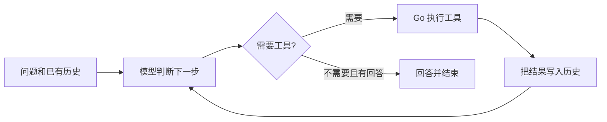

# Day 1：模型如何通过工具完成任务

今天要理解一件事：模型输出一个调用请求，Go 执行对应函数，再把结果交给模型。这几步连起来，就形成了最小的 Agent 循环。

读完这一篇，你应该能解释工具定义、调用请求和执行结果的区别，能沿着消息历史走完一次任务，也能判断哪些调用可以并行。它们对应 Agent 岗位里的工具编排、上下文管理和运行控制。

## 1. 先跟着一个问题走一遍

假设用户问：“计算 `(1234×5678)` 开根号取整，另外今天星期几？”

模型需要两种能力：准确计算，以及获得当前时间。项目提供 calculator 和 get_current_datetime 两个工具。

| 阶段 | 谁做 | 做了什么 |
| --- | --- | --- |
| 理解任务 | 模型 | 判断需要计算和查询时间，填写两个工具的参数 |
| 执行动作 | Go | 调用计算函数和时间函数，得到真实结果 |
| 理解结果 | 模型 | 读取结果，组织成用户能理解的回答 |

模型提出 `calculator(expression="floor(sqrt(1234*5678))")`，并不意味着它已经完成计算。真正计算的是 Go 里的函数。模型看到工具返回的2647后，才能把这个结果纳入回答。

ReAct 描述了“判断下一步 → 行动 → 观察结果 → 再判断”的过程。观察结果会改变下一步，所以步骤可以随着任务进展调整。



## 2. 工具定义、调用请求、执行结果是三样东西

**工具定义告诉模型“能做什么”。** 它包含名字、用途和参数的 JSON Schema。例如，一个 calculator 的定义可以这样表达：

```json
{
  "type": "function",
  "function": {
    "name": "calculator",
    "description": "计算数学表达式，支持四则运算、sqrt 和 floor",
    "parameters": {
      "type": "object",
      "properties": {"expression": {"type": "string"}},
      "required": ["expression"]
    }
  }
}
```

这里没有函数实现。Schema 描述的是输入结构：需要一个叫 expression 的字符串。模型读到定义，才知道该用哪个名字、传什么参数；Go 仍需要检查参数并执行计算。

**调用请求告诉程序“这一次做什么”。** 模型返回的 tool_calls 中，一项调用的形状如下：

```json
{
  "id": "call_calc",
  "type": "function",
  "function": {
    "name": "calculator",
    "arguments": "{\"expression\":\"floor(sqrt(1234*5678))\"}"
  }
}
```

注意 arguments 是“装着 JSON 的字符串”。Go 先解码整个 API 响应，再解析这个字符串里的参数。在 [tools.go](../../tools.go) 中，对应的核心操作是：

```go
var args struct {
    Expression string `json:"expression"`
}
err := json.Unmarshal([]byte(call.Function.Arguments), &args)
// 检查 err，再把 args.Expression 交给 calculate。
```

**执行结果告诉模型“实际上发生了什么”。** 计算成功后，程序将结果放进 tool 消息，使用 tool_call_id 对应原来的调用：

```json
{
  "role": "tool",
  "tool_call_id": "call_calc",
  "content": "{\"result\":2647}"
}
```

上面是协议示意。当前程序的 content 还包含工具名和调用 ID，方便观察。结果必须来自实际执行；失败时返回错误信息，不能让模型把猜测当作工具结果。

## 3. 为什么只写“你是工具助手”也能调用工具

本项目的 system prompt 只有一句：

```text
你是一个工具助手，按需使用工具帮助用户，并用中文回答。
```

工具说明另外放在请求的 `tools` 字段里。模型需要工具时，通过 `tool_calls` 返回调用请求；普通回答在 `content` 中自由表达。

因此，prompt 可以简短，程序仍有可解析的调用结构。以前让模型输出 `Thought:`、`Actions:` 等前缀，是把协议放进普通文本；原生 Tool Calling 把这个约定交给 API 字段表达。

只保留这句 prompt，却不提供工具定义，模型就不知道本程序提供的本地函数。只提供定义，却没有执行器，模型也只能提出请求。定义、执行器和结果回流缺一不可。[方舟 Chat API 协议](https://docs.volcengine.com/docs/ark/chat-api?lang=zh)

## 4. 消息历史是下一轮决策的依据

第二次请求模型时，它不会自动知道 Go 刚才算出了什么。程序必须带上原始问题、模型提出的调用，以及工具返回的结果。

一次计算任务的历史逐渐变成：

```text
system：工具助手角色
user：计算表达式并查询今天星期几
assistant：提出计算和日期两个调用，各自带 ID
tool：计算结果，指向计算调用的 ID
tool：日期结果，指向日期调用的 ID
assistant：根据结果回答
```

[react.go](../../react.go) 里的两处追加操作负责保存这些信息：

```go
history = append(history, reply)

history = append(history, Message{
    Role:       "tool",
    ToolCallID: observation.ID,
    Content:    string(data),
})
```

第一处保存“模型要求做什么”，第二处保存“程序实际做成什么”。如果只打印工具结果，模型下一轮并不能看到；如果只传结果而丢掉原始调用，结果和请求也可能无法正确对应。

tool_call_id 标识某一次调用，不能用工具名字代替：同一轮可能两次调用 calculator，分别计算不同表达式。即使结果完成顺序不同，ID 仍能把它们正确对应起来。

当前 history 只保存在一次运行的内存里。重新启动程序会新建历史；跨会话记忆属于后续学习内容。

## 5. loop 比一次 API 调用多做了什么

循环职责有四项：解析模型输出、调度工具、维护消息历史、判断是否终止。

可以用下面的简化过程理解 runAgent：

```text
准备 system 和 user 消息
请求模型，保存响应
    有工具调用：执行 → 保存 tool 结果 → 再请求模型
    没有工具调用且有回答：结束
```

一次普通 API 请求只得到当前响应。loop 会继续处理调用请求和工具结果，让模型能够根据新信息采取下一步行动。

例如“先查学习笔记，再把查到的职责数量乘以25”：第一次请求得到查询调用，执行后才能知道数量是4；第二次请求才能据此发起 `4*25`；第三次请求根据计算结果回答。这些决策发生在不同的模型轮次。

当前代码没有工具调用且有正常回答时结束。它表示模型这一轮停止行动，不自动证明回答内容正确，所以学习时仍要对照实际工具结果理解答案。

## 6. 并行调用是在哪一层发生的

要分清三个数量：可用工具有多少种、模型这一轮提出多少次调用、程序允许多少次调用同时执行。

本项目默认有3种工具。一轮可以提出两次 calculator 调用；`-parallel 1` 会让它们互不重叠执行，`-parallel 4` 允许它们同时执行。1到16是本项目设置的执行并发范围。

“计算已知表达式”和“查询日期”互不依赖，可以并行；“查到职责数量，再乘以25”依赖前一步结果，应当先查询，再继续计算。模型同轮提出多个调用，只是提供了批次；真正的并行来自 Go 执行器。

在 executeBatch 里：

- goroutine 发起各项执行。
- 有缓冲的 channel 控制名额。
- 每项结果写进自己的 results[i]。
- WaitGroup 等待整批结束，再由主循环更新 history。

这样既能重叠独立操作，也避免多个 goroutine 同时修改历史。当前名额为1时不保证按数组顺序执行；真正需要先后顺序的任务，不能只依靠把并发数改成1。

批量调用减少模型往返，并行执行减少工具等待。两个独立工具分别耗时2秒和3秒，串行约5秒，并行约3秒，再加模型和调度耗时。本项目的本地工具很快，练习重点是看清流程。

工具“加载”则是准备名字、描述、schema 与处理函数。本地工具定义已在内存中；它与执行某次调用是两个阶段。Codex、Claude Code 等工具型产品也围绕模型与执行器组织循环，并在此基础上扩展上下文、权限和任务管理。先掌握这条主线，再逐步增加能力。

## 7. 对着现有代码练习

先在项目根目录填写 .env 中的 ARK_API_KEY，再运行下面两个问题。启动与模型配置集中见[项目 README](../../README.md)。

```sh
go run . -question '请用 calculator 计算 floor(sqrt(1234*5678))，并查询当前日期和星期，两项可以同轮调用。'
go run . -question '请先用 search_notes 查询循环职责，再用 calculator 计算职责数量乘以25。'
```

第一题关注两个独立调用如何进入同一批，以及两个结果如何对应各自的 ID。第二题关注消息历史怎样增长：模型在收到查询结果之后，才能使用数量4继续计算。

阅读代码时按这个顺序走：

| 位置 | 带着什么问题读 |
| --- | --- |
| [react.go](../../react.go) 的 runAgent | 哪一行请求模型？哪两处更新历史？何时结束？ |
| [tools.go](../../tools.go) 的 toolDefinitions、runTool | 定义和真正的函数怎样对应？参数在哪里解析？ |
| react.go 的 executeBatch | 并发名额怎么控制？结果为什么不会串到别的调用上？ |
| [llm.go](../../llm.go) 的 callModel | messages 和 tools 怎么发送？响应从哪里读出？ |
| [main.go](../../main.go) | 问题、配置和运行参数如何进入循环？ |

## 8. 用自己的话复述

| 问题 | 参考理解 |
| --- | --- |
| 模型返回 calculator 请求后，谁真正计算？ | Go 的工具函数；模型只提供名字与参数。 |
| 为什么下一轮要保存 assistant 和 tool 两种消息？ | 前者记录请求，后者记录结果，两者用 ID 关联。 |
| 工具结果只打印到终端会怎样？ | 下一次模型请求没有这些信息，模型无法据此继续判断。 |
| 为什么两次工具调用不一定能并行？ | 后一次的参数或执行效果可能依赖前一次。 |

下一步会继续学习步数预算、工具重试和重复动作控制。延伸阅读：[ReAct 论文](https://arxiv.org/abs/2210.03629)。
