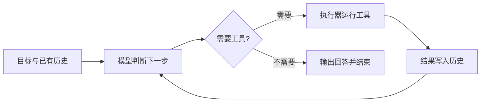

# Day 1：工具调用与 Agent 循环

## 学习目标

读完本文，应能回答以下问题：

1. 大语言模型本身只能生成文本，它是怎样"执行动作"的。
2. 函数调用协议中的工具定义、调用请求、执行结果分别是什么，由谁产生。
3. 为什么每次请求都要携带完整的消息历史，历史中有哪些必须满足的约束。
4. Agent 循环比一次 API 调用多承担了哪些职责，何时终止。
5. 模型在一轮中提出多个调用时，哪些可以并行执行，并行发生在哪一层。

## 1. 从生成文本到采取行动

语言模型的输出只是 token 序列。它不能自己访问网络、读文件或做精确计算。要让模型影响外部世界，需要三样东西配合：

- **工具（tool）**：程序提供的函数，例如计算器、搜索、读写文件、调用业务 API；
- **执行器（executor）**：解析模型的调用请求，校验参数，真正运行函数；
- **循环（loop）**：把执行结果交还给模型，让它决定下一步。

Anthropic 在《Building Effective Agents》中区分了两类系统：**workflow** 的步骤由代码预先编排，模型只负责其中的环节；**agent** 由模型根据环境反馈动态决定下一步做什么、调用哪个工具。本文讨论后者的最小形态：一个模型、一组工具、一个循环。

## 2. ReAct：推理与行动交替

ReAct（Reasoning + Acting，Yao et al., 2022）把任务求解描述为交替进行的三步：

```text
推理（Reason）：根据目标和已有信息，判断下一步
行动（Act）  ：调用一个工具
观察（Observe）：读取工具结果，作为下一次推理的输入
```

与只做思维链（Chain-of-Thought）相比，ReAct 的推理会被外部观察纠正。例如模型以为某个文件存在，读取后发现不存在，下一步就会改变计划。与只做行动相比，显式推理能帮助模型分解任务、追踪进度。



早期实现让模型在文本中按固定格式输出 `Thought:`、`Action:`、`Action Input:`，再由程序用正则解析。这种方式依赖模型严格遵守格式，解析脆弱。现代 API 提供**原生函数调用（native function / tool calling）**：调用以结构化字段返回，不再混在自然语言里。

## 3. 函数调用协议的三类对象

以 OpenAI 兼容的 Chat Completions 协议为例（其他厂商字段名不同，结构相同）。

### 3.1 工具定义：告诉模型"能做什么"

```json
{
  "type": "function",
  "function": {
    "name": "get_weather",
    "description": "查询指定城市当前天气。城市名使用中文全称。",
    "parameters": {
      "type": "object",
      "properties": {
        "city": {"type": "string", "description": "城市名，例如 上海"},
        "unit": {"type": "string", "enum": ["celsius", "fahrenheit"]}
      },
      "required": ["city"]
    }
  }
}
```

- 定义只描述**接口**，不包含实现。参数用 JSON Schema 表达类型、枚举与必填项。
- `description` 是写给模型看的说明，本质上是提示词的一部分：何时使用、参数格式、返回什么、有什么限制，都应写清楚。
- 工具定义通过请求的 `tools` 字段发送，会占用输入 token。工具越多，模型选择越难，成本也越高。

### 3.2 调用请求：模型决定"这一次做什么"

模型需要工具时，响应中的 assistant 消息带有 `tool_calls`：

```json
{
  "role": "assistant",
  "content": null,
  "tool_calls": [{
    "id": "call_01",
    "type": "function",
    "function": {"name": "get_weather", "arguments": "{\"city\":\"上海\"}"}
  }]
}
```

- `arguments` 是**JSON 字符串**，不是对象。程序先解析整个响应，再把这个字符串解析为参数。
- 模型生成的参数可能不合法：缺字段、类型错误、超出范围，甚至不是合法 JSON。执行器必须校验，不能直接信任。部分 API 提供严格模式（如 `strict: true`），用受约束解码保证参数符合 Schema，但业务层面的校验仍然需要。
- 模型"提出调用"不等于"完成动作"。计算、查询、写入都由执行器完成。

### 3.3 执行结果：程序告诉模型"实际发生了什么"

```json
{"role": "tool", "tool_call_id": "call_01", "content": "{\"temp\":21,\"condition\":\"多云\"}"}
```

- 结果必须来自真实执行。失败时也要返回，内容是可让模型理解的错误信息，而不是让模型自己猜测结果。
- `tool_call_id` 把结果与请求一一对应。同一轮可能调用同一个工具两次，参数不同，因此不能用工具名代替 ID。

### 3.4 控制模型是否调用工具

`tool_choice` 控制调用行为：`auto` 由模型决定；`none` 禁止调用；`required` 要求至少调用一个；也可以指定必须调用某个工具。系统提示词可以保持简短，只说明角色和回答要求，工具的用法写在工具定义里。

## 4. 消息历史：无状态 API 上的"记忆"

Chat Completions 这类 API 是**无状态**的：服务端不记得上一次请求。模型在第二次请求时之所以知道工具结果，完全是因为程序把它放进了这次请求的 `messages`。

一次带工具的任务，历史逐步变成：

```text
system    ：角色与规则
user      ：问题
assistant ：tool_calls = [A(id=1), B(id=2)]
tool      ：A 的结果（tool_call_id=1）
tool      ：B 的结果（tool_call_id=2）
assistant ：最终回答
```

协议对历史有明确的约束，违反时 API 通常直接报错：

- 每个 `tool_calls` 中的 ID，都必须在随后出现对应的 tool 消息；
- tool 消息必须紧跟在发起它的 assistant 消息之后，不能孤立存在；
- assistant 消息应**原样保存**，包括服务端返回的推理内容或加密字段，否则部分模型在工具循环中无法延续推理。

只把工具结果打印到终端而不写回历史，模型下一轮就看不到它；只写结果而丢掉原始 assistant 消息，结果就失去了配对对象。

历史随轮次增长，每次请求的输入 token 也随之增长，总成本大致按轮数的平方增长。窗口有限时如何取舍历史，是 Day 3 的主题。

## 5. Agent 循环的职责

一次 API 调用只得到一个响应。循环在此之上反复执行，直到任务结束。循环职责有四项：解析模型输出、调度工具、维护消息历史、判断是否终止。

```text
history = [system, user]
loop:
    reply = model(history, tools)
    history.append(reply)                       # 保存模型的决定
    if reply 没有 tool_calls: return reply       # 模型选择停止
    results = execute(reply.tool_calls)         # 执行器真正行动
    for r in results:
        history.append(tool_message(r))         # 保存实际发生的事
```

几个要点：

- **依赖关系决定轮次**。"先查出数量，再乘以 25"需要两轮工具调用：第二步的参数取决于第一步的结果，模型必须看到结果后才能提出计算。
- **"没有工具调用"表示模型选择停止，不代表答案正确**。回答是否可靠，要对照工具结果核实。
- 最小循环没有任何护栏：模型可能无限调用、工具可能一直失败。预算、重试和重复检测见 Day 2。

## 6. 并行工具调用

需要区分三个数量：

| 层次 | 含义 | 由谁决定 |
| --- | --- | --- |
| 工具目录 | 有多少种工具可用 | 程序注册的定义 |
| 一轮的批次 | 模型这一轮提出几个调用 | 模型 |
| 执行并发 | 同一时刻实际运行几个调用 | 执行器 |

模型在一轮中提出多个调用，只是给出了一个可以一起处理的批次，真正的并行来自执行器。

**能否并行取决于依赖与副作用**：

- 互不依赖的只读操作（查天气、查日期、计算已知表达式）可以并行；
- 后一步的参数依赖前一步的结果，必须分在不同轮次；
- 两个操作写同一资源（修改同一个文件），即使模型同轮提出，也应串行或做冲突检测。

**收益**：批量调用减少模型往返次数；并行执行减少等待时间。两个独立工具分别耗时 2 秒和 3 秒，串行约 5 秒，并行约 3 秒。

**实现要点**（以 Go 为例）：

- 每个调用一个 goroutine，用带缓冲的 channel（信号量）限制同时运行的数量；
- 每个调用把结果写进**预先分配的结果槽** `results[i]`，避免多个 goroutine 同时修改共享的历史；
- 用 `sync.WaitGroup` 等待整批完成，再由主循环**按原始顺序**写回历史。完成顺序不确定，写回顺序必须确定。

注意，把并发数设为 1 只保证不重叠，不保证按数组顺序执行；真正有顺序要求的步骤，应当拆到不同轮次。

## 7. 执行器的安全边界

工具把模型的输出变成真实动作，执行器是安全的最后一道检查：

- **参数校验**：类型、范围、长度，以及业务约束；
- **不执行任意代码**：例如计算器应解析数学表达式的语法树，而不是 `eval` 字符串；
- **权限控制**：工具能访问的文件、网络与数据，应由程序限定，不能由模型的参数扩大；
- **错误回填**：校验失败或执行失败，把可理解的错误作为结果返回，让模型修正，而不是让程序崩溃。

## 8. 何时需要 Agent

Agent 用延迟、成本和可预测性换取灵活性。如果步骤固定、可以预先写成流程，用 workflow 更简单可靠；如果步骤取决于中间结果、事先无法枚举，才适合交给模型在循环中决策。Codex、Claude Code 等编码 Agent 的核心仍是这条"模型—工具—结果回流"的循环，再加上上下文管理、权限与任务管理等能力。

## 9. 自测

| 问题 | 参考答案 |
| --- | --- |
| 模型返回计算器的调用请求后，谁真正完成计算？ | 执行器中的函数；模型只提供工具名和参数。 |
| 为什么 `arguments` 需要二次解析和校验？ | 它是模型生成的 JSON 字符串，可能格式错误或不符合业务约束。 |
| 下一轮请求为什么要同时保存 assistant 和 tool 两种消息？ | 前者记录请求，后者记录结果，两者用 ID 配对；缺一个协议就不完整。 |
| 工具结果只打印、不写回历史会怎样？ | API 无状态，下一轮模型看不到结果，无法据此继续。 |
| 为什么不能用工具名代替 `tool_call_id`？ | 同一轮可能多次调用同一工具，名字无法区分。 |
| 模型同轮提出两个调用，是否一定可以并行？ | 不一定；有依赖或写同一资源时要分轮或串行。 |
| 模型不再调用工具，任务就一定完成了吗？ | 不一定；它只表示模型选择停止，答案仍需核实。 |

## 参考

- Yao et al., [ReAct: Synergizing Reasoning and Acting in Language Models](https://arxiv.org/abs/2210.03629), 2022
- Anthropic, [Building Effective Agents](https://www.anthropic.com/engineering/building-effective-agents), 2024
- OpenAI, [Function calling 指南](https://platform.openai.com/docs/guides/function-calling)
- 火山方舟，[Chat API 协议](https://docs.volcengine.com/docs/ark/chat-api?lang=zh)
- [JSON Schema](https://json-schema.org/understanding-json-schema)

本课程的代码实现、动手步骤与运行观察见 [Day 1 项目实践](day-01-lab.md)。下一篇：[Day 2：Agent 循环的可靠性控制](../day-02/day-02-notes.md)。
