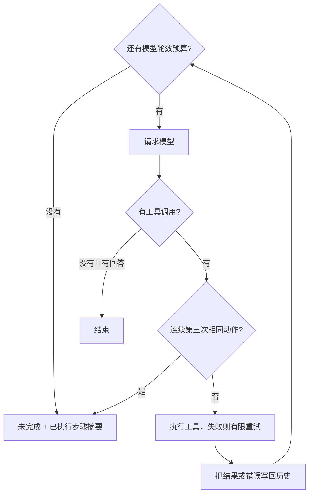

# Day 2：让循环在失败时可控

Day 1 解决了“如何调用工具继续做事”。今天学习三个控制条件：任务跑得太久时怎样停，工具短暂失败时怎样重试，模型反复做同一件事时怎样打断。

读完后，你应该能区分模型轮数、工具尝试次数和重复动作次数，并知道每个护栏应该放在哪一层。它们对应 Agent 运行控制、可靠性和可观测性。

## 1. 三种失败需要三种控制

想象一个任务一直没有完成：可能是步骤真的很多，可能是某个工具暂时不可用，也可能是模型反复查询同样的信息。只加一个停止条件，无法把这些情况都处理好。

| 情况 | 护栏 | 本项目的规则 |
| --- | --- | --- |
| 一直行动，迟迟不结束 | max_steps | 默认最多10轮模型请求 |
| 当前工具执行失败 | 有限重试与指数退避 | 默认额外重试2次，等待200ms、400ms |
| 连续提出相同动作 | 重复动作熔断 | 第三次相同工具与参数出现时拦截 |

这些边界由 Go 执行。即使模型还要求继续，程序也会遵守预算并返回停止原因。Anthropic 的文章将最大迭代次数等停止条件作为控制自主循环的方法之一。[Building Effective Agents](https://www.anthropic.com/engineering/building-effective-agents)



## 2. max_steps 限制的是模型轮数

本项目把一次 callModel 算一轮。一轮可以提出多个工具调用；这些工具在本地重试，也不会增加模型轮数。最终回答同样需要请求模型，因此也占一轮。

Day 3 增加上下文摘要后，`-max-steps` 延伸为模型请求总预算：摘要请求也计入，所以决策轮数可能少于总请求数。下面的例子仍按Day 2没有摘要子请求的情况理解；详见 [Day 3笔记](../day-03/day-03-notes.md)。

看“查询笔记里的职责数量，再乘以25”这个例子：

| 模型轮次 | 模型决定 | 程序随后做什么 |
| --- | --- | --- |
| 第1轮 | 查询笔记 | 执行 search_notes，得到职责数量4 |
| 第2轮 | 计算4*25 | 执行 calculator，得到100 |
| 第3轮 | 根据结果回答 | 输出回答并结束 |

如果预算只有1轮，查询完成后就必须停止。此时任务未完成，但“已查到笔记”是有效进度，应当告诉用户。

在 [react.go](../../react.go) 的 runAgent 中，循环上限直接来自 maxSteps；耗尽后调用 stopRun 返回未完成和已执行步骤摘要。摘要来自本地记录，不再调用模型。否则，预算已经耗尽却又花一次模型请求写总结，限制就失去了意义。

预算是“最多允许多少轮”，并不是“必须用满多少轮”。一个问候如果第一轮就回答了，立即结束。

### 10和50的取舍

| 上限 | 得到什么 | 付出什么 |
| --- | --- | --- |
| 10 | 更早停止错误路径，较容易控制耗时与费用 | 正常长任务也可能被截断 |
| 50 | 长任务有更多完成机会 | 失控路径也有更多消耗预算的空间 |

最大请求数增加5倍，不代表总 token 或费用只增加5倍，因为每次请求携带的历史可能越来越长。max_steps 也不等于单次请求超时：次数限制和时间限制解决不同问题。

## 3. 重试只处理当前这一次调用

假设模型请求查询外部服务，第一次因为临时网络故障失败。直接放弃可能损失一次本来可以成功的任务，立刻不停重试又可能继续压垮服务。

指数退避让失败后的等待时间逐渐变长。当前默认 retries=2，表示首次执行之后最多再试两次：

```text
第1次执行失败 → 等200ms
第2次执行失败 → 等400ms
第3次仍失败   → 停止重试，把错误交回模型
```

代码里的等待时间是 `200ms × 2^r`，r 从0开始。200ms是方便学习观察的起点，不是通用生产标准。当前参数允许0到5次额外重试；设置0就只执行一次。

[react.go](../../react.go) 的 runWithRetry 保留同一个调用 ID，增加 attempts。等待使用 timer 和 context，所以 Ctrl+C 可以中断退避。

### 为什么错误必须回填

错误告诉模型下一步怎样调整。例如“缺少参数 expression”意味着应补参数；“服务暂时不可用”可能意味着换工具或向用户说明暂时做不到。

如果程序只在本地打印错误，下一轮模型看不到这个反馈。当前代码把失败也作为 Observation，通过原生 tool 消息放回 history，模型就能继续决策。工具执行层决定“同一请求再试几次”，模型层决定“接下来改做什么”。

Go 中预期失败通常用 error 返回。本项目还在 runTool 的边界捕获 panic 并转成 error，让本课的异常工具也能进入重试与结果回流流程。

当前课程按题目要求统一重试工具错误。实际系统还要区分：网络抖动可能值得重试，缺参数和除数为0则需要修改输入；涉及扣款、写入等副作用时，还需要保证重试不会重复执行同一笔操作。

## 4. 重复动作熔断盯的是模型的决策

设想模型连续三轮都请求 `check_task_status(task_id="day2-loop")`，每次得到 pending，又原样发起下一次请求。工具本身可能一直正常返回，但任务没有推进。

这时重试机制不会触发，因为工具没有报错。重复动作熔断会记录模型提出的工具名与参数，第三次连续相同请求出现时停止。

| 动作序列 | 连续重复判定 |
| --- | --- |
| A(x) → A(x) → A(x) | 第三个请求触发熔断 |
| A(x) → A(y) → A(x) | 参数变化，连续次数重置 |
| A(x) → B(y) → A(x) | 工具变化，连续次数重置 |

actionKey 会忽略调用 ID、JSON 空白和对象键顺序。因为调用 ID 每次可以不同，而空格或键顺序变化不代表任务真的变了。

### 并行批次怎样处理

runAgent 在启动工具之前，按模型返回的 tool_calls 数组顺序检查。它不看 goroutine 的完成先后，否则相同请求可能因为运行快慢不同得到不同判定。

发现第三次连续重复时，整个本轮批次都会被拦下。如果每轮只有一次调用，前两轮已执行，第三轮不执行；如果三个重复请求都在同一批里，这一批就都不会启动。

这种检测也有边界：A→B→A→B 不属于连续相同，仍需要 max_steps 兜底；真实任务中合理的持续轮询也可能被阈值3截断。阈值与任务类型需要一起考虑。

## 5. 最容易混淆的三个数字

| 场景 | 模型轮数 | 工具尝试次数 | 重复动作次数 |
| --- | --- | --- | --- |
| 一轮提出两个不同工具，各成功一次 | 1 | 每个工具1次 | 当前各动作没有连续重复 |
| 一个工具请求，失败后重试两次 | 1 | 同一个调用3次 | 只提出过1个动作 |
| 三轮提出同一工具和参数 | 3 | 前两次各执行1次，第三次被拦截 | 达到3次 |

因此，“重试两次”不会直接触发“三次重复动作熔断”。一个计数在工具执行内部，另一个计数在模型与执行器之间。

还要区分“工具执行成功”和“任务完成”。状态工具成功返回 pending，表示查询本身成功，任务仍未完成。正常结束一段模型回答，也可能是在向用户解释任务为什么暂时无法完成。

## 6. 用现有程序亲手观察

在项目根目录运行，模型与密钥配置见[项目 README](../../README.md)。实验工具需要显式加 `-lab-tools`，普通任务默认不会加载它们。

**先跑正常任务，建立参照。**

```sh
go run . -question '请用 calculator 计算 floor(sqrt(1234*5678))，并查询当前日期和星期，两项独立请同轮调用。'
```

关注计算和日期查询如何在同一轮提出，以及下一轮怎样根据结果回答。工具成功后不应该进入重试等待。

**让一次调用一直失败，观察错误怎样走完循环。**

```sh
go run . -lab-tools -retries 2 -question '请调用 always_fail 完成一次故障操作。如果工具反馈失败，请说明任务未完成和错误原因，然后结束。'
```

always_fail 是故意制造异常的实验工具。关注首次执行加两次重试后，错误怎样成为 tool 消息，再由下一轮模型处理。不是程序直接崩溃，也不是把三次执行算成三轮模型请求。

**让模型反复查询，观察熔断发生的位置。**

```sh
go run . -lab-tools -question '请持续使用 check_task_status 查询 task_id 为 day2-loop 的任务。每轮只查询一次；状态为 pending 就在下一轮用相同参数继续查询，直到状态变成 completed 才结束。'
```

这个实验工具故意一直返回 pending。关注第三次请求出现后，执行器是否已经停止，步骤摘要是否只包含实际执行过的动作。

**把预算降到1轮，观察“有进度但未完成”。**

```sh
go run . -max-steps 1 -question '请先用 search_notes 查询循环职责，再用 calculator 计算职责数量乘以25。'
```

关注程序完成查询后怎样返回未完成，为什么不继续计算，也不额外请求模型总结。熔断和超限时返回退出码1，表示程序主动中止了任务。

这些练习直接观察终端即可，不需要保存输出文件。先在 [react.go](../../react.go) 中找到 runAgent、runWithRetry、actionKey 和 stopRun，再对照你看到的执行过程阅读。

## 7. 自测与参考理解

| 问题 | 参考理解 |
| --- | --- |
| 为什么预算用完后不能再调用模型写摘要？ | 那会突破预算。程序已经掌握执行记录，可以本地生成摘要。 |
| 一次工具执行尝试3次，为什么不一定熔断？ | 它们属于同一个模型调用请求；熔断统计的是连续重复提出的动作。 |
| 模型换了调用 ID，但工具和参数没变，会怎样？ | ID不参与重复判定，仍算相同动作。 |
| 工具返回错误后，为什么还需要下一轮模型？ | 模型需要根据反馈修正参数、改用工具，或解释无法继续的原因。 |
| 为什么只做熔断还不够？ | 交替调用或持续改变参数可以绕过连续重复判定，轮数预算仍有作用。 |

## 8. 生产环境还会遇到哪些失败

Day 2 的三个护栏处理循环失控和单次工具失败。生产环境还需要判断错误来自哪一层、是否值得重试、操作是否已经产生效果。这些是本课的知识扩展，下面没有实现的能力不计为已完成。

| 失败类型 | 具体例子 | 处理思路 |
| --- | --- | --- |
| 模型或外部服务暂时不可用 | 连接中断、临时限流、服务返回503 | 判断能否安全重试；限制次数和总耗时，退避并加入随机抖动 |
| 参数或协议不合法 | 缺少 expression、参数类型错误、调用不存在的工具、tool_call_id 对不上 | 执行前校验；模型能修正的参数错误作为 observation；请求拼装错误由程序修复 |
| 配置、认证或权限失败 | Key无效、配额耗尽、无权访问目标资源 | 停止原样重试；修复配置、按授权流程刷新凭据或报告权限不足 |
| 单次调用卡住 | 一个工具一直等网络响应，整批卡在 WaitGroup.Wait | 为调用设置超时，并为整个任务设置截止时间；让底层操作响应取消 |
| 超时后结果未知 | 创建工单已成功，但响应丢失，客户端以为失败 | 通过业务操作ID查询结果；需要安全重试时使用服务端支持的幂等机制 |
| 并行冲突或部分成功 | 两个工具同时改同一文件；三个子任务完成、一个失败 | 独立操作才并行；冲突写入串行或校验版本；保留每项结果，避免整批重做 |
| 上下文与消息状态错误 | 搜索结果过大、历史超长、压缩时丢了权限约束或工具结果 | 限制结果体积和上下文预算；压缩时保留关键约束、事实与调用/结果关系 |
| 进程中断与恢复错误 | 外部写入成功，进程在保存结果前退出；重启后又执行一遍 | 保存执行进度，并结合幂等或结果查询恢复；单靠消息历史不够 |
| 业务结果不正确 | HTTP 200里是失败状态；任务仍pending，模型却说完成 | 区分请求成功、操作完成、用户目标达成；用实际状态和结果证据验证 |
| 工具内容诱导越权 | 搜到的网页夹带指令，要求读取私有文件并发往外部 | 外部内容按数据处理；执行器按用户权限和任务范围校验工具调用 |

这些问题对应岗位中的运行控制、并发可靠性、幂等恢复、上下文工程和安全边界。可以先学会判断处理方向，再按后续每天的任务逐步实现。

### 8.1 重试前，先区分“稍后再试”和“换一种做法”

同一个错误请求重复执行，并不一定增加成功机会：

- 服务短暂繁忙：在剩余预算内，安全的请求可以稍后再试。
- calculator 缺少 expression：等待再久也不会长出参数，应将错误交给模型修正。
- 认证无效或权限不足：需要配置或授权层处理，不能让模型通过换工具绕过权限。
- 用户取消或任务总截止时间已到：停止，不继续重试。
- 程序 panic：可能是代码缺陷，生产中应捕获诊断信息、隔离影响并修复；不能默认视作网络抖动。

分类应结合服务的错误码和接口语义，不能仅凭“HTTP 429就一定值得重试”或“所有5xx都安全”作判断。限流与配额耗尽可能需要不同处理。

大量请求同时失败时，如果全都精确等待200ms再重试，会同时冲击服务。jitter是在退避时间里加入随机性，分散重试时刻；同时还应限制等待上限并遵守服务的重试提示。[AWS SDK重试说明](https://docs.aws.amazon.com/sdkref/latest/guide/feature-retry-behavior.html)展示了错误分类与带抖动的指数退避。

还要约定哪一层负责重试。假设Agent、工具封装和HTTP客户端每层最多尝试3次，一次逻辑操作最坏可能变成3×3×3=27次底层请求。次数、总耗时和费用需要一起限制。

工具失败可以回填给仍可用的模型；模型API本身不可用时，需要调用层恢复或由程序返回未完成。错误反馈应提供可行动的信息，去掉密钥等敏感内容。

### 8.2 最容易误判的情况：超时了，但操作已经成功

以创建工单为例，以下是示意流程：

```text
Agent：创建工单，业务操作ID=op-001
服务端：工单创建成功，编号T-123
网络：响应丢失
Agent：只收到 timeout，不知道是否创建成功
```

此时状态应记为“结果未知”，不能直接记为“没有创建”。再发一次全新的创建请求，可能产生第二张工单。

幂等机制让服务端识别“这还是同一次业务操作”。同一操作的重试复用同一个幂等键，并由服务端去重或返回已有结果；不能只是客户端多加一个任意字段。也可以通过操作ID查询实际状态。若服务不支持这些能力，应报告结果待核实，而不是盲目重复有副作用的操作。[Stripe幂等请求文档](https://docs.stripe.com/api/idempotent_requests)提供了一个实际API设计例子。

本项目的 tool_call_id 用来关联模型请求与工具结果。模型下一轮再次提出同一业务操作时，call ID可能变化，因此它不能直接代替跨重试、跨恢复的业务操作ID。

同样，取消请求也不等于撤销已发生的写入。停止等待之后，仍需区分未开始、确认失败、确认成功和结果未知。

### 8.3 max_steps 不能代替超时

设 max_steps=10。如果第1轮的某个工具一直不返回，循环根本走不到第2轮，更不会触发第10轮上限。

可以用三种不同维度理解预算：

| 预算 | 回答的问题 |
| --- | --- |
| 模型轮数 | 最多允许做几轮决策？ |
| 单次超时与任务截止时间 | 一个调用、整个任务最多等多久？ |
| token、费用和工具调用额度 | 总共允许消耗多少资源？ |

Go的 context 用于传递截止时间和取消信号，但不会强制杀死任意 goroutine。HTTP请求、数据库查询、子进程或长循环也必须支持并响应取消，资源才能释放。[Go Context说明](https://go.dev/blog/context)

当前 [llm.go](../../llm.go) 已有单次模型HTTP请求5分钟超时；[react.go](../../react.go) 的退避等待响应取消。当前尚未设置整个任务的时间预算，也没有给每个工具单独设置超时。以后接入慢工具时，需要在那个工具的执行链路中落实。

### 8.4 没有 error，也可能做错了

工具返回 pending，表示查询成功，但后台任务没有完成。接口返回HTTP 200，也可能在响应体中明确写着业务失败。模型给出一段流畅的回答，只表示生成完成，不能作为外部操作成功的凭据。

例如修改文件后，可以读取文件确认目标内容；创建工单后，检查工单编号和状态；回答检索问题时，核对来源是否确实支持结论。检查应围绕用户目标，避免只检查“工具是否返回nil”。Anthropic也强调Agent需要依靠环境反馈判断进展。[Building Effective Agents](https://www.anthropic.com/engineering/building-effective-agents)

并行执行还会出现“有的成功，有的失败”。应逐项保留结果，让后续决策知道已经完成了什么；对于失败或结果未知的子任务，再分别判断是否重试。对有依赖或冲突的动作，例如先更新配置再读取验证，应按顺序执行。

安全错误也可能没有运行异常：工具顺利读到了不该访问的数据，仍是失败。外部网页、笔记和工具结果中的指令不能自行扩大权限；最终执行前应由程序检查权限、资源范围和参数。[OWASP Agent工具防护说明](https://cheatsheetseries.owasp.org/cheatsheets/LLM_Prompt_Injection_Prevention_Cheat_Sheet.html#agent-specific-defenses)

### 8.5 对照当前实现，分清学习范围

当前 [runWithRetry](../../react.go) 按课程要求统一重试工具错误；模型API错误会直接进入 stopRun。协议结构、参数检查、预算、重复动作和错误回流已有基础处理。分类重试、业务幂等、任务恢复等仍是后续学习内容。

本课的“重复动作熔断”观察单个Agent是否原地重复。后端服务常说的 circuit breaker 通常观察下游是否持续失败，暂时拒绝请求，冷却后再试探恢复。两者观察的对象不同。

先掌握三个判断：同样的请求值得再试吗？上次操作可能已经成功吗？这次结果是否真的完成用户目标？这些判断比单纯把 retries 或 max_steps 调大更能帮助选择正确的恢复路径。

补充自测：

| 问题 | 参考理解 |
| --- | --- |
| 缺参数时等200ms、400ms有用吗？ | 原参数不会变；应反馈给模型修正。 |
| 创建工单超时，是否可以立即用新ID重发？ | 先考虑结果未知；查询原操作，或按服务端幂等协议复用同一操作标识。 |
| 并行四项中三项成功，能否直接整批再跑？ | 先保留成功项；分别处理失败/未知项，避免重复副作用。 |
| max_steps=10能否保证任务十分钟结束？ | 不能，轮数与耗时不同；还需要有效的超时和取消链路。 |

## 9. 生产处理怎样分工：通用策略与工具语义

一部分需要按工具和业务处理，另一部分可以共用。下面是一种常见的组织方式，用来理解职责分工；具体字段是教学示意，并非统一行业协议，也不是当前代码已经实现的结构。

### 9.1 工具封装解释错误，执行器应用规则，模型调整计划

| 层次 | 掌握的信息 | 负责的决定 | 对照当前代码 |
| --- | --- | --- | --- |
| 工具封装 | 参数、服务错误码、业务响应、操作是否有副作用、幂等接口约定 | 将原始失败归类；说明操作效果是否已知；实现查状态等业务恢复能力 | runTool 及其调用的具体工具 |
| 执行器 | 错误分类、工具安全属性、尝试次数、剩余时间、取消状态 | 是否自动重试、等待多久、何时停止本次调用；统一执行限制 | runWithRetry |
| 模型与主循环 | 工具结果、可修正的错误、用户目标和历史 | 模型补参数、选择其他允许的方案或解释无法完成；主循环维持预算并保存结果 | runAgent 和 history |

这些是职责边界，学习项目中可以仍然放在已有函数里。工具的业务知识不必全部堆进主循环，重试计数和退避也不必每个工具重写一遍。


生产SDK也会按错误类型应用共用的重试逻辑。例如AWS SDK结合服务错误码与HTTP状态分类，随后检查尝试次数和重试预算，再执行退避；具体服务可以保留差异化规则。[AWS重试流程](https://docs.aws.amazon.com/sdkref/latest/guide/feature-retry-behavior.html)

### 9.2 用同一个 create_ticket 工具看“按业务处理”

假设它调用外部工单接口，各种结果的处理如下。涉及“未执行”“可幂等重放”的判断，都需要接口契约或可核查的状态支持。

| 原始结果 | 工具封装应说明什么 | 执行器或后续决策 |
| --- | --- | --- |
| 本地校验发现没有 title，尚未发请求 | 参数错误，操作未执行 | 不原样重试；回填缺少的字段，模型从已有任务信息补齐，信息不足时询问用户 |
| 服务明确返回临时限流，并保证未执行 | 临时故障，本次未产生效果 | 在预算内退避重试，遵守服务端的等待提示 |
| 请求发送后读取响应超时 | 通信故障，创建结果未知 | 按接口约定复用有效的幂等键安全重放，或查询业务操作ID；无此保障则停止盲目重发并报告待核实 |
| 服务返回无权限 | 权限拒绝 | 不原样重试；报告受阻原因，模型不能自行绕过访问控制 |
| 服务返回该业务操作已创建 | 可能是重复操作，需要核对原记录和本次意图 | 只有确认是同一操作且已达成目标，才返回已有工单；否则按冲突处理 |
| HTTP成功，业务状态为 pending | 请求已受理，工单流程尚未完成 | 返回真实状态；需要等待时按业务轮询规则继续，不宣布完成 |

同样的 timeout，查询操作通常可以考虑重试，而创建操作必须处理重复副作用。Stripe的网络错误说明给出了实际例子：结果未知时，依据其幂等协议复用相同键和参数；改变参数或换键并不等同于重试原操作。[Stripe错误恢复说明](https://docs.stripe.com/error-low-level#network-errors)

### 9.3 共用规则依靠稳定字段，不依靠猜错误文案

工具封装通常依据SDK的错误类型、稳定错误码、HTTP状态和业务响应分类。Go中可以用 errors.Is / errors.As 识别具体错误；避免把判断写成搜索 error 字符串里的某个中文词，因为文案可能变化。

例如下面是提供给模型的一个自定义错误结果示意，未改动本项目当前 Observation 结构：

```json
{
  "ok": false,
  "error": {
    "category": "invalid_arguments",
    "code": "TITLE_REQUIRED",
    "message": "缺少 title。请根据用户任务补充标题。",
    "effect": "none"
  }
}
```

category 表示恢复分类，code 让程序稳定识别原因，message 提供可修正的信息，effect 表示这次操作有没有产生效果（示例中因本地校验失败而确定没有执行）。对于请求已发出但响应丢失的情况，effect 应是 unknown，不能因为收到 error 就写 none。保留请求ID等内部诊断信息时，也应避免把密钥或完整内部堆栈直接放进模型上下文。

对于同一操作，自动重试的决策可以用下面的条件理解：

```text
可能通过等待恢复
且 相同操作可以安全重放
且 尝试次数与任务时间仍有预算
且 没有取消
→ 才允许自动重试
```

错误是否暂时性与是否安全重放是两个问题。安全重放可以来自无副作用的查询、服务端幂等保障，或明确证明前次没有执行。工具原样重试与模型修改参数后提出一个新动作也不同：后者仍要重新校验权限、参数和预算。

只要SDK已经负责了网络重试，外层就应避免重复叠加同一套重试，或明确协调总次数与截止时间。参数错误回填给模型、模型重新规划，并不意味着自动获得了额外的无限重试额度。

### 9.4 新错误怎样补进来

接入工具时，先依据接口文档定义正常结果、已知错误、副作用、幂等保障和默认恢复行为。上线后发现未覆盖的错误，利用实际响应、请求关联信息和业务状态定位，再把它归入已有类别；确实存在独特业务语义时，才添加该工具的专门分支。新错误在语义未明确前，不应默认允许有副作用的自动重试。

并非每个意外结果都是异常。例如 search_notes 成功返回空列表表示没有命中，可以由模型调整检索词；文件读取遇到权限拒绝则是执行失败。分类需要服务于工具的实际业务含义。

对当前学习实现，未来最小的演进方向是让 runTool 提供少量可识别的错误类别，让 runWithRetry 据此决定是否原样重试，保留 runAgent 已有的 observation 回流。这里先理解分工，尚未增加生产框架或新代码。

自测：创建工单与查询工单都返回 timeout，为什么不能仅凭这个错误词决定重试？因为错误只说明通信没有取得确定结果；还要结合操作副作用、已知执行状态、服务端幂等能力和剩余预算。

延伸阅读：[Anthropic：Building Effective Agents](https://www.anthropic.com/engineering/building-effective-agents)、[OpenAI：A Practical Guide to Building Agents](https://cdn.openai.com/business-guides-and-resources/a-practical-guide-to-building-agents.pdf)。其中的循环退出和护栏思想可以与本项目实现对照阅读。
