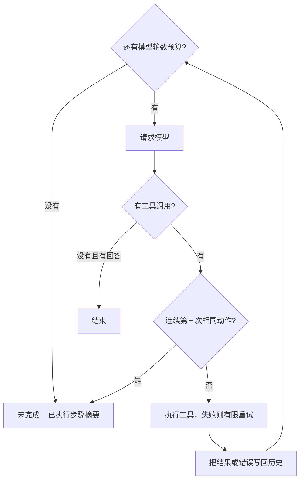

# Day 2：让循环在失败时可控

Day 1 解决了“如何调用工具继续做事”。今天学习三个控制条件：任务跑得太久时怎样停，工具短暂失败时怎样重试，模型反复做同一件事时怎样打断。

读完后，你应该能区分模型轮数、工具尝试次数和重复动作次数，并知道每个护栏应该放在哪一层。它们对应 Agent 运行控制、可靠性和可观测性。

## 1. 三种失败需要三种控制

想象一个任务一直没有完成：可能是步骤真的很多，可能是某个工具暂时不可用，也可能是模型反复查询同样的信息。只加一个停止条件，无法把这些情况都处理好。

| 情况 | 护栏 | 本项目的规则 |
| --- | --- | --- |
| 一直行动，迟迟不结束 | max_steps | 默认最多10轮模型请求 |
| 当前工具执行失败 | 有限重试与指数退避 | 默认额外重试2次，等待200ms、400ms |
| 连续提出相同动作 | 重复动作熔断 | 第三次相同工具与参数出现时拦截 |

这些边界由 Go 执行。即使模型还要求继续，程序也会遵守预算并返回停止原因。Anthropic 的文章将最大迭代次数等停止条件作为控制自主循环的方法之一。[Building Effective Agents](https://www.anthropic.com/engineering/building-effective-agents)



## 2. max_steps 限制的是模型轮数

本项目把一次 callModel 算一轮。一轮可以提出多个工具调用；这些工具在本地重试，也不会增加模型轮数。最终回答同样需要请求模型，因此也占一轮。

看“查询笔记里的职责数量，再乘以25”这个例子：

| 模型轮次 | 模型决定 | 程序随后做什么 |
| --- | --- | --- |
| 第1轮 | 查询笔记 | 执行 search_notes，得到职责数量4 |
| 第2轮 | 计算4*25 | 执行 calculator，得到100 |
| 第3轮 | 根据结果回答 | 输出回答并结束 |

如果预算只有1轮，查询完成后就必须停止。此时任务未完成，但“已查到笔记”是有效进度，应当告诉用户。

在 [react.go](../../react.go) 的 runAgent 中，循环上限直接来自 maxSteps；耗尽后调用 stopRun 返回未完成和已执行步骤摘要。摘要来自本地记录，不再调用模型。否则，预算已经耗尽却又花一次模型请求写总结，限制就失去了意义。

预算是“最多允许多少轮”，并不是“必须用满多少轮”。一个问候如果第一轮就回答了，立即结束。

### 10和50的取舍

| 上限 | 得到什么 | 付出什么 |
| --- | --- | --- |
| 10 | 更早停止错误路径，较容易控制耗时与费用 | 正常长任务也可能被截断 |
| 50 | 长任务有更多完成机会 | 失控路径也有更多消耗预算的空间 |

最大请求数增加5倍，不代表总 token 或费用只增加5倍，因为每次请求携带的历史可能越来越长。max_steps 也不等于单次请求超时：次数限制和时间限制解决不同问题。

## 3. 重试只处理当前这一次调用

假设模型请求查询外部服务，第一次因为临时网络故障失败。直接放弃可能损失一次本来可以成功的任务，立刻不停重试又可能继续压垮服务。

指数退避让失败后的等待时间逐渐变长。当前默认 retries=2，表示首次执行之后最多再试两次：

```text
第1次执行失败 → 等200ms
第2次执行失败 → 等400ms
第3次仍失败   → 停止重试，把错误交回模型
```

代码里的等待时间是 `200ms × 2^r`，r 从0开始。200ms是方便学习观察的起点，不是通用生产标准。当前参数允许0到5次额外重试；设置0就只执行一次。

[react.go](../../react.go) 的 runWithRetry 保留同一个调用 ID，增加 attempts。等待使用 timer 和 context，所以 Ctrl+C 可以中断退避。

### 为什么错误必须回填

错误告诉模型下一步怎样调整。例如“缺少参数 expression”意味着应补参数；“服务暂时不可用”可能意味着换工具或向用户说明暂时做不到。

如果程序只在本地打印错误，下一轮模型看不到这个反馈。当前代码把失败也作为 Observation，通过原生 tool 消息放回 history，模型就能继续决策。工具执行层决定“同一请求再试几次”，模型层决定“接下来改做什么”。

Go 中预期失败通常用 error 返回。本项目还在 runTool 的边界捕获 panic 并转成 error，让本课的异常工具也能进入重试与结果回流流程。

当前课程按题目要求统一重试工具错误。实际系统还要区分：网络抖动可能值得重试，缺参数和除数为0则需要修改输入；涉及扣款、写入等副作用时，还需要保证重试不会重复执行同一笔操作。

## 4. 重复动作熔断盯的是模型的决策

设想模型连续三轮都请求 `check_task_status(task_id="day2-loop")`，每次得到 pending，又原样发起下一次请求。工具本身可能一直正常返回，但任务没有推进。

这时重试机制不会触发，因为工具没有报错。重复动作熔断会记录模型提出的工具名与参数，第三次连续相同请求出现时停止。

| 动作序列 | 连续重复判定 |
| --- | --- |
| A(x) → A(x) → A(x) | 第三个请求触发熔断 |
| A(x) → A(y) → A(x) | 参数变化，连续次数重置 |
| A(x) → B(y) → A(x) | 工具变化，连续次数重置 |

actionKey 会忽略调用 ID、JSON 空白和对象键顺序。因为调用 ID 每次可以不同，而空格或键顺序变化不代表任务真的变了。

### 并行批次怎样处理

runAgent 在启动工具之前，按模型返回的 tool_calls 数组顺序检查。它不看 goroutine 的完成先后，否则相同请求可能因为运行快慢不同得到不同判定。

发现第三次连续重复时，整个本轮批次都会被拦下。如果每轮只有一次调用，前两轮已执行，第三轮不执行；如果三个重复请求都在同一批里，这一批就都不会启动。

这种检测也有边界：A→B→A→B 不属于连续相同，仍需要 max_steps 兜底；真实任务中合理的持续轮询也可能被阈值3截断。阈值与任务类型需要一起考虑。

## 5. 最容易混淆的三个数字

| 场景 | 模型轮数 | 工具尝试次数 | 重复动作次数 |
| --- | --- | --- | --- |
| 一轮提出两个不同工具，各成功一次 | 1 | 每个工具1次 | 当前各动作没有连续重复 |
| 一个工具请求，失败后重试两次 | 1 | 同一个调用3次 | 只提出过1个动作 |
| 三轮提出同一工具和参数 | 3 | 前两次各执行1次，第三次被拦截 | 达到3次 |

因此，“重试两次”不会直接触发“三次重复动作熔断”。一个计数在工具执行内部，另一个计数在模型与执行器之间。

还要区分“工具执行成功”和“任务完成”。状态工具成功返回 pending，表示查询本身成功，任务仍未完成。正常结束一段模型回答，也可能是在向用户解释任务为什么暂时无法完成。

## 6. 用现有程序亲手观察

在项目根目录运行，模型与密钥配置见[项目 README](../../README.md)。实验工具需要显式加 `-lab-tools`，普通任务默认不会加载它们。

**先跑正常任务，建立参照。**

```sh
go run . -question '请用 calculator 计算 floor(sqrt(1234*5678))，并查询当前日期和星期，两项独立请同轮调用。'
```

关注计算和日期查询如何在同一轮提出，以及下一轮怎样根据结果回答。工具成功后不应该进入重试等待。

**让一次调用一直失败，观察错误怎样走完循环。**

```sh
go run . -lab-tools -retries 2 -question '请调用 always_fail 完成一次故障操作。如果工具反馈失败，请说明任务未完成和错误原因，然后结束。'
```

always_fail 是故意制造异常的实验工具。关注首次执行加两次重试后，错误怎样成为 tool 消息，再由下一轮模型处理。不是程序直接崩溃，也不是把三次执行算成三轮模型请求。

**让模型反复查询，观察熔断发生的位置。**

```sh
go run . -lab-tools -question '请持续使用 check_task_status 查询 task_id 为 day2-loop 的任务。每轮只查询一次；状态为 pending 就在下一轮用相同参数继续查询，直到状态变成 completed 才结束。'
```

这个实验工具故意一直返回 pending。关注第三次请求出现后，执行器是否已经停止，步骤摘要是否只包含实际执行过的动作。

**把预算降到1轮，观察“有进度但未完成”。**

```sh
go run . -max-steps 1 -question '请先用 search_notes 查询循环职责，再用 calculator 计算职责数量乘以25。'
```

关注程序完成查询后怎样返回未完成，为什么不继续计算，也不额外请求模型总结。熔断和超限时返回退出码1，表示程序主动中止了任务。

这些练习直接观察终端即可，不需要保存输出文件。先在 [react.go](../../react.go) 中找到 runAgent、runWithRetry、actionKey 和 stopRun，再对照你看到的执行过程阅读。

## 7. 自测与参考理解

| 问题 | 参考理解 |
| --- | --- |
| 为什么预算用完后不能再调用模型写摘要？ | 那会突破预算。程序已经掌握执行记录，可以本地生成摘要。 |
| 一次工具执行尝试3次，为什么不一定熔断？ | 它们属于同一个模型调用请求；熔断统计的是连续重复提出的动作。 |
| 模型换了调用 ID，但工具和参数没变，会怎样？ | ID不参与重复判定，仍算相同动作。 |
| 工具返回错误后，为什么还需要下一轮模型？ | 模型需要根据反馈修正参数、改用工具，或解释无法继续的原因。 |
| 为什么只做熔断还不够？ | 交替调用或持续改变参数可以绕过连续重复判定，轮数预算仍有作用。 |

延伸阅读：[Anthropic：Building Effective Agents](https://www.anthropic.com/engineering/building-effective-agents)、[OpenAI：A Practical Guide to Building Agents](https://cdn.openai.com/business-guides-and-resources/a-practical-guide-to-building-agents.pdf)。其中的循环退出和护栏思想可以与本项目实现对照阅读。
