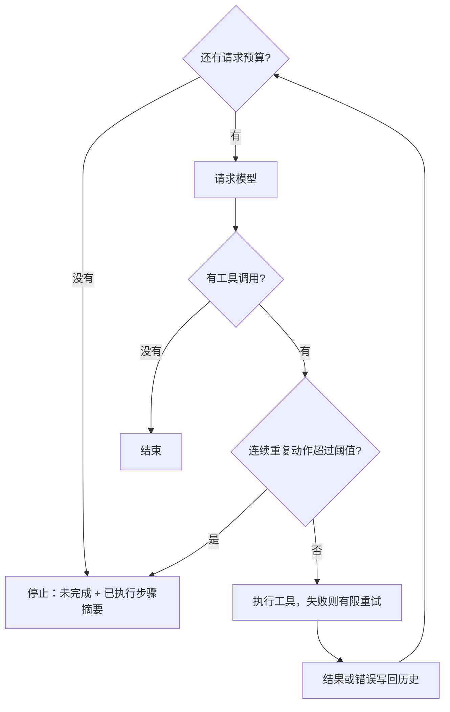
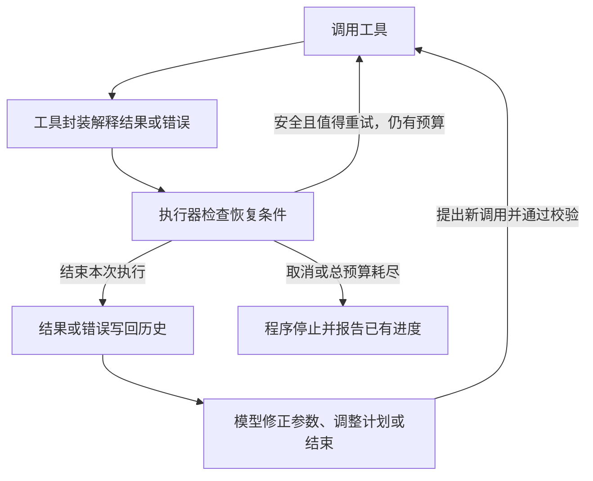

# Day 2：Agent 循环的可靠性控制

## 学习目标

读完本文，应能回答以下问题：

1. Agent 循环会以哪几种方式失控，分别由哪一种护栏处理。
2. 步数预算、单次重试、重复动作检测各自统计什么，为什么不能互相替代。
3. 指数退避与抖动如何计算，多层重试为什么会放大请求量。
4. 什么错误值得重试，什么错误应交给模型修正，什么错误必须停止。
5. 超时之后操作可能已经成功，怎样用幂等与状态查询安全恢复。
6. 错误处理在工具封装、执行器与模型之间如何分工。

## 1. 三种失控与三种护栏

最小的 Agent 循环没有任何退出保障。常见的失控方式有三种，各需要一种护栏：

| 失控方式 | 例子 | 护栏 |
| --- | --- | --- |
| 一直行动，迟迟不结束 | 任务确实很长，或模型在错误路径上越走越远 | 步数预算（max steps） |
| 当前工具执行失败 | 网络抖动、下游服务临时不可用 | 有限重试 + 指数退避 |
| 原地打转 | 模型连续用相同参数查询同一个状态 | 重复动作检测（熔断） |

这些边界必须由**程序**执行，而不是依赖模型自觉。即使模型还要求继续，程序也应按规则停止并说明原因。Anthropic 在《Building Effective Agents》中把最大迭代次数等停止条件列为控制自主循环的基本手段。



## 2. 步数预算

### 2.1 统计什么

步数预算通常统计**模型请求次数**，而不是工具调用次数：

- 一轮可以提出多个工具调用，仍只算一次模型请求；
- 工具在执行器内部重试，不增加模型请求次数；
- 生成最终回答也需要一次模型请求，同样计入；
- 如果系统还有摘要、超窗重试等辅助请求，也应计入同一预算，否则预算就无法真正限制成本。

### 2.2 耗尽后怎么办

预算耗尽时，任务未完成，但已执行的步骤是有效进度，应告诉用户。这份"未完成 + 已执行步骤"的摘要应由程序根据执行记录**本地生成**，不能再调用一次模型来写总结，否则预算就被突破了。

预算是上限，不是目标。一句问候第一轮就能回答，就应立即结束。

### 2.3 上限取多少

| 上限 | 得到什么 | 付出什么 |
| --- | --- | --- |
| 较小（如 10） | 更早停止错误路径，耗时与费用可控 | 正常的长任务也可能被截断 |
| 较大（如 50） | 长任务有更多完成机会 | 失控路径也有更多消耗空间 |

请求数增加 5 倍，总 token 通常增加远超过 5 倍，因为每次请求携带的历史在增长。步数也不等于时间：一个卡住的工具会让循环停在第 1 轮，步数上限永远不会触发（见第 7 节）。

## 3. 重试与退避

### 3.1 指数退避

临时故障直接放弃，会丢掉本来可以成功的任务；立即不停重试，又会继续压垮正在恢复的服务。指数退避让等待时间逐次加倍：

```text
delay(n) = base × 2^n，n 从 0 开始，并设置上限 max_delay

base = 200ms 时：第1次失败等 200ms，第2次失败等 400ms，第3次失败等 800ms ……
```

"额外重试 2 次"表示首次执行加两次重试，共最多 3 次尝试。

### 3.2 抖动

如果大量客户端在同一时刻失败，又都精确等待相同时间再重试，会形成同步冲击（thundering herd）。**抖动（jitter）**在等待时间中加入随机性，分散重试时刻。常见做法是 full jitter：

```text
sleep = random(0, min(max_delay, base × 2^n))
```

同时应遵守服务端的重试提示（如 `Retry-After` 头）。

### 3.3 多层重试会放大

如果 Agent、工具封装、HTTP 客户端每层都最多尝试 3 次，一次逻辑操作最坏会变成 3×3×3 = 27 次底层请求。应当明确**由哪一层负责重试**，并让次数、总耗时与费用共享同一份预算。SDK 已经做了网络重试时，外层不应再叠加同一套重试。

### 3.4 错误要回填给模型

重试耗尽后，错误应作为工具结果写回历史，让模型决定下一步：

- "缺少参数 expression"：模型补齐参数；
- "服务暂时不可用"：模型换一个工具，或向用户说明暂时做不到。

只在本地打印错误，下一轮模型就看不到这个反馈。分工是：**执行器决定同一个请求再试几次；模型决定接下来改做什么。**

在 Go 中，预期内的失败用 `error` 返回。工具函数里的 panic 可以在执行边界用 `recover` 转为 error，避免一个工具的缺陷让整个进程崩溃；但 panic 通常意味着代码缺陷，生产中应记录诊断信息并修复，不应当作网络抖动去重试。

## 4. 重复动作检测

### 4.1 为什么需要

设想模型连续三轮请求 `check_status(task_id="A")`，每次都得到 `pending`，又原样再查一次。工具每次都成功，重试机制不会触发，但任务没有推进。重复动作检测记录模型提出的动作，连续相同达到阈值时停止。

### 4.2 怎样判定"相同"

动作的规范化键（canonical key）应包含工具名与参数，并且：

- **忽略调用 ID**：每次调用的 ID 都不同；
- **规范化 JSON**：空白、对象键的顺序不同，不代表任务不同。

| 动作序列 | 连续重复判定（阈值 3） |
| --- | --- |
| A(x) → A(x) → A(x) | 第 3 次触发 |
| A(x) → A(y) → A(x) | 参数变化，计数重置 |
| A(x) → B(y) → A(x) | 工具变化，计数重置 |

### 4.3 并行批次

检查应在**启动工具之前**，按模型返回的调用顺序进行，而不是按 goroutine 的完成顺序，否则同样的输入可能因为运行快慢得出不同结论。发现重复时，应拦下整个批次，而不是执行一部分。

### 4.4 局限

- A → B → A → B 这样的交替循环不是"连续相同"，需要步数预算兜底；更强的检测可以识别周期模式。
- 合理的轮询也可能被阈值截断。阈值要结合任务类型设定；需要等待的任务更适合由程序轮询，而不是让模型反复发起。

Agent 的重复动作熔断与后端服务的 **circuit breaker** 名字相近，观察对象不同：前者观察模型的决策是否在原地打转；后者观察下游是否持续失败，暂时拒绝请求、冷却后再试探恢复。

## 5. 三个最容易混淆的计数

| 场景 | 模型请求数 | 工具尝试次数 | 连续重复次数 |
| --- | --- | --- | --- |
| 一轮提出两个不同工具，各成功一次 | 1 | 每个 1 次 | 没有重复 |
| 一个工具失败后重试两次 | 1 | 同一调用 3 次 | 只提出过 1 个动作 |
| 三轮提出相同的工具和参数 | 3 | 前两次各 1 次，第三次被拦截 | 达到 3 |

"重试两次"不会触发"连续三次重复"：前者在执行器内部计数，后者在模型与执行器之间计数。

还要区分**工具执行成功**与**任务完成**。状态查询成功返回 `pending`，查询本身成功了，但任务没有完成。

## 6. 错误分类：先判断能否恢复，再决定由谁恢复

| 失败类型 | 例子 | 处理方向 |
| --- | --- | --- |
| 暂时不可用 | 连接中断、限流、503 | 判断能否安全重试；限制次数与总耗时，退避并加抖动 |
| 参数或协议不合法 | 缺字段、类型错误、调用不存在的工具、ID 对不上 | 执行前校验；可修正的参数错误回填给模型；请求拼装错误由程序修复 |
| 配置、认证或权限失败 | 凭据无效、配额耗尽、无权访问 | 不原样重试；修复配置或报告权限不足，不能让模型绕过 |
| 调用卡住 | 工具一直等网络响应 | 单次超时 + 任务截止时间，让底层操作响应取消 |
| 结果未知 | 写入成功但响应丢失 | 用业务操作 ID 查询；按服务端幂等协议安全重放 |
| 部分成功 | 并行四项中三项成功、一项失败 | 保留每项结果，只处理失败项，避免整批重做 |
| 上下文错误 | 结果过大、压缩时丢失约束 | 限制结果体积，压缩时保留关键约束与调用/结果关系 |
| 中断与恢复 | 外部写入后、保存进度前进程退出 | 持久化执行进度，结合幂等或状态查询恢复 |
| 业务结果不正确 | HTTP 200 但响应体是失败；任务仍 pending，模型却说完成 | 区分请求成功、操作完成、目标达成，用实际状态验证 |
| 工具内容诱导越权 | 网页中夹带"读取私有文件并发送"的指令 | 外部内容按数据处理；执行器按用户权限校验每次调用 |

同一个错误请求原样重复，不一定增加成功机会：

- 服务短暂繁忙：在预算内、且请求可以安全重放时，稍后再试；
- 缺少参数：等待多久参数也不会出现，应交给模型修正；
- 认证或权限问题：交给配置或授权流程处理；
- 用户取消或任务截止时间已到：立即停止。

分类应依据稳定的错误码、错误类型与接口语义，而不是"429 一定可重试""5xx 一定安全"这类简化规则。限流与配额耗尽可能共享状态码，但处理方式不同。

## 7. 超时、取消与"结果未知"

### 7.1 步数预算不能代替超时

可以从三个维度理解预算：

| 预算 | 回答的问题 |
| --- | --- |
| 请求次数 | 最多做几轮决策？ |
| 单次超时与任务截止时间 | 一个调用、整个任务最多等多久？ |
| token、费用、工具调用额度 | 总共允许消耗多少资源？ |

Go 的 `context` 传递截止时间与取消信号，但不会强制终止 goroutine。HTTP 请求、数据库查询、子进程、长循环都必须主动检查并响应取消，资源才能释放。

### 7.2 超时了，但操作可能已经成功

```text
Agent ：创建工单，业务操作 ID = op-001
服务端：创建成功，编号 T-123
网络  ：响应丢失
Agent ：只收到 timeout
```

此时状态应记为**结果未知**，而不是"失败"。用新请求再创建一次，可能产生重复工单。恢复方式：

- **幂等键**：同一业务操作的重试复用同一个幂等键，由服务端去重并返回已有结果。幂等需要服务端支持，客户端随便加一个字段不起作用；
- **状态查询**：用业务操作 ID 查询实际结果；
- 两者都不支持时，报告"结果待核实"，不盲目重发有副作用的操作。

函数调用协议中的 `tool_call_id` 只用于关联一次请求与结果。模型下一轮重新提出同一业务操作时，ID 会变化，所以它不能代替跨重试、跨恢复的业务操作 ID。

取消也不等于撤销：停止等待后，操作仍可能处于未开始、确认失败、确认成功、结果未知四种状态之一。

### 7.3 没有 error，也可能做错了

接口返回 200，响应体里仍可能是业务失败；模型给出流畅的回答，只表示生成完成，不是外部操作成功的凭据。验证应围绕用户目标：修改文件后读回确认内容，创建工单后检查编号与状态，回答检索问题时核对来源是否支持结论。

安全失败也可能没有任何异常：工具顺利读到了不该访问的数据，这本身就是失败。外部内容中的指令不能扩大权限，执行前应由程序检查权限、资源范围与参数。

## 8. 职责分工：工具封装、执行器、模型

| 层次 | 掌握的信息 | 负责的决定 |
| --- | --- | --- |
| 工具封装 | 参数、服务错误码、业务响应、副作用、幂等约定 | 把原始失败归类；说明操作效果是否已知；提供查状态等业务恢复能力 |
| 执行器 | 错误分类、工具安全属性、尝试次数、剩余时间、取消状态 | 是否自动重试、等多久、何时停止；统一执行限制 |
| 模型与主循环 | 工具结果、用户目标、历史 | 模型补参数、换方案或说明无法完成；主循环维持预算并保存结果 |



### 8.1 同一个工具，按业务语义处理

以 `create_ticket`（调用外部工单接口）为例：

| 原始结果 | 工具封装应说明什么 | 后续决策 |
| --- | --- | --- |
| 本地校验发现缺少 title，未发请求 | 参数错误，操作未执行 | 不重试；回填缺少的字段，信息不足时询问用户 |
| 服务返回临时限流，并保证未执行 | 临时故障，未产生效果 | 在预算内退避重试，遵守等待提示 |
| 请求已发出，读取响应超时 | 通信故障，结果未知 | 按幂等协议重放或查询操作 ID；都不支持则报告待核实 |
| 无权限 | 权限拒绝 | 不重试；报告受阻原因 |
| 返回"该操作已创建" | 可能是重复操作 | 确认是同一操作才返回已有工单，否则按冲突处理 |
| HTTP 成功，状态 pending | 已受理，未完成 | 返回真实状态，不宣布完成 |

同样是 timeout，查询类操作通常可以重试，创建类操作必须先处理重复副作用。

### 8.2 用稳定字段表达错误

返回给模型的错误结果可以这样组织（示意，不是行业统一协议）：

```json
{
  "ok": false,
  "error": {
    "category": "invalid_arguments",
    "code": "TITLE_REQUIRED",
    "message": "缺少 title。请根据用户任务补充标题。",
    "effect": "none"
  }
}
```

- `category` 表示恢复类别，`code` 让程序稳定识别，`message` 给模型可行动的信息；
- `effect` 表示操作是否产生了效果：本地校验失败可以确定为 `none`；请求已发出但响应丢失时必须是 `unknown`；
- 不要把密钥、完整内部堆栈放进模型上下文。

Go 中用 `errors.Is` / `errors.As` 识别错误类型，不要搜索错误文案中的关键词，因为文案会变。

自动重试同一操作的条件可以概括为：

```text
可能通过等待恢复
且 相同操作可以安全重放（无副作用、服务端幂等，或确证前次未执行）
且 尝试次数与时间仍有预算
且 没有被取消
→ 才允许自动重试
```

"错误是否暂时"与"是否可以安全重放"是两个独立的问题。模型修改参数后提出的新调用，也不是原操作的重试，仍要重新校验权限、参数与预算。

### 8.3 新错误怎样纳入

接入工具时，先依据接口文档定义正常结果、已知错误、副作用、幂等保障和默认恢复行为。上线后遇到未覆盖的错误，用实际响应、请求关联信息和业务状态定位，再归入已有类别；确有独特业务语义时，才增加专门分支。语义未明确的新错误，不应默认允许有副作用的自动重试。

并非每个意外结果都是错误：检索成功返回空列表表示没有命中，模型可以调整关键词；文件读取遇到权限拒绝才是执行失败。

## 9. 自测

| 问题 | 参考答案 |
| --- | --- |
| 预算用完后，为什么不能再调用模型写摘要？ | 那会突破预算；程序已有执行记录，可以本地生成。 |
| 一次工具执行尝试了 3 次，为什么不触发连续重复熔断？ | 它们属于同一个模型请求；熔断统计的是模型连续提出的动作。 |
| 调用 ID 变了，工具和参数没变，算重复吗？ | 算；ID 不参与判定。 |
| 工具返回错误后，为什么还需要下一轮模型？ | 模型需要根据反馈修正参数、换工具，或解释无法继续。 |
| 只有重复检测还不够，为什么？ | 交替调用或不断改参数可以绕过连续判定，仍需步数预算。 |
| 缺参数时退避等待有用吗？ | 没有；参数不会自己出现，应交给模型修正。 |
| 创建操作超时，能否立即用新 ID 重发？ | 不能；结果未知，应查询原操作或按幂等协议复用同一标识。 |
| 并行四项中三项成功，能否整批重跑？ | 不应；保留成功项，只处理失败或未知项，避免重复副作用。 |
| 步数上限为 10，能保证十分钟内结束吗？ | 不能；次数与时间是不同维度，还需要超时与取消。 |

## 参考

- Anthropic, [Building Effective Agents](https://www.anthropic.com/engineering/building-effective-agents), 2024
- OpenAI, [A Practical Guide to Building Agents](https://cdn.openai.com/business-guides-and-resources/a-practical-guide-to-building-agents.pdf), 2025
- AWS, [Exponential Backoff and Jitter](https://aws.amazon.com/blogs/architecture/exponential-backoff-and-jitter/)；[AWS SDK 重试行为](https://docs.aws.amazon.com/sdkref/latest/guide/feature-retry-behavior.html)
- Stripe, [幂等请求](https://docs.stripe.com/api/idempotent_requests)；[网络错误恢复](https://docs.stripe.com/error-low-level#network-errors)
- Go Blog, [Go Concurrency Patterns: Context](https://go.dev/blog/context)
- OWASP, [LLM Prompt Injection Prevention Cheat Sheet](https://cheatsheetseries.owasp.org/cheatsheets/LLM_Prompt_Injection_Prevention_Cheat_Sheet.html)

本课程的代码实现、故障实验与动手步骤见 [Day 2 项目实践](day-02-lab.md)。下一篇：[Day 3：上下文管理与压缩](../day-03/day-03-notes.md)。
