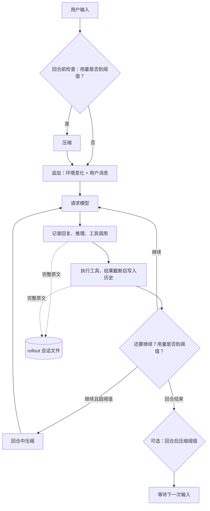

# Codex 上下文管理调研

这篇文档整理 OpenAI Codex（`codex` CLI，Rust 实现）如何管理上下文：每次请求由什么组成、历史怎样写入和计数、何时压缩、压缩成什么样，以及压缩出错时怎样保护。

本文定位为外部实现调研，结论限定在下述源码版本和复核范围；对本项目的启示是设计建议，不代表当前桌面安装的行为。本项目方案见 [上下文系统设计](context-system-design.md)，运行参数与实验见 [Day 3 实践](day-03-lab.md)。

## 0. 调研范围和资料

- **源码**：[openai/codex](https://github.com/openai/codex/tree/afb436df8b70bb5bc57b86d9a3e829968988cd21) 主分支，2026-10-04重新核对提交 `afb436df8b70bb5bc57b86d9a3e829968988cd21`。本次重点核对本地与远端v2的请求、裁剪、用户原话保留、阈值和工具输出处理；其他扩展机制沿用2026-10-03的调研。文中路径相对于 `codex-rs/`。
- **官方文档**：[配置参考](https://learn.chatgpt.com/docs/config-file/config-reference)、[AGENTS.md 说明](https://learn.chatgpt.com/docs/agent-configuration/agents-md)。
- **没读到的资料**：OpenAI 工程博客 *Unrolling the Codex agent loop* 访问被拒（403），本文没有使用它的内容。
- **看不到的部分**：远端压缩的结果由 OpenAI 服务端生成，而且是加密的；实验性 token 预算模式的笔记功能也依赖服务端。这两处只能描述客户端的行为。
- **官方压缩说明**：本次读取了[Codex Prompting Guide](https://developers.openai.com/cookbook/examples/gpt-5/codex_prompting_guide#compaction)和[Responses Compaction](https://developers.openai.com/api/docs/guides/compaction)。公开API支持请求内自动压缩与单独调用 `/responses/compact`；这不能直接替代对Codex客户端v2路径的源码核对，也不能证明当前桌面安装采用哪个分支。
- 源码迭代很快，常量和默认值以上述提交为准。

## 0.1 从这次allo案例理解关键区别

Codex的“给模型看的摘要输入”和“压缩后保留的用户原话”是两条独立的数据处理路径。

本地压缩先复制会话历史，用副本发送摘要请求。只有服务端返回 `ContextWindowExceeded`，才删副本中最旧的条目并重试；工具调用与结果会配对删除。摘要成功后，程序重新从会话历史取得用户原话，而不是从裁过的副本里取。因此，一句用户原话从摘要输入中删掉，不等于它一定从压缩后的上下文中消失。这里的会话历史是本次压缩前仍然活动的历史，不是重新扫描全部rollout；更早压缩已经淘汰的内容不会自动找回。

```text
本次压缩前的会话历史
  ├─ 复制 → 请求摘要 → 服务端报超窗才删旧条目、重试 → 文本摘要
  └─ 提取用户原话 → 从新往旧，最多20,000 token ────┐
                                                    ↓
                       新历史 = 保留的用户原话 + 文本摘要
                       初始指令与环境按压缩阶段重新注入
```

依据：[本地请求与错误处理](https://github.com/openai/codex/blob/afb436df8b70bb5bc57b86d9a3e829968988cd21/codex-rs/core/src/compact.rs#L262)、[重新获取会话历史](https://github.com/openai/codex/blob/afb436df8b70bb5bc57b86d9a3e829968988cd21/codex-rs/core/src/compact.rs#L349)、[原话保留算法](https://github.com/openai/codex/blob/afb436df8b70bb5bc57b86d9a3e829968988cd21/codex-rs/core/src/compact.rs#L669)。

| 方面 | Codex本地压缩 | Codex远端v2 | 本项目当前实现 |
| --- | --- | --- | --- |
| 压缩产物 | 模型生成的交接文本 | 服务端生成的不透明compaction条目 | 六段交接文本 |
| 原文保留预算 | 用户文本最多20,000 token | 用户等符合条件的保留消息合计最多64,000 token | 用户原话为换算后容量的10%；这次755 |
| 摘要前腾空间 | 服务端明确报超窗后，删临时副本的最旧条目 | 本地估算超窗时，替换末尾连续工具输出；遇到非工具输出停止 | 本地估算超过学习预算，就先删旧组；服务端超窗也会继续删 |
| 压缩后目标比例 | 未见40%目标或60%接受线 | 未见40%目标或60%接受线 | 40%软目标、60%接受线 |
| 固定保留最近K组工具链 | 没有本项目这样的K组尾部策略 | 没有本项目这样的K组尾部策略 | 默认最多2组，可因配额减少 |

这次真实对话直到“好，那你输出一下这篇文章”，共7条用户文本，按UTF-8字节/4逐条向上取整约3,237 token，包含“我叫allo”。按所查Codex本地文本保留规则推演，这些用户文本能全部放进20,000配额，不需要依靠后面那句assistant回答再次带出姓名。**这是对真实文本的预算核算与源码推演，没有把这条对话交给Codex实际运行，也不证明模型一定正确回答。**

它仍然有损：更长对话也会用尽原话配额；只在assistant或工具结果出现的信息主要依赖摘要；服务端的加密条目也不是公开可验证的无损存档。保留的优先级主要按消息类型和时间确定，没有在这里实现“姓名、账号永不丢失”的语义规则。

---

## 1. 总览



核心思路有三条：

1. **两次压缩之间，发给模型的历史只往后追加。** 环境或配置变化时追加一条更新，不改写开头，让前缀缓存一直有效。压缩是唯一的例外：它把整段历史**替换**成一份短得多的新历史，缓存失效一次，之后从这份新历史开始继续只追加。

   ```text
   请求 1   [初始上下文][用户1]                              
   请求 2   [初始上下文][用户1][回复1][工具1]                ← 开头和请求 1 相同，命中缓存
   …        每次都在后面追加，开头不变                         用量一路涨到 90%
   压缩     整段替换为 [初始上下文*][用户原话][摘要]          ← 和上一次不同，缓存失效一次
   请求 n+1 [初始上下文*][用户原话][摘要][回复][工具]          ← 开头和压缩后相同，又能命中
   ```

   用量曲线因此呈锯齿形：慢慢涨到 90%，压缩时骤降到几十 k，再慢慢涨。`初始上下文*` 是按当前状态重新生成的版本，之前追加的环境更新消息在这时被一并清掉。
2. **活动历史和完整记录分开。** 活动历史里的工具输出会被截断，完整内容保存在 rollout 文件里。
3. **接近窗口上限时一次性压缩。** 压缩后只保留用户原话、摘要（或压缩条目），以及重新注入的初始上下文。

---

## 2. 一次请求由什么组成

按在请求中的顺序：

| 部分 | 内容 | 来源 |
| --- | --- | --- |
| 基础指令 | 针对具体模型的系统提示词 | `core/src/session`，`get_prompt_base_instructions` |
| 工具定义 | shell、apply_patch、MCP 工具等的 schema | `tool_router.model_visible_specs()` |
| 初始上下文（developer 消息） | 权限与沙箱说明、协作模式、插件、skill、apps 等 | `build_initial_context_with_world_state` |
| 初始上下文（user 消息） | AGENTS.md 指令、环境信息（工作目录、shell、日期、时区、网络、文件系统权限等） | `context/world_state/*.rs` |
| 对话历史 | 用户消息、assistant 消息、推理条目（可能加密）、工具调用、工具输出 | `context_manager/history.rs` |

### 2.1 AGENTS.md 怎样加载

官方文档的规则：

- **全局级别**：先找 `~/.codex/AGENTS.override.md`，再找 `~/.codex/AGENTS.md`，只取第一个非空文件。
- **项目级别**：从项目根目录（通常是 Git 根目录）一路向下到当前目录。每一层依次查找 `AGENTS.override.md`、`AGENTS.md`，以及 `project_doc_fallback_filenames` 配置的备用文件名。
- **合并顺序**：从根目录往下拼接，离当前目录越近的越靠后，所以优先级越高。
- **大小上限**：所有文件合计达到 `project_doc_max_bytes`（默认 32 KiB）就不再加入。源码中的常量是 `AGENTS_MD_MAX_BYTES = DEFAULT_PROJECT_DOC_MAX_BYTES // 32 KiB`。
- **加载时机**：每次运行开始时构建一次。用户级和项目级之间用 `--- project-doc ---` 分隔（`core/src/agents_md.rs`）。
- 项目被标记为不受信任时，不读取项目里的 AGENTS.md。

---

## 3. 稳态：只追加，用"差异"表达变化

`core/src/context/world_state/` 把初始上下文拆成很多段（section），例如 `environment`、`agents_md`、`permissions`、`collaboration_mode`、`model`、`tools`、`context_window_guidance` 等。每一段都实现 `render_diff`：

- 和上一次的快照相同：**不输出任何内容**。
- 发生了变化：**在历史末尾追加一条更新消息**。例如 AGENTS.md 内容变了，会追加一条带"替换说明"的新指令（`world_state/agents_md.rs`），而不是改写开头那份。
- 多个可合并的更新会合成一条消息（`context_manager/updates.rs`）。

这样即使中途切换了目录、日期变了、权限改了，旧的前缀也一个字节都不变，缓存依然有效。代价是历史里会多出几条更新消息，下次压缩时一并清理。

压缩之后，基准快照被清空，下一次请求会完整重新注入初始上下文，而不是只追加差异。

---

## 4. 写入历史时做的处理

### 4.1 工具输出截断

- 每条工具输出写入活动历史时，按模型的截断策略或配置 `tool_output_token_limit` 截断（`context_manager/history.rs`，`record_item_with_metadata`）。
- 截断方式是**去掉中间、保留开头和结尾**（`utils/output-truncation`，`truncate_middle_chars` 和 `truncate_middle_with_token_budget`）。命令输出的开头通常是命令本身和早期信息，结尾通常是错误和最终结果，两头都有用。
- 源码注释：

  > Tool output truncation applies only to live history, preserving full rollout payloads.

  截断只作用于活动历史，rollout 文件里保存的是完整内容。

- 截断在写入时就完成，之后这条内容不再改变，所以不会破坏缓存。

### 4.2 历史规范化

`context_manager/normalize.rs` 在把历史发给模型前保证几条不变量：

- 每个工具调用都有对应的输出。缺失的输出补一条 `"aborted"`，例如用户中断了工具执行。
- 每个工具输出都有对应的调用。孤立的输出会被删除。
- 模型不支持的图片或音频内容会被移除。

删除最旧条目时，`remove_first_item` 会顺带删除与它配对的调用或输出，避免留下孤立的一半。

### 4.3 完整记录：rollout 文件

- 会话中的每一条记录都写入本地 rollout 会话文件，用于 `/resume` 恢复和 `/fork` 分叉。
- 压缩会以 `Compacted` 记录写入，其中带着替换后的历史（`replacement_history`）。恢复会话时，从最近一次压缩点开始重建，而不必重放全部历史（`session/rollout_reconstruction.rs`）。
- 另有 `history.persistence`（`save-all` 或 `none`）和 `history.max_bytes`，控制是否保存对话记录文件 `history.jsonl`，以及它的大小上限。

---

## 5. 用量怎样计算

`context_manager/history.rs` 的 `get_total_token_usage`：

```text
当前用量 = 上一次响应 usage 的 total_tokens
         + 估算(上一次模型输出之后新加入的条目)
         [+ 服务端没计入的历史推理条目的估算]
```

- 大部分数字来自服务端返回的真实 usage，只有最近新增的那一小段需要估算。
- 估算器按字节粗算，源码注释说它是"粗略的下限，不是精确的分词计数"。
- 压缩后还没有新的真实 usage，`recompute_token_usage` 会用估算值（基础指令 + 全部条目）作为临时用量。

---

## 6. 什么时候压缩

### 6.1 阈值

`protocol/src/openai_models.rs` 和 `session/context_window.rs`：

| 名称 | 计算方式 |
| --- | --- |
| 自动压缩阈值 | 默认`total`口径为 `min(model_auto_compact_token_limit, 窗口 × 90%)`。不配置时取模型默认推导值；`body_after_prefix`口径可直接使用配置的增量阈值，不能把90%钳制规则套到所有模式 |
| 硬上限 | 窗口 × `effective_context_window_percent`（默认 95%），达到时必须压缩 |
| 计数范围 | `model_auto_compact_token_limit_scope`：`total`（默认，计算整个活动上下文）或 `body_after_prefix`（只计算上次压缩留下的前缀之后新增的部分） |
| 回合后阈值 | `model_post_turn_compact_threshold_percent`，大于 0 时启用：回合结束后达到这个百分比就提前压缩 |

普通模式有自动阈值和完整窗口保护，没有本项目那种“40%目标、60%接受”的压缩后百分比规则。压缩后剩多少，由第8节的组成决定。实验性token预算模式还可给自动阈值加兜底缓冲；具体看[阈值计算](https://github.com/openai/codex/blob/afb436df8b70bb5bc57b86d9a3e829968988cd21/codex-rs/core/src/session/context_window.rs#L55)。

### 6.2 触发时机

`core/src/session/turn.rs`：

| 时机 | 条件 | 压缩后初始上下文怎么放 |
| --- | --- | --- |
| 回合前 | 用量达到阈值或硬上限 | 不立即注入，下一次请求完整重新注入 |
| 回合前：换了更小窗口的模型 | 旧模型的用量超过新模型的阈值，且旧窗口比新窗口大 | 用**旧模型**来压缩，失败时改用新模型重试 |
| 回合前：压缩兼容标识变化 | 前后两个模型的 `comp_hash` 不同 | 用旧模型压缩，原因记为 `CompHashChanged` |
| 回合中 | 模型还要继续（有工具结果或排队的输入），且用量达到阈值 | 插在最后一条真实用户消息之前 |
| 回合后（可选） | 达到回合后阈值，且没有排队的输入 | 不立即注入 |
| 手动 | 用户执行 `/compact` | 不立即注入 |

回合中压缩时，初始上下文放在最后一条用户消息之前，源码注释给出的理由是：模型在训练中习惯看到压缩摘要位于历史末尾。

普通请求如果直接报"超出上下文窗口"，Codex 会把当前用量标记为已满，结束这一回合并报错。下一回合开始前的检查就会触发压缩。

---

## 7. 三种压缩实现

`turn.rs` 中的 `run_auto_compact` 按以下顺序选择：

| 实现 | 什么时候用 | 结果 |
| --- | --- | --- |
| token 预算模式（实验） | 开启 `TokenBudget` 功能 | 不做摘要，直接开一个新的上下文窗口 |
| 远端压缩 v2 | 服务商支持远端压缩（OpenAI 自家服务） | 服务端返回一个加密的压缩条目 |
| 本地压缩 | 服务商不支持远端压缩（例如其他 OpenAI 兼容接口） | 客户端请求模型写一段文本摘要 |

实际分支由功能开关与provider的 `remote_compaction` 能力决定：先判断TokenBudget，再在V2和Unsupported之间选择远端或本地。不能只根据登录方式断言当前桌面会话使用哪条路径。[分支源码](https://github.com/openai/codex/blob/afb436df8b70bb5bc57b86d9a3e829968988cd21/codex-rs/core/src/session/turn.rs#L1482)

### 7.1 本地压缩（`core/src/compact.rs`）

1. 在完整历史末尾追加一条 user 消息，内容是压缩提示词，用**同一个模型**发出请求。提示词可以用 `compact_prompt` 或 `experimental_compact_prompt_file` 替换。
2. 服务端明确返回 `ContextWindowExceeded` 时，**从摘要请求副本最旧的一条开始删除**，连带处理工具配对，然后重试。它没有本项目按小实验预算先行裁剪的判断。修改靠前的消息可能破坏后续前缀缓存，不能把“删最旧”解释为缓存命中保证。
3. 网络等其他错误按退避策略重试。
4. 构造新历史：
   - **用户消息原文**：重新读取未被摘要请求裁剪改动的会话历史，从最新往前收集，总量不超过 `COMPACT_USER_MESSAGE_MAX_TOKENS = 20_000`；放不下的那一条截断后停止。之前的摘要消息不算用户消息，不会被重复保留。这里只保留当前会话历史仍有的原话，不从全部rollout找回更早已淘汰的内容。
   - **摘要**：一条 user 消息，开头是固定前缀，放在最后。
   - **assistant 消息、推理、工具调用和工具输出全部丢弃。**
5. 按第 6.2 节的规则重新注入初始上下文，然后用估算值重新计算用量。
6. 提示用户：

   > Heads up: Long threads and multiple compactions can cause the model to be less accurate. Start a new thread when possible to keep threads small and targeted.

压缩提示词（`prompts/templates/compact/prompt.md`）原文：

```text
You are performing a CONTEXT CHECKPOINT COMPACTION. Create a handoff summary for another LLM that will resume the task.

Include:
- Current progress and key decisions made
- Important context, constraints, or user preferences
- What remains to be done (clear next steps)
- Any critical data, examples, or references needed to continue

Be concise, structured, and focused on helping the next LLM seamlessly continue the work.
```

摘要前缀（`prompts/templates/compact/summary_prefix.md`）原文：

```text
Another language model started to solve this problem and produced a summary of its thinking process. You also have access to the state of the tools that were used by that language model. Use this to build on the work that has already been done and avoid duplicating work. Here is the summary produced by the other language model, use the information in this summary to assist with your own analysis:
```

注意它的措辞："另一个模型"写下了摘要，"你"在此基础上继续。摘要被定位为交接材料，而不是模型自己的记忆。

### 7.2 远端压缩 v2（`core/src/compact_remote_v2.rs`、`compact_remote_v2_attempt.rs`）

1. **请求前先腾空间**（`compact_remote_history.rs`，`trim_function_call_history_to_fit_context_window`）：如果估算超出窗口，就从历史**末尾**往前，把连续的工具输出替换成 `Output exceeded the available model context and was truncated`，直到放得下，遇到不是工具输出的条目就停止。这处理的是“刚返回一个超大工具输出”的情况，没有在这个分支里通用地逐条删除最早用户消息。[源码](https://github.com/openai/codex/blob/afb436df8b70bb5bc57b86d9a3e829968988cd21/codex-rs/core/src/compact_remote_history.rs#L68)
2. **请求内容**：和普通请求相同的基础指令、相同的工具定义、完整历史，最后追加一个 `CompactionTrigger` 条目。由于前缀和平时完全一样，这次压缩请求本身也能命中缓存。
3. **结果**：服务端必须返回**恰好一个** `compaction` 条目，否则视为错误。这个条目是不透明的，客户端看不到内容。
4. **构造新历史**（`build_v2_compacted_history`）：
   - 保留用户消息（以及hook注入的提示），从新往旧收集；符合条件的保留消息共享 `RETAINED_MESSAGE_TOKEN_BUDGET = 64_000`，不是给每一类单独64,000。[构造新历史](https://github.com/openai/codex/blob/afb436df8b70bb5bc57b86d9a3e829968988cd21/codex-rs/core/src/compact_remote_v2.rs#L506)
   - 多 agent 场景下，保留不超过 `MAX_RETAINED_AGENT_MESSAGE_TOKENS = 10_000` 的 agent 消息，但不保留子 agent 的进度消息和最终答复。
   - 开启对应功能时，保留客户端写入的 developer 消息，以及有预算限制的图片。
   - 最后放入 `compaction` 条目。
5. 按第 6.2 节的规则重新注入初始上下文。
6. 因为切换模型而触发的压缩，如果旧模型失败，就改用当前模型重试（`compact_model_fallback.rs`）。
7. 传输层重试次数最多 2 次，比普通请求少，因为一次压缩可能耗时很长。

### 7.3 token 预算模式（实验，`compact_token_budget.rs`、`session/token_budget.rs`）

- **启用条件**：开启 `ContextManagement` 功能、模型支持、使用 OpenAI 官方路由，并且账号是 ChatGPT Plus、Pro 等付费套餐。
- **把上下文交给模型自己管**：
  - 剩余 token 低于阈值时，向历史追加一条提醒，告诉模型还剩多少。
  - 模型可以调用 `new_context` 工具（描述是 "Start a new context window. Does not clear, reset, or otherwise affect environment state."），主动开一个新的上下文窗口。
  - 剩余为 0 时，追加一条兜底提示（`auto_compact_fallback_prompt`）。
- **新窗口的内容**：重新构建的初始上下文，加上被保留的客户端 developer 消息。旧历史**不做摘要**，内容的延续依靠一个"笔记"扩展。这个扩展通过服务端和 MCP 实现，开源代码里看不到细节。
- 新窗口会告诉模型首个、上一个和当前的窗口 ID（`context/token_budget_context.rs`）。

---

## 8. 压缩后的上下文由什么组成

以远端压缩v2为例，压缩后的下一次请求包括：

```text
基础指令 + 工具定义                           ← 固定开销
权限、协作模式、AGENTS.md、环境信息……         ← 重新注入，固定开销
保留的用户原话                                ← 0 到 6.4 万 token
compaction 条目                               ← 服务端生成，大小不透明
```

本地压缩把最后两部分换成"最多 2 万 token 的用户原话 + 文本摘要"。

实际使用中，压缩后通常剩下**几十 k token**。固定开销加上用户原话，本身就有这个量级，相比 90% 的触发线已经很低，所以一次压缩之后能运行很长时间。`turn.rs` 的一条注释也依赖这一点：

> as long as compaction works well in getting us way below the token limit, we shouldn't worry about being in an infinite loop.

这个数量级是根据用户的实际观察和上述上限推断的，我没有实际运行 Codex 测量。

---

## 9. 出错时的保护

| 情况 | 处理 |
| --- | --- |
| 回合前压缩失败 | 仍然记录用户这次的输入，不让它丢失；报告错误，不继续请求 |
| 回合后压缩失败 | 保留已经完成的回答，只记录警告 |
| 压缩请求本身超出窗口 | 本地：从最旧的一条开始逐条删除后重试；远端：先替换末尾的超大工具输出 |
| 网络等瞬时错误 | 按退避重试，次数有上限 |
| 用户中断 | 直接返回，不重试 |
| 压缩钩子 | `PreCompact` 和 `PostCompact` 钩子可以中止这一回合 |
| 多次压缩导致的效果下降 | 提示用户开新线程 |

---

## 10. 用户能控制什么

**配置项**（[配置参考](https://learn.chatgpt.com/docs/config-file/config-reference)）：

| 配置 | 作用 |
| --- | --- |
| `model_context_window` | 模型上下文窗口大小 |
| `model_auto_compact_token_limit` | 自动压缩阈值；默认total口径按窗口90%钳制，其他口径见第6节 |
| `model_auto_compact_token_limit_scope` | 阈值的计数范围：`total` 或 `body_after_prefix` |
| `model_post_turn_compact_threshold_percent` | 回合后提前压缩的百分比 |
| `compact_prompt` / `experimental_compact_prompt_file` | 替换压缩提示词 |
| `tool_output_token_limit` | 每条工具输出在历史中的 token 上限 |
| `project_doc_max_bytes` / `project_doc_fallback_filenames` | AGENTS.md 的大小上限 / 备用文件名 |
| `history.persistence` / `history.max_bytes` | 是否保存对话记录 / 记录文件大小上限 |

**斜杠命令**（`tui/src/slash_command.rs`）：

| 命令 | 说明 |
| --- | --- |
| `/compact` | 总结对话，避免达到上下文上限 |
| `/new` | 在对话中开始一个新聊天 |
| `/clear` | 清屏并开始新聊天 |
| `/fork` | 分叉当前聊天 |
| `/resume` | 恢复已保存的聊天 |
| `/status` | 显示当前会话配置和 token 用量 |

---

## 11. 可观测性

每次压缩都会发出一个分析事件（`compact.rs`，`CompactionAnalyticsAttempt`），字段包括：

- 触发方式（自动或手动）、原因（上下文上限、模型切换、`comp_hash` 变化、用户请求）、阶段（回合前、回合中、回合后、独立回合）、实现（本地、远端）；
- 压缩前后的活动上下文 token 数、摘要 token 数；
- 压缩请求的缓存命中 token 数和缓存写入 token 数；
- 保留的图片数量、状态（完成、失败、中断）、错误类型、耗时。

策略名统一记为 `Memento`。

---

## 12. 设计思想总结

1. **尽量复用缓存。** 平时只追加；环境变化用差异追加；远端压缩请求尽量复用普通请求前缀。删改靠前历史可能使后续缓存失效，命中情况以实际usage为准。
2. **两份历史。** rollout 保存完整内容，活动历史可以有损地截断和压缩。
3. **用户原话是最可靠的锚。** 两种摘要式压缩都逐字保留用户消息（2 万或 6.4 万 token），不靠模型去复述用户要什么。
4. **压缩是交接。** 提示词把摘要定位成写给"下一个模型"的交接材料，内容是进展、决定、约束、下一步和关键数据。
5. **稳定内容不摘要。** 系统指令、AGENTS.md、环境信息在压缩后从来源重新注入。
6. **重建历史而非反复微调。** 达到触发条件后，以有限保留内容和压缩产物替换活动历史；没有本项目的40%目标或60%接受线。
7. **压缩失败不能丢东西。** 用户输入和已完成的回答都要保住。
8. **新方向：让模型自己管理上下文。** token 预算模式让模型看到剩余量，并自己决定何时开新窗口。

---

## 13. 对本项目的启示

本项目调用方舟的 Chat Completions，没有远端压缩，对应的是 Codex 的**本地压缩**路径。可以直接借鉴的：

- 用 `usage` 加增量估算来计算用量；
- 写入时截断工具输出、保留头尾，完整原文另存；
- 以模型容量和明确预算触发，压缩后重建固定组成；默认total口径的自动阈值最多90%；
- 压缩后保留用户原话，加上交接式摘要；
- 本地路径在服务端明确报摘要输入超窗后，才裁剪摘要请求副本；构造新历史时独立从未裁副本的会话历史选用户原话；
- 压缩失败时，保住用户输入和已有结果。

不适用的：

- 加密的压缩条目，依赖 OpenAI 服务端；
- `body_after_prefix` 计数范围、`comp_hash` 机制，依赖模型目录和服务端；
- token 预算模式里的笔记扩展，依赖服务端。

具体方案见 [上下文系统设计](context-system-design.md)。

---

## 14. 源码索引

| 文件（相对 `codex-rs/`） | 内容 |
| --- | --- |
| `core/src/session/turn.rs` | 回合主循环；压缩的触发时机和实现选择 |
| `core/src/session/context_window.rs` | 阈值、硬上限、计数范围 |
| `protocol/src/openai_models.rs` | `auto_compact_token_limit` 的 90% 上限，`effective_context_window_percent` 默认 95 |
| `core/src/compact.rs` | 本地压缩、保留用户消息、初始上下文插入位置、分析事件 |
| `core/src/compact_remote_v2.rs`、`compact_remote_v2_attempt.rs` | 远端压缩 v2 的请求与新历史构造 |
| `core/src/compact_remote_history.rs` | 远端压缩前替换末尾的超大工具输出 |
| `core/src/compact_model_fallback.rs` | 切换模型后的压缩重试 |
| `core/src/compact_token_budget.rs`、`core/src/session/token_budget.rs` | token 预算模式、剩余量提醒、兜底提示 |
| `core/src/tools/handlers/new_context_window_spec.rs` | `new_context` 工具定义 |
| `core/src/context_manager/history.rs` | 活动历史、写入时截断、用量计算、删除最旧条目 |
| `core/src/context_manager/normalize.rs` | 调用与输出配对、补 `aborted`、删除孤立输出 |
| `core/src/context_manager/updates.rs`、`core/src/context/world_state/` | 初始上下文分段与差异追加 |
| `core/src/agents_md.rs` | AGENTS.md 的查找与拼接 |
| `core/src/session/rollout_reconstruction.rs` | 从 rollout 和压缩记录重建会话 |
| `prompts/templates/compact/` | 压缩提示词和摘要前缀 |
| `utils/output-truncation/` | 去掉中间、保留头尾的截断 |
| `tui/src/slash_command.rs` | 斜杠命令说明 |
