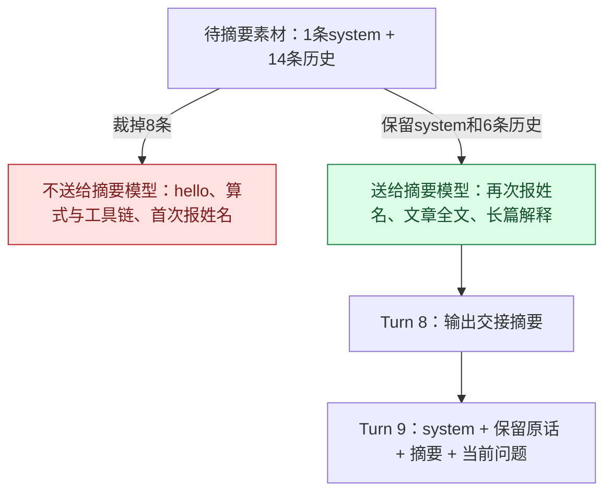

# Day 3 项目实践：完整记录、模型视图与集中压缩

原理见 [Day 3 学习笔记](day-03-notes.md)，设计依据见 [上下文系统设计](context-system-design.md)，动画见 [Day 3 课件](../slides/day-03.html)。本文记录本项目的参数、一次真实压缩、方舟实测、终端输出与动手步骤。启动与模型配置见根目录 [README](../../README.md)。

## 1. 参数与实现

| 项 | 本项目 |
| --- | --- |
| 数据 | `Context` 在进程内存中维护 Transcript 与 View（[context_manager.go](../../context_manager.go)）；主循环用 `Append` 写入、`Next` 在请求前准备、`RecordReply` 记录回复与用量位置 |
| 输入容量 | `-context-window 12288` − 输出预留 4096 − `-reasoning-reserve 1024` = 7168。这是学习用的配置窗口，不是模型官方窗口 |
| 输出上限 | `-max-output-tokens` 默认 0：不向 API 发送上限，4096 只作本地预留；设为正数才发送 `max_completion_tokens`（含推理），并按该值预留 |
| 三条线 | 触发 90%（6451）、软目标 40%、接受上限 60%；摘要目标约 5% |
| 工具输出 | `-tool-output-tokens 2000`，写入 View 时保留头尾，标记"中间省略N字，模型无法再读取这部分" |
| 配额 | 最近组 `-keep-groups 2`，不超过 20%；用户原话不超过 10%；K 可减到 0 |
| 估算 | 约 4 字节 1 token 加消息开销；压缩前按"真实 ÷ 粗估"把容量换算为 `est_cap` |
| 摘要请求 | 原生前缀 + 摘要指令；带工具时发送 `tool_choice: "none"`；计入 `-max-steps` |
| 停止边界 | 只剩 1 次额度不摘要；摘要不递归；服务端超窗只重试一次；连续两次紧邻压缩后停止 |
| 持久化 | 无数据库；观测台续聊时经 `-history-stdin` 恢复上次 View 与最后回答 |

## 2. 一次真实压缩

在 `hello → 算式 → 我叫allo → 《石钟山记》` 这条观测台对话里，用户粘贴了重复的长文章，模型给了较长解释。用户再问"好，那你输出一下这篇文章"时，发送前估算达到 7603，超过触发线 6451。

1. 先尝试清理旧工具结果，收益不足，放弃清理副本。
2. 摘要请求本身也超出预算：从待摘要的 1 条 system + 14 条历史中，先删掉最早的 8 条（hello 及回复 2 条、算式及工具链 4 条、首次报姓名及回复 2 条）。计算结果 24354 在这一步就离开了摘要输入。
3. Turn 8 发送 1 条 system + 6 条历史 + 1 条摘要指令，得到交接摘要：用户叫 allo、讨论苏轼《石钟山记》、已完成讲解。
4. Turn 9 只剩 4 条 messages：

| 顺序 | role | 内容 |
| --- | --- | --- |
| 1 | system | 工具助手规则 |
| 2 | user | 保留的原话："这个石钟山记讲了什么，你解释一下" |
| 3 | user | 历史交接摘要（固定前缀标明是数据） |
| 4 | user | 当前问题："好，那你输出一下这篇文章" |



新视图保留了 allo，但没有 24354，也没有文章全文。观测台里还能翻到原文，不代表模型能读到。

## 3. 方舟实测：为什么带工具时粗估偏低

真实请求，`reasoning_effort=minimal`：

| 请求 | prompt_tokens |
| --- | --- |
| system + "你好" | 39 |
| 同上，再带 1 个 calculator 定义 | 473 |
| 同上，再加 `tool_choice: "none"` | 39 |
| 上一轮 assistant 带或不带 2400 字推理，后接新用户消息 | 57 / 57 |
| 同一轮工具循环中，带 tool_calls 的 assistant 带或不带这段推理 | 528 / 1928 |

- 1 个小工具定义实际约 430 token，按 JSON 字节粗估只有几十；
- `tool_choice: "none"` 时方舟不渲染工具定义，工具任务里摘要请求很难命中前缀缓存；不带工具的 33 轮实验中，摘要缓存命中 5944/6337；
- 推理只在当前工具循环内计入输入，所以"上次 prompt + completion"在工具循环中准确；新一轮会多算一次推理，下一次真实 usage 自动校正。

压缩时的换算日志：

```text
Compact scale: real=6533 est=8022 est_cap=8801   ← 中文对话粗估偏高约23%，换算后容量变大
Compact scale: real=1927 est=1169 est_cap=897    ← 带工具的任务粗估偏低，换算后容量变小
```

## 4. 读终端输出

- `Context:` 用量来源（真实 usage 加增量 / 初始粗估 / 服务端满窗口）、容量、触发线，以及 system（含工具定义）、保留原话、摘要、最近区的粗估大小。
- `Compact:` 压缩前后大小、清理数量、摘要消息数、保留组数、重试次数；`Compact input: drop_group=起..止 protected=保留区边界` 表示摘要输入删了哪一组。
- `Model request:` 区分 `purpose=main` 与 `compact`；`Usage:` 记录输入、输出与 cached_tokens，缺失时显示 unavailable。

## 5. 动手

```sh
# 普通任务，默认 high 推理
go run . -question '先查学习笔记中的循环职责，再计算职责数量乘以25。'
# 33 轮真实对话 + 大工具输出实验
go run . -context-lab -max-steps 60 -context-window 8192 -max-output-tokens 2048 -reasoning-effort minimal
```

实验第 1 轮给出账号，第 2 轮规定只讨论 Day 3，第 33 轮询问这两条。所有回复与摘要都由真实模型生成，程序检查 Transcript 未被压缩改写。召回之后，模型通过仅实验启用的 `read_day3_notes` 读取 Day 3 学习笔记全文，观察写入截断与原文保留。

网页观察：`go -C observer run .`，点击左侧"Day 3 上下文实验"。对话流中压缩显示为"上下文已压缩"分隔线；切到"观测"，点"终端输出"看 `Context`、`Compact`、`Recall`，切"迷宫"看输入量曲线。直接在根目录运行实验会绕过代理，不会出现在网页里。观测台续聊会恢复上次 View（含摘要），新问题重新获得请求预算。

## 6. 阅读代码

先读 [react.go](../../react.go) 中的 `Append`、`Next`、`RecordReply` 调用位置，再读 [context_manager.go](../../context_manager.go) 的 `Prepare` 与 `summarize`，最后对照 [llm.go](../../llm.go) 的 usage 结构与请求计数器。[context_lab.go](../../context_lab.go) 是实验入口。

| 带着问题读 | 在哪里 |
| --- | --- |
| 工具结果在哪里截断？ | 写入 View 的追加路径 |
| UsageAt 为什么在回复追加之后记录？ | `RecordReply` |
| 清理的收益门槛与 keep-groups 保护在哪里？ | `Prepare` 的清理分支 |
| 摘要输入放不下时删哪一组？ | `summarize` 中的 `protected` 与 `drop_group` |
| 只剩 1 次请求时为什么停止？ | `Prepare` 中的预算检查 |
