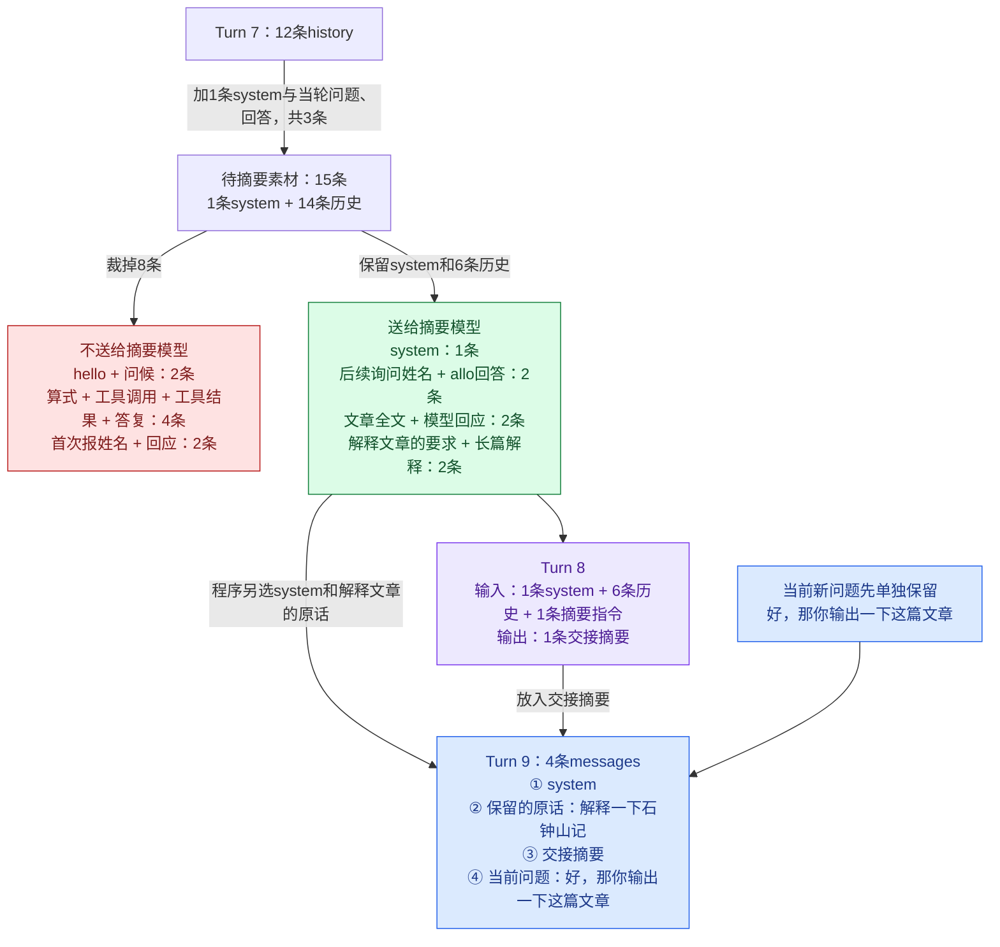
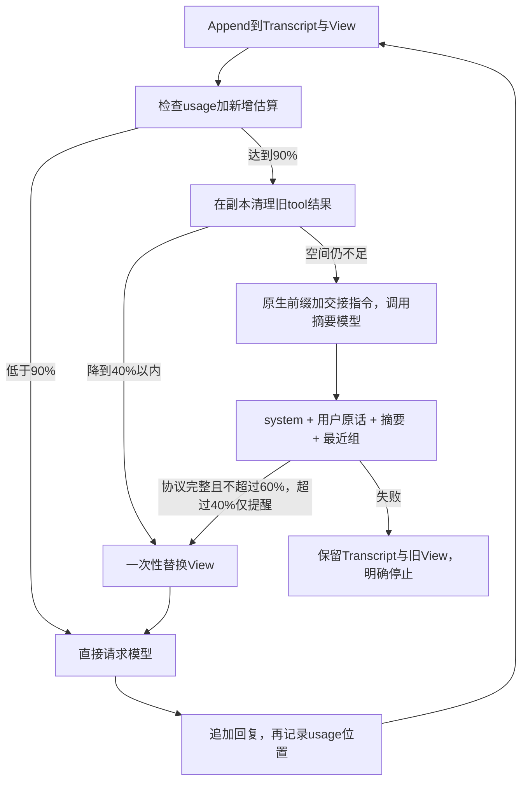

# Day 3：完整记录、模型视图与集中压缩

这版实现依据[上下文系统设计](context-system-design.md)重构。学习目标是理解：消息原文如何保留，模型每次实际看到什么，什么时候值得花一次请求压缩，以及压缩失败时如何停止。

它对应岗位中的上下文工程、运行控制、模型协议与可观测性。代码仍用Go标准库，不使用框架或脚本模型。

想先看消息怎样移动，打开 [Day 3课件](../slides/day-03.html)：已按“基本概念 → 压后组成与曲线 → Codex流程 → 案例与项目参数”重排为14页。[Codex动画从第7页开始](../slides/day-03.html#s7)，第13页单独说明本项目现有参数。按右箭头逐步播放，左箭头回看，P自动播放。曲线的谷底由保留内容决定，不固定在40%，也不保证达到绝对最小值。超窗删除过程是机制示意；allo预算来自真实文本，Codex结果是源码推演。课件重排没有改变本项目Go压缩逻辑，下文仍解释当前代码行为。

## 先看一次真实压缩：旧原文怎样变成下一次请求

压缩改的是下一次发给模型的阅读材料。平时把问题、回答和工具结果追加进View；材料接近容量时，程序保留一部分原话和最近消息，让模型把旧内容写成交接摘要，再组装更短的View继续任务。观测台中以前的聊天记录仍然存在，模型下一次只能看到这份重新组装的输入。

在 `hello → 算式 → 我叫allo → 《石钟山记》` 这条实际对话中，用户粘贴了重复的长文章，模型又给了较长的解释。用户接着问“好，那你输出一下这篇文章”时，发送前的占用估算达到7603，超过默认触发线6451。

程序先尝试清理旧工具结果；这些结果省下的空间不足以达到目标，于是额外请求模型写摘要。这是Turn 8。它生成的摘要记录了用户叫allo、讨论的是苏轼《石钟山记》、已经完成内容讲解等信息。

这里还有一次摘要之前的裁剪：摘要请求本身也受输入预算限制。这次程序先从待摘要材料中删掉8条最早的消息（hello及回复2条、算式及工具链4条、首次报姓名及回复2条），再发送给摘要模型。按修正后的展示口径，system独立于history计数：Turn 7携带1条system、12条history、1条当前问题，共14条messages。将该问题和随后生成的回答加入历史后，待摘要材料是1条system加14条历史；裁掉8条历史后，Turn 8携带1条system、6条history、1条摘要指令，共8条messages。最新的“好，那你输出一下这篇文章”单独保留，不在待摘要材料里。因此history的12→6是摘要前裁剪的净变化；system加剩余历史的7条仍是原文，并不是已生成的摘要。旧界面的13→7把system误计入history，现已修正。24354在进入摘要模型之前就被移除了。

下面按这次真实请求画出消息去向。红色表示从摘要输入里裁掉，绿色表示仍交给摘要模型；旧观测记录没有因此删除。



绿色的7条包含1条system和6条历史，只表示“供摘要模型阅读”，不表示它们都会原样进入Turn 9。全文和长解释之后由摘要承接，system和选中的用户原话单独保留。

随后Turn 9的请求实际只剩4条messages：

| 顺序 | role | 内容与用途 |
| --- | --- | --- |
| 1 | system | 原来的工具助手规则 |
| 2 | user | 保留原话：“这个石钟山记讲了什么，你解释一下” |
| 3 | user | 程序包装的历史交接摘要，含用户姓名与对话进度 |
| 4 | user | 当前问题：“好，那你输出一下这篇文章” |

工具定义仍在请求的tools字段。Turn 9继续原任务，可以回答，也可以先调用工具；写摘要本身并不等于完成用户任务。后面新消息继续追加，直到再次达到触发线，才会再整理。新的摘要会结合上次摘要和后来追加的旧消息生成。

这是有损压缩。这次新的输入保留了allo，但没有保留早先的计算结果24354，也没有带上文章全文。下一次模型能否正确复述某个事实，取决于该事实是否仍在发送内容里；不能因为原文还能在观测台翻到，就认为模型也能读到。需要逐字引用的材料应保留原文或通过工具重新取回，目前没有读取旧对话原文的工具。

数字各自负责不同的事：90%决定何时整理；40%是希望整理后的占用；60%是摘要后可以接受的上限。具体保留几条用户原话、几组最近消息由预算决定，不是固定每隔几轮压缩，也不是每次只保留最后两轮。

## 1. 先分清两份数据

| 数据 | 用途 | 变化方式 |
| --- | --- | --- |
| Transcript | 保存本次运行的完整对话与工具结果 | 只追加，不被压缩改写 |
| View | 真正发给模型的messages | 平时只追加；成功压缩时整体替换 |

二者在agent进程内存中。单独运行CLI时，退出后不会自动恢复；通过观测台续聊时，观测台利用已有请求存档，经 `-history-stdin` 恢复上次View与最后的回答，再追加新问题。新的Transcript从这一恢复点继续记录，不把压缩前的全部原文重新加载。所谓“完整结果已保存”，仍指当前运行的Transcript；本课没有增加数据库、额外日志文件或读取历史原文的工具。

模型只能利用本次发送的View。原文还在Transcript，说明程序没有丢记录；如果没有放回View或通过工具重新读取，模型仍然无法直接访问它。

在 [context_manager.go](../../context_manager.go) 中，Context统一管理这两份状态。主循环通过Append写入，通过Next在请求前准备上下文，再把回复交给RecordReply。

## 2. 平时只追加，工具输出在写入时处理

用户消息和assistant消息进入两份记录时保留原文。工具结果进入Transcript时也保留原文；进入View时，如果超过tool-output-tokens上限，就保留头尾，在中间插入明确的省略标记。

```text
实际工具结果 → Transcript：完整原文
             → View：开头 + [中间省略N字，模型无法再读取这部分] + 结尾
```

截断在首次写入时完成。后面普通追加消息，不反复改写这条工具结果。这使两次压缩之间的请求可以共享已有前缀。能否实际命中缓存，还取决于服务端；应看cached_tokens，而不是只看消息是否相同。

截断也可能损失位于中间的关键数据。Transcript保留原文有助于以后恢复，但本课没有原文检索工具，不能把“记录还在”当成“模型知道”。所以省略标记直接告诉模型这部分读不到，而不是暗示它去找Transcript。

## 3. 容量与用量要分开

```text
输入容量 = context-window - 输出预算预留 - reasoning-reserve
触发线   = 输入容量 × 90%
软目标   = 输入容量 × 40%
接受上限 = 输入容量 × 60%
```

默认窗口12288、输出预算预留4096、额外预留1024，因此输入容量为7168。这是学习程序配置的窗口，并非宣称模型的官方窗口只有这么大。

方舟的max_completion_tokens已经包含推理与可见回答。max-output-tokens现在默认0，表示不发送该参数，让供应商采用默认输出策略；显式设为正数才发送。这里的4096只是本地输入预算预留，不会把high推理截在4096；省略参数仍受服务端默认限制。显式配置输出上限时，输入预算改为按配置值预留。reasoning-reserve是额外安全余量。

用量优先依据真实API响应：

```text
本次预计用量 = 上次prompt_tokens + completion_tokens
             + 上次回复之后新增消息的估算量
```

关键在于“之后”：RecordReply先追加本次assistant回复，再记录UsageAt。这样下一轮只估算之后的新用户消息、工具结果，不会把已经在completion_tokens里的回复再算一遍。

首次请求、成功压缩后，或API没有返回usage时，才全量粗估。粗估按序列化字节约4字节一个token并加入消息开销；工具定义也计入固定开销。它不是精确分词器，特别是加密思考块的字节长度不等于模型实际输入token。上一轮completion中的推理也不一定全部计入下一轮输入，因此这条用量预测不是严格单调增长的。

触发判断用真实用量，但压缩时要比较“这几组消息放进去有多大”，只能用粗估。两种口径不能混用：粗估偏高时，会无谓地多删；偏低时，压完的实际占用会超过目标。所以Prepare先算出当前View的“真实用量 ÷ 粗估”比例，把容量换算成粗估单位（终端里的`est_cap`），之后的40%、60%、20%、10%配额和摘要请求能否放下，都和这个换算后的容量比较。服务端报超窗时，真实用量至少等于容量，比例按此取值。

```text
Compact scale: real=6533 est=8022 est_cap=8801   ← 中文对话粗估偏高约23%，换算后容量变大
Compact scale: real=1927 est=1169 est_cap=897    ← 带工具的任务粗估偏低，换算后容量变小
```

为什么带工具时粗估偏低？用真实方舟请求测过（reasoning_effort=minimal）：

| 请求 | prompt_tokens |
| --- | --- |
| system + “你好” | 39 |
| 同上，再带1个calculator工具定义 | 473 |
| 同上，再加tool_choice: "none" | 39 |
| 上一轮assistant带或不带2400字reasoning_content，后面是新用户消息 | 57 / 57 |
| 同一轮工具循环中，带tool_calls的assistant带或不带这段推理 | 528 / 1928 |

由此可以读出三件事：

- 一个小工具定义实际约占430 token，服务端会把它包装成很长的工具说明；按JSON字节粗估只有几十。比例换算能吸收这类偏差，但它是固定量而不是比例，所以仍是近似。
- tool_choice: "none"时，方舟不把工具定义放进prompt。摘要请求因此和带工具的普通请求在开头就不同，工具任务里摘要请求很难命中前缀缓存；不带工具的33轮实验里，摘要缓存命中5944/6337。
- 推理内容只在当前这一轮工具循环中计入输入；新用户消息到来后，之前轮次的推理被服务端丢弃。所以“上次prompt + completion”在工具循环中是准确的；换到新一轮时会多算一次推理量，下一次真实usage会把它校正回来。

## 4. 到触发线后，先尝试便宜的清理

程序先复制View，把最近keep-groups个完整消息组（至少1组，通常就是刚返回的工具结果）以外的tool结果换成占位说明，保留调用ID和参数。清理和摘要用同一个“最近”的定义。本来就比占位说明还短的结果不替换。

只有清理后的整个候选View能够降到40%目标线内，才采用它。否则丢弃清理副本，摘要模型仍看到未清理的原View，避免先把需要摘要的数据抹掉。

这样做的目的是让一次前缀改写换来足够空间。若每轮只省掉一点，后面很快又需要压缩，会持续增加延迟、费用和信息损失。

这里的“原View”中，工具结果可能已经在写入时截断。它不同于完整的Transcript。

## 5. 需要摘要时，先确定保留哪些消息组

一个消息组是：

- 一条用户消息；
- 一条assistant消息，连同它请求的全部工具结果。

普通assistant回答没有工具结果，自己就是一组。程序在发送前校验，不允许孤立tool结果、缺失结果或重复调用ID。

默认希望保留最近2组，但最近组有容量20%的配额。超过配额就把K逐次减小；即使满足20%，如果system、用户原话、最近组再加摘要目标仍放不进40%软目标，也继续减少K，最小可以为0。因此新设计不再承诺永远保留最近6条；它承诺保留的组是完整的，且在既定配额内。

上次压缩生成的摘要，以及单独保留的较早用户原话，不会被当作新的最近消息组。

## 6. 摘要请求保留原生消息前缀

摘要请求直接使用：

```text
system + 切点之前的原生messages + 一条user摘要指令
```

同一运行中，普通请求与摘要使用相同模型、工具定义和推理强度；摘要额外传tool_choice: "none"，通过API协议禁止工具调用，而不只依赖提示词。该参数已用真实方舟调用确认可用。如果上游仍返回违规的工具调用，程序保留异常校验并拒绝执行。

历史不再被序列化为一大段JSON文本交给另一个system。这样，摘要请求和已有请求仍有共同的原生消息前缀。但tool_choice可能影响服务端组织工具上下文的方式，不能仅凭“它在messages之外”就保证缓存命中不变；仍以cached_tokens实测为准。system负责维持原规则，摘要只整理对话事实，不改写system本身。

六段交接摘要是：用户目标、当前状态、关键数据、决定与发现、失败记录、下一步。账号、路径、ID和数字要求逐字保留，没有内容就写“无”。摘要目标最多约占容量5%，并结合实际剩余空间缩小；它是生成目标，模型不保证精确遵守。最终候选View不超过60%就可接受；超过40%时打印提醒，继续任务。

如果摘要请求预计放不下，或服务端明确拒绝超窗，就删掉一组再试。删除顺序是：先删保留区之后最旧的原始消息组；保留区（较早的用户原话和上一份摘要）最后才删。保留区是更早历史仅剩的载体，上一份摘要一旦被删，更早的事实就永久离开View。终端会打印`drop_group=起..止 protected=保留区边界`。这个处理仅影响摘要请求副本，不修改Transcript或现有View；没有可用历史时明确停止。

同一运行中，tool_choice: "none"只在请求带工具时发送；不带工具的请求本来就不能调用工具，不少兼容接口还会拒绝没有tools的tool_choice。

需要注意：从摘要请求中淘汰旧组也会丢失该次摘要的输入事实。更大的窗口、合理输出预留与后续记忆检索才能减少这种损失，不能靠摘要提示词保证永远记住。

## 7. 成功后重建View

```text
system：从systemPrompt等可信来源重新生成
较早用户原话：从新往旧收集，再按时间排序，总量不超过容量10%
历史交接摘要：一条带固定前缀的user消息，明确只是历史数据
最近K组：原生消息与完整工具结果
```

用户原话从Transcript读取，排除已经在最近组中的消息。遇到配额边界时，只对最旧的边界消息做带标记的截断；不让模型改写用户原话。合成摘要没有真实用户来源ID，因此不会被误收集成用户原话。

原文优先保留，也不等于所有用户消息都会永久进入View。长对话中，早期账号或约束可能已经不在10%的原话配额里，需要靠摘要保留。

40%是希望一次省出足够空间的目标，不是硬失败线。例如容量2000，目标800，接受上限1200，压缩后900会提醒并继续。新View超过60%接受上限、摘要为空、模型失败或协议配对不合法时，才不替换当前View并报告错误。K已减到0仍无法给摘要留出60%以内的空间时，也会明确停止。通过检查后才整体替换，并清空旧usage基准；下一次真实响应会建立新基准。



## 8. 四个停止边界

1. 摘要和普通请求共用max-steps。摘要请求、超窗失败请求和重试，都消耗一次额度。需要摘要但只剩1次额度时，不做摘要，直接以max_steps停止，避免最后一次额度花在摘要上、却没有机会继续回答。
2. 摘要请求不会递归触发Prepare，防止“为摘要再次摘要”的循环。
3. 某次普通请求被服务端明确拒绝超窗，标记为已满，压缩后只重试一次；其他HTTP错误不会触发这条恢复路径。
4. 压缩后下一次决策前又需要压缩，这种紧邻触发连续出现两次，就在第三次压缩前停止，报告各部分占用。

最后一种情况通常说明新增单项太大，或可用容量太小。程序不会靠无限摘要掩盖容量配置问题。

## 9. 观察终端和观测台

Context行区分真实usage加增量、初始粗估和服务端满窗口标记。system一项包含工具定义；其他项显示保留用户区、摘要区和最近原始区的粗估大小。分项用于定位占用来源，不是精确计费。

Compact行说明一次处理前后大小、清理数量、摘要消息数、保留组数和摘要重试次数。Model request区分main与compact。Usage记录服务端输入、输出、cached_tokens；字段缺失时显示unavailable，不冒充0。

观测台中的用户问题标为user，点击查看该条输入；每个Turn的history入口只展示本次已发送的历史。点击message查看完整模型调用，输入分为系统规则、历史与本轮输入，三者合起来才是模型收到的messages；system始终独立计数，新对话首轮没有history。压缩后的旧原话与摘要进入history，避免看起来像重新提问。观测台把摘要显示为独立模型调用，不把摘要正文当作最终回答；依据实际请求前缀变化标记视图重建。它按调用ID跨请求查找tool结果，不再假设messages长度永远增长。缓存命中应直接查看API返回值，共同前缀只表示具备复用条件。

想在网页观察这组对话，先在项目的 `observer/` 目录执行 `go run .`，打开观测台后选择“Day 3 上下文实验”，点击“运行实验”。页面会启动 `-context-lab -max-steps 60 -reasoning-effort minimal`，不必再在另一个终端运行实验。点击“终端输出”看压缩与召回，切换“迷宫”看输入量变化；完整操作见[观测台笔记](../observer/observer-notes.md)。直接在根目录运行实验会绕过代理，所以不会自动出现在网页。

观测台也支持手动续聊：选中左侧已有对话，输入下一句话，点击“继续提问”。此前生成的摘要会随View一起恢复，后续仍按90%阈值检查；摘要不混入用户原话保留区。Day 3实验默认续接前面33轮对话。每个新问题的请求预算重置，观测台的Turn计数保持连续。

## 10. 自己运行

完整参数与方舟配置见[README](../../README.md)。普通任务仍然使用默认high推理：

```sh
go run . -question '先查学习笔记中的循环职责，再计算职责数量乘以25。'
```

33轮实验用同一个模型和统一minimal推理，降低学习实验的推理耗时；普通请求和摘要使用相同的推理强度，摘要额外禁用工具调用：

```sh
go run . -context-lab -max-steps 60 -context-window 8192 -max-output-tokens 2048 -reasoning-effort minimal
```

第1轮给账号，第2轮规定只讨论Day 3，第33轮询问这两条信息。期间每个回复与摘要都由真实模型生成，程序检查Transcript没有被压缩修改，并检查未压缩时View不被改写。

召回实验之后，模型通过仅实验启用的read_day3_notes工具实际读取本地学习笔记，观察写入截断、原文保留和正常回答。这个工具在召回结束后才启用，避免笔记中的示例账号干扰召回实验。

这些是实际行为观察，模型输出会波动。没有模型替身、假摘要或预置工具决策。实验程序只打印终端输出，不另存日志；通过观测台启动时，观测台沿用已有的observer/runs存档，便于回看。

## 11. 阅读代码与自测

先读 [react.go](../../react.go) 中的Append、Next和RecordReply，再读 [context_manager.go](../../context_manager.go) 的Prepare与summarize；最后对照 [llm.go](../../llm.go) 的usage结构和请求计数器。[context_lab.go](../../context_lab.go) 是真实实验入口。

| 问题 | 参考理解 |
| --- | --- |
| Transcript保留了账号，模型就一定知道吗？ | 不一定，模型只看到View；需要原话、摘要或检索把账号带回输入。 |
| 为什么在写入时截断工具输出？ | 限制单条视图大小，同时使之后普通追加不改写已有前缀。 |
| 清理后的候选仍高于40%，为什么不先采用它？ | 收益不足；还会让摘要输入丢掉工具事实，应直接用原View摘要。 |
| 为什么UsageAt记录在回复追加之后？ | 上次usage已经包含这次回复，避免下一轮再次估算它。 |
| 粗估和真实用量差20%，压缩会出什么问题？ | 偏高时多删、偏低时压完仍超目标；所以先用当前比例把容量换算成粗估单位再比较。 |
| 摘要请求放不下时为什么不先删最旧的消息？ | 最旧的是保留的用户原话和上一份摘要，删掉它们会永久丢失更早的事实；先删它们之后的原始消息组。 |
| 最近2组为什么可能变成0组？ | 最近原文超出20%配额时需要减少K，才能给固定内容和摘要留空间。 |
| 为什么不能按user角色收集所有View消息？ | 摘要也是user角色，必须根据来源区分它与真实用户输入。 |
| 公共前缀相同就证明缓存命中吗？ | 不能；要看服务端cached_tokens，并注意缺失值与0不同。 |
| 压缩后超过40%就失败吗？ | 不会，40%是软目标；在60%内提醒后继续。超过60%或真正的请求/协议错误才保留旧视图并报错。 |
| 固定部分挤占摘要空间怎么办？ | 重新选切点，逐步减少K并重新收集用户原话；到0仍无法容纳时停止。 |

详细设计与调研保留在[上下文系统设计](context-system-design.md)和[Codex调研](codex-context-research.md)。当前学习笔记解释本项目实际行为，调研中的其他产品机制不是本项目已经实现的功能。
