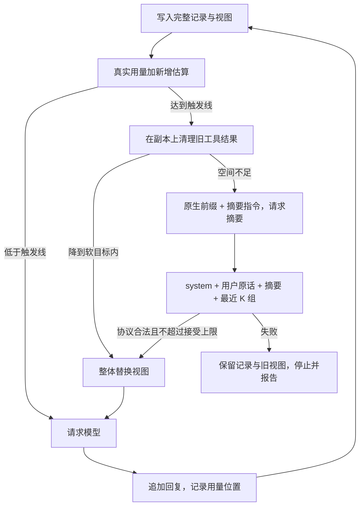

# Day 3：上下文管理与压缩

## 学习目标

读完本文，应能回答以下问题：

1. 为什么 Agent 需要主动管理上下文，而不是等窗口溢出再处理。
2. "完整记录"与"模型视图"为什么要分开，模型到底能看到什么。
3. 输入容量如何规划，用量如何测量，估算偏差会造成什么问题。
4. 截断、清理工具结果、摘要压缩、外部记忆各适合什么情况，各丢失什么。
5. 摘要压缩应保留哪些内容，摘要请求本身放不下时怎么办。
6. 压缩与前缀缓存之间存在什么冲突，如何减少代价。
7. 压缩失败或反复触发时，循环应在哪里停止。

## 1. 问题：上下文是一种有限资源

Agent 的每次请求都要携带系统提示、工具定义、对话历史和工具结果。任务越长，输入越大，会遇到四个问题：

| 问题 | 说明 |
| --- | --- |
| 窗口上限 | 输入加输出超过模型窗口，请求直接失败 |
| 成本与延迟 | 输入 token 按量计费；每轮都重发全部历史，总量随轮数近似平方增长 |
| 注意力稀释 | 窗口未满时质量也会下降：长上下文中段的信息更容易被忽略（"lost in the middle"），无关内容会干扰判断 |
| 体积失控 | 一次工具调用可能返回很长的文件或网页，单条消息就占满窗口 |

Anthropic 把这类工作称为**上下文工程（context engineering）**：在每一步，决定窗口里应该放什么、放多少，让模型用尽量少的高信号 token 完成任务。它不只是"满了再删"，而是贯穿写入、组装、压缩与取回的全过程。

## 2. 完整记录与模型视图

一个清晰的做法是维护两份数据：

| 数据 | 用途 | 变化方式 |
| --- | --- | --- |
| 完整记录（Transcript） | 保存全部对话与工具原文，用于审计、调试与恢复 | 只追加，压缩不改写它 |
| 模型视图（View） | 每次真正发送给模型的 messages | 平时只追加；压缩成功时整体替换 |

关键事实：**模型只能利用本次发送的 View。** 原文仍在 Transcript 中，说明程序没有丢失记录；但如果它没有被放回 View，或者没有工具能把它重新取回，模型就无法访问它。"记录还在"不等于"模型知道"。

把两者分开，可以独立决定"保存什么"和"展示什么"：完整记录可以持久化到文件或数据库，视图则按预算精心组装。

## 3. 写入时控制工具输出

工具结果是视图膨胀最常见的来源。比较稳妥的做法是在**首次写入视图时**处理：

```text
工具原文 → 完整记录：保留原文
         → 模型视图：开头 + [中间省略 N 字，模型无法再读取这部分] + 结尾
```

- **保留头尾**：很多输出的关键信息在开头（标题、摘要）或结尾（错误、统计）。
- **明确的省略标记**：告诉模型这里有缺失、缺了多少、能否再读取。如果没有取回原文的工具，标记就不应暗示"可以去别处找"。
- **只在写入时处理一次**：之后不再改写这条消息，视图的前缀保持稳定（见第 9 节缓存）。

截断可能恰好丢掉中间的关键数据。更好的方式是工具本身支持分页、过滤或返回摘要，或者把大结果写入文件，只把路径和摘要放进视图，需要时再读取（Manus 称之为把文件系统当作外部上下文）。

## 4. 容量规划

窗口要同时容纳输入与输出：

```text
输入容量 = 模型窗口 − 输出预留 − 安全余量
```

- **输出预留**：推理模型的推理 token 通常也计入输出上限（例如 `max_completion_tokens` 包含推理与可见回答）。预留过小，长推理会被截断；预留过大，可用输入变少。本地用于规划的预留值，与是否向 API 发送输出上限参数，是两个独立的决定。
- **安全余量**：吸收估算误差。

在输入容量上设置几条线，常见设计是：

| 线 | 作用 | 示例比例 |
| --- | --- | --- |
| 触发线 | 达到后开始压缩 | 90% |
| 软目标 | 希望压缩后的占用，留出足够余量避免很快再次触发 | 40% |
| 接受上限 | 压缩结果超过它就视为失败 | 60% |

触发线与软目标之间的距离形成**滞回**：一次压缩换来足够空间，而不是每轮都省一点、频繁压缩。每次压缩都会产生额外请求、延迟、缓存失效与信息损失。

## 5. 用量测量：真实值与估算值

### 5.1 以 API 返回值为准

最可靠的用量来自 API 响应中的 `usage`。下一次请求前的预计输入可以这样计算：

```text
预计输入 = 上次 prompt_tokens + 上次 completion_tokens
         + 上次回复之后新增消息的估算量
```

上次回复已经计入 completion_tokens，所以只估算"之后"新增的用户消息和工具结果，避免重复计算。首次请求、刚压缩后、或 API 没有返回 usage 时，才对整个视图做估算。

### 5.2 估算的偏差

常见的粗估方法按字节或字符数换算（如约 4 字节一个 token），它不是分词器，偏差可能很大：

- 中文、代码、JSON 的字节与 token 比例差别很大；
- **工具定义**会被服务端包装成较长的说明文字，实际占用可能是 JSON 字节估算的数倍乃至十倍；
- **推理内容**：许多服务在新的用户轮次开始后，不再把先前轮次的推理计入输入；但在同一轮工具循环中，推理需要保留并计入。Anthropic 的扩展思考文档描述了这一规则。具体行为因服务而异，应实测。

### 5.3 两种口径不能混用

"是否触发"可以用真实用量判断，但压缩时要比较"这几组消息放进去有多大"，只能用估算。如果触发线用真实值、配额用估算值，估算偏高时会多删，偏低时压缩后仍超目标。

一个简单的校准方法：用当前视图的"真实用量 ÷ 估算用量"作为比例，把容量换算成估算单位，再用这个换算后的容量计算各项配额。比例能吸收按比例出现的偏差，但对工具定义这类固定开销只是近似。

### 5.4 用量不是单调增长的

新的用户轮次开始时，旧推理不再计入输入，用量会下降；压缩后用量会大幅下降。用量曲线是锯齿状的，监控时应看趋势与触发点，而不是假设它只增不减。

## 6. 压缩策略的谱系

| 策略 | 做法 | 成本 | 丢失什么 |
| --- | --- | --- | --- |
| 截断 / 滑动窗口 | 只保留最近 N 条或 N token | 无额外请求 | 早期全部信息，包括目标与约束 |
| 清理旧工具结果 | 把较早的工具结果替换为占位说明，保留调用本身 | 无额外请求 | 旧结果的具体内容；调用痕迹仍在 |
| 摘要压缩 | 让模型把较早历史写成交接摘要，替换原文 | 一次模型请求 | 摘要没有写进去的细节，属于有损 |
| 外部记忆与检索 | 把信息写入文件或存储，需要时由工具取回 | 存储与检索成本 | 取决于写了什么、能否找回 |

实践中常组合使用：先做便宜的清理，空间不够再摘要；需要逐字保留的材料放到外部，通过工具取回。Anthropic 的 API 提供"清理旧工具结果"一类的上下文编辑能力；Codex、Claude Code 等编码 Agent 在接近窗口上限时自动做摘要压缩（compaction）。

**清理要有收益门槛**：只有清理后能降到软目标以内，才采用清理结果；否则直接摘要，并让摘要模型看到未清理的原文，避免先把需要摘要的事实抹掉。

## 7. 消息组：压缩的最小单位

函数调用协议要求 assistant 的 `tool_calls` 与随后的 tool 结果严格配对。因此压缩时不能按单条消息切，而要按**消息组**切：

- 一条用户消息自成一组；
- 一条 assistant 消息，连同它请求的全部工具结果，构成一组；
- 没有工具调用的 assistant 回答自成一组。

切点只能落在组与组之间。任何时候都不能出现孤立的 tool 结果、缺失的结果或重复的调用 ID。组装完视图后、发送之前，应校验这些约束。

## 8. 摘要压缩的设计

### 8.1 压缩后的视图由什么组成

```text
system      ：从可信来源重新生成，不让摘要改写规则
用户原话    ：较早的用户消息原文，按配额保留（例如不超过容量 10%）
交接摘要    ：一条带固定前缀的消息，声明它只是历史数据
最近 K 组   ：最近几组原始消息与完整工具结果（例如不超过容量 20%）
```

- **用户原话优先原样保留**：用户的目标、约束、账号、路径等措辞往往最关键，模型改写可能走样。配额不够时，保留较新的原话，只截断边界上最旧的那条，并加标记。
- **最近 K 组保留原文**：模型正在进行的工作需要完整的最近上下文。K 不是固定承诺：最近组超出配额，或固定部分加摘要放不进软目标时，K 逐步减少，必要时可以减到 0。
- **摘要必须可区分**：摘要通常以 user 角色出现，必须用前缀或元数据标明来源，避免下一次压缩把它当作真实用户原话保留。

### 8.2 摘要写什么

一个实用的交接摘要结构：

```text
1. 用户目标      2. 当前状态      3. 关键数据（账号、路径、ID、数字逐字保留）
4. 决定与发现    5. 失败记录      6. 下一步
```

没有内容的部分写"无"，以免模型编造。摘要长度应有目标上限（例如容量的 5%），但模型不保证精确遵守，组装后仍要检查总量。再次压缩时，新摘要应合并上一份摘要和其后的历史。

### 8.3 摘要请求怎样发送

直接在原有消息之后追加一条摘要指令：

```text
system + 切点之前的原生 messages + 一条"请写交接摘要"的指令
```

而不是把历史序列化成一大段文本交给另一个系统提示。这样摘要请求与之前的普通请求共享原生前缀，有机会命中缓存；同时原有规则仍然生效。

摘要请求应在协议层禁止工具调用（如 `tool_choice: "none"`），而不只是在提示词里要求；如果仍收到工具调用，执行器应拒绝执行。注意：有的服务在 `tool_choice: "none"` 时不渲染工具定义，摘要请求的前缀因此与普通请求不同，缓存命中会受影响；实际效果以 `cached_tokens` 为准。

### 8.4 摘要请求本身放不下

摘要请求也受窗口限制。放不下时，必须从**摘要输入的副本**中删掉一部分再试，删除顺序很重要：

- 先删保留区之后最旧的原始消息组；
- 保留区（较早的用户原话和上一份摘要）最后才删：它们是更早历史仅剩的载体，一旦删除，那些事实就永久离开了视图。

这只影响摘要请求，不改动完整记录与当前视图。被删除的组中的事实也不会进入新摘要，这是窗口不足的代价。

### 8.5 接受与替换

检查通过后才**整体替换**视图：协议配对合法、摘要非空、总量不超过接受上限。超过软目标但在接受上限内，记录提醒后继续；超过接受上限、摘要失败或协议不合法，保留旧视图并报告错误。替换后清空旧的用量基准，由下一次真实响应重新建立。



## 9. 压缩与前缀缓存

主流服务都提供**前缀缓存**（prompt caching）：请求开头与近期请求相同的部分，可以复用已计算的结果，降低延迟和费用。命中的前提是前缀**逐字节相同**。

这带来几条设计原则：

- 平时只在末尾追加，不回头修改旧消息（这也是工具输出要在写入时一次处理的原因）；
- 系统提示与工具定义保持稳定，不在其中放时间戳等易变内容；
- 每次压缩都会改写前缀，之后的第一次请求基本无法命中缓存。压缩越频繁，缓存收益越低，这是需要滞回的另一个原因。

前缀相同只表示**具备复用条件**，是否实际命中要看响应中的 `cached_tokens`。字段缺失和值为 0 含义不同，前者是"未知"。

## 10. 停止边界

压缩本身也可能失控，需要明确的边界：

1. **压缩请求计入同一预算**。需要摘要但只剩 1 次请求额度时，应直接停止：把最后一次额度花在摘要上，就没有机会继续回答了。
2. **摘要请求不递归压缩**，避免"为摘要再做摘要"。
3. **服务端报告超窗时只重试一次**：标记已满，压缩后重试；其他错误不走这条路径。
4. **连续压缩熔断**：压缩后下一次决策前又需要压缩，连续出现时停止，并报告各部分占用。这通常说明单项内容过大或容量配置过小，不能靠无限摘要掩盖。

## 11. 压缩是有损的

例子：一段对话中，用户早先报了姓名，计算过一个数，后来粘贴了一篇长文章并请求讲解。接近窗口上限时触发压缩：新视图保留了讲解请求的原话、记录了姓名与进度的摘要，以及当前问题；而那次计算的结果、文章全文都没有进入新视图。

此后模型能否复述某个事实，取决于它是否还在发送内容里。需要逐字保留的材料，应保留原文或提供取回工具，不能指望摘要提示词记住一切。长对话中，早期的约束可能已经不在用户原话配额内，只能依靠摘要；摘要漏写，约束就会丢失。

## 12. 可观测性

调试上下文问题时，应记录：

- 每次请求前的预计用量、来源（真实值加增量 / 全量估算）、触发判断结果；
- 视图的组成：system 与工具、用户原话区、摘要区、最近原文区各占多少；
- 每次压缩的前后大小、清理数量、被摘要的消息数、保留组数、摘要重试与删除情况；
- 区分普通请求与压缩请求；记录 usage 与 cached_tokens，缺失时标为不可用而不是 0。

## 13. 自测

| 问题 | 参考答案 |
| --- | --- |
| 完整记录里有账号，模型就一定知道吗？ | 不一定；模型只看到视图，需要原话、摘要或检索把它带回输入。 |
| 为什么在首次写入时截断工具输出？ | 限制单条体积，同时避免之后改写旧消息、破坏前缀缓存。 |
| 清理后仍高于软目标，为什么不先采用清理结果？ | 收益不足且会让摘要输入丢掉工具事实；应直接用原视图摘要。 |
| 为什么用量基准要记录在回复追加之后？ | 上次 usage 已包含这次回复，避免下一轮重复估算。 |
| 估算比真实值低 20%，压缩会出什么问题？ | 压缩后实际占用超过目标；应先用真实/估算比例校准容量。 |
| 摘要请求放不下时，为什么不先删最旧的消息？ | 最旧的是保留的用户原话和上一份摘要，删掉会永久丢失更早的事实。 |
| 最近 2 组为什么可能变成 0 组？ | 最近原文超出配额时需要减少 K，才能给固定部分和摘要留出空间。 |
| 为什么不能按 user 角色收集用户原话？ | 摘要也常用 user 角色，必须按来源区分。 |
| 公共前缀相同就说明缓存命中了吗？ | 不能，要看 cached_tokens。 |
| 压缩后超过软目标就算失败吗？ | 不算；软目标是期望值，超过接受上限或出现协议错误才失败。 |

## 参考

- Anthropic, [Effective context engineering for AI agents](https://www.anthropic.com/engineering/effective-context-engineering-for-ai-agents), 2025
- Anthropic, [Context windows](https://docs.anthropic.com/en/docs/build-with-claude/context-windows)；[Extended thinking](https://docs.anthropic.com/en/docs/build-with-claude/extended-thinking)；[Prompt caching](https://docs.anthropic.com/en/docs/build-with-claude/prompt-caching)
- OpenAI, [Prompt caching](https://platform.openai.com/docs/guides/prompt-caching)
- Manus, [Context Engineering for AI Agents: Lessons from Building Manus](https://manus.im/blog/Context-Engineering-for-AI-Agents-Lessons-from-Building-Manus)
- Liu et al., [Lost in the Middle: How Language Models Use Long Contexts](https://arxiv.org/abs/2307.03172), 2023

本课程的实现参数、真实压缩案例、方舟实测与动手步骤见 [Day 3 项目实践](day-03-lab.md)；设计依据见 [上下文系统设计](context-system-design.md) 与 [Codex 上下文管理调研](codex-context-research.md)。下一篇：[Day 4：检索增强生成与 Agent](../day-04/day-04-notes.md)。
