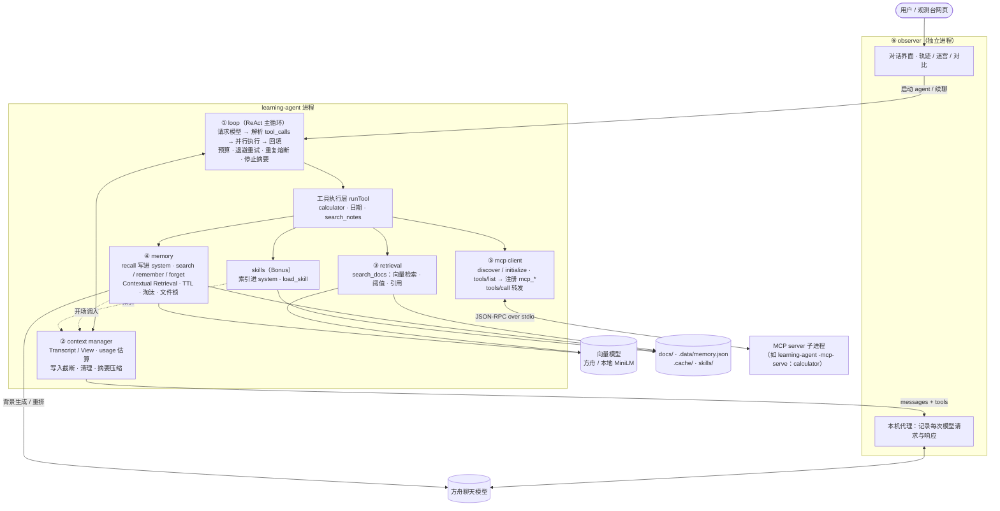

# Week 1 复盘：从零造出 Agent 的执行循环

## Day 1–7 各一句话

| 天 | 主题 | 一句话 |
| --- | --- | --- |
| Day 1 | Tool Calling 与 ReAct | 模型只负责**提出**工具调用，程序负责执行，并把带 `tool_call_id` 的结果写回消息历史；“请求 → 执行 → 回填”循环到模型不再调用工具为止。 |
| Day 2 | 循环护栏 | 模型不可靠，循环必须由程序兜底：请求次数预算、指数退避重试、重复动作熔断；停下时要说清做了什么、没做什么。 |
| Day 3 | 上下文管理 | 完整记录（Transcript）和发给模型的视图（View）要分开；窗口快满时，先清理大工具结果，再摘要旧消息，同时保住用户原话和最近的消息组。 |
| Day 4 | 检索注入 | 窗口外的知识按需检索、作为工具结果回流，低分片段不注入，回答必须引用来源；检索质量要用固定题集量化，不能凭感觉。 |
| Day 5 | 长期记忆 | 记忆是 Agent 自己读写的状态：模型决定要不要记，程序决定能不能记；读要按相关度过滤，忘要有 TTL、淘汰和更正通道。 |
| Day 6 | MCP client | MCP 把“应用 × 工具”的对接从乘法变成加法；client 交换协议版本与 capabilities（旧版靠握手一次交换，2026-07-28 版改为每个请求自带），再 `tools/list` 发现、`tools/call` 调用。 |
| Day 7 | MCP server | server 是信任边界：参数在 server 端分层重校验，可纠正的错误用 `isError` 返回给模型，并以最小权限运行。 |
| Bonus | Agent Skills | MCP 给 access，skill 给 know-how；索引常驻、全文按需读取，第一版只读知识、不执行第三方脚本。 |

## 架构图

不经过观测台时，agent 直接请求方舟，代理这一段不存在。各模块的边界：

| 模块 | 负责 | 不负责 |
| --- | --- | --- |
| ① loop | 一轮轮推进任务，决定何时停止 | 消息怎样装进窗口 |
| ② context manager | 每次请求发什么、窗口满了怎么压缩 | 工具怎样执行 |
| ③ retrieval | 只读知识库的召回与过滤 | 写入任何状态 |
| ④ memory | 跨会话状态的读、写、忘与并发安全 | 会话内的消息历史 |
| ⑤ mcp client | 外部工具的发现、命名转换、调用与错误区分 | 外部工具的权限与实现 |
| ⑥ observer | 在协议层记录和展示，不改变 agent 的行为 | 决定任务怎样执行 |

## 本周的几条主线

1. **模型提议，程序裁决**。工具调用、记忆写入、MCP 参数、skill 读取，都是模型提出请求，代码决定放不放行。
2. **上下文是稀缺资源**。压缩、按需检索、记忆预算、渐进式加载 skill，都是“先放便宜的，需要时再取贵的”。
3. **错误要分类，才能决定怎么处理**。可重试与不可重试、协议错误与执行错误、“未执行”与“结果未知”，分不清就只能一律重试或一律放弃。
4. **用真实运行验证，并区分“跑通了”和“懂了”**。每一项都有真实模型日志，但理解程度要靠复述和追问确认。

## W2 最想补的三件事

> 以下是根据本周“已知问题”整理的**建议草稿**，最终以你自己的选择为准，可以直接改写。

1. **错误分类与结果未知**（对应 Day 8–9）：工具错误不分类、一律重试；被取消的调用会从 summary 里消失；“执行中被取消”被误写成失败。先把错误分成可重试、不可重试、结果未知三类，再做 checkpoint 和中断续跑。
2. **最小权限与执行隔离**（对应 Day 12）：MCP 子进程继承了全部环境变量；skill 只敢做知识型，脚本要等沙箱。目标是能以受限的环境、目录和网络运行第三方 server 与脚本。
3. **可复现评测**（对应 Day 15–16 的提前准备）：熔断只识别相邻重复、已注入的记忆被重复检索、skill 触发准确率，这些目前都只有一两次观察。需要固定题集和指标，改动之后才能判断是变好了还是变坏了。

## 待你确认的理解

本周所有功能都有真实运行记录，但下列理解尚未由你复述确认，暂不记为已掌握：

- Day 6：握手交换的两样东西，以及为什么需要 capabilities 协商；新版为什么去掉握手。
- Day 7：为什么 server 端必须重做参数校验（信任边界）。
- Bonus：skill、MCP tool、程序性记忆三者的分工；为什么第一版不执行 skill 自带的脚本。
