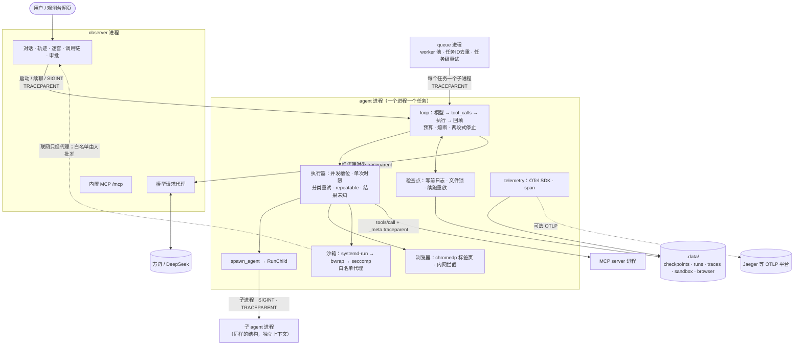

# Week 2 复盘：让 Agent 像生产系统一样跑

第一周造出了执行循环；第二周回答的是“它出事时会怎样”：慢了怎么办、进程死了怎么办、任务多了怎么办、要碰真实世界（网页、shell）怎么办、出了问题怎么看清。综合演练的过程与结果见 [Day 14 实践](day-14/day-14-lab.md)。

## Day 8–13 各一句话

| 天 | 主题 | 一句话 |
| --- | --- | --- |
| Day 8 | 取消、超时与分类重试 | 每次运行和每次工具尝试都有时限；结果分成成功、失败、未执行、**结果未知**四种，只有确定没生效或可以安全重做的才重试，停止分两段：先回填再退出。 |
| Day 9 | 检查点与恢复 | 每个边界都落盘，执行工具前先写“要做什么”（写前日志）；续跑时已完成的不重做，中断中的那批里只有可重复的工具自动重做，其余交给模型核对。 |
| Day 10 | 任务队列与幂等 | 固定数量的 worker 限制并发，任务 ID 就是检查点 ID：重复提交、重跑队列、队列被杀都不会让完成的任务再执行一次。 |
| 扩展 | 子 agent | 子任务在独立进程、独立上下文里跑，复用队列的执行器；子任务 ID 由父任务 ID 和任务原文派生，父任务续跑时子任务一起续跑或取回存档。 |
| Day 11 | 浏览器 | 只读、一次调用一个标签页、取消就关标签；不伪装、不绕过验证，拦截内网地址；看到的网页内容是数据，不是指令。 |
| Day 12 | Bash 沙箱 | namespace 管看得到什么，cgroup 管用多少，seccomp 管能做哪些系统调用；默认断网，联网白名单只能由人批准。 |
| 扩展 | 模型路由 | 供应商差异只在地址、模型和密钥；路由表在 agent 里，观测台按 agent 声明的上游转发。 |
| Day 13 | 可观测性 | 每次交互一个 trace，span 跨进程（TRACEPARENT、traceparent 头、MCP `_meta`）连成一棵树；属性按 GenAI 约定命名，数据层标准化后，展示层可以是自己的观测台，也可以是 Jaeger。 |

## 架构图



| 模块 | 负责 | 不负责 |
| --- | --- | --- |
| 执行器 | 每次工具调用的时限、重试与四种结局 | 决定调用哪个工具 |
| 检查点 | 让任何时刻被杀的进程都能接着跑 | 判断外部副作用有没有发生 |
| 队列 / RunChild | 任务级的并发、去重、续跑与重试 | 任务内部的步骤 |
| 子 agent | 把独立子任务放进新上下文和新进程 | 和父 agent 共享对话 |
| 浏览器、沙箱 | 让工具碰真实世界，同时限制能碰到什么 | 判断内容是否可信 |
| telemetry | 记录每段工作的起止、父子关系与属性 | 改变 agent 的行为 |

## 一次工具调用的一生

把第二周的模块串起来，最好的线索是跟着一次工具调用走完全程：

```text
模型返回 tool_calls
 → 熔断：相同工具与参数连续第 3 次就拦下整批                         D2
 → 写前日志：检查点记下“要执行这批调用”                               D9
 → execute_tool span 开始；等并发槽位                                D8 · D13
 → 单次尝试：独立 goroutine，最多等 tool-timeout
     ├ 成功 → ok
     ├ 确定性错误（llm.Permanent）→ error，不重试
     ├ 超时或被取消 → unknown：可能已经生效
     │     └ 只有 repeatable 的工具才自动重试
     └ 暂时故障 → 退避后重试，事件记在 span 上
 → Observation 回填给模型，检查点记下“这批已完成”                     D9
 → 进程若在两次落盘之间被杀：续跑时重放这批
     ├ repeatable → 再执行一次
     └ 其他 → 回填“结果未知”，交给模型核对                              D9 · Q13
```

spawn_agent 是同一条路上的一个特例：它的“执行”是一个子进程，子进程内部又是一条完整的路。续跑时，子任务 ID 决定是续跑、取回存档还是从头开始（[Q15](deep-questions.md#q15)）。

## 本周的几条主线

1. **结果分类贯穿始终**。ok、error、not_run、unknown 四种结局在执行器里产生，在检查点里保存，在续跑时决定重放方式，在调用链里成为 span 状态。分不清“没做”和“不知道做没做”，后面每一层都会做错决定。
2. **状态在磁盘上，进程随时可以死**。一个进程只跑一个任务；检查点加文件锁保证同一任务只有一个执行者；队列和子 agent 都只是“启动进程、读检查点”。所以停止、崩溃、重跑都能用同一套逻辑处理。
3. **边界由程序和人守，不靠模型自觉**。沙箱限制命令，浏览器拦截内网，联网白名单只能由人批准。模型在演练里也会自己拒绝可疑请求，但那只是第二道防线。
4. **先看清，再改进**。D13 之前，“为什么慢”“哪一层失败了”只能读终端日志推测；有了调用链，综合演练里的取消路径、并行、子 agent 的预算消耗都可以直接读出来。

## 实测中反复出现的问题

| 现象 | 出现位置 | 原因 |
| --- | --- | --- |
| 子 agent 在同一页面上反复 `find`，预算耗尽 | Day 11 3.7、Day 14 4.2 | 正文截断、无状态的页面工具、子 agent 预算小，任务说明又要求“仔细核对” |
| 续聊后子任务从头重跑（已修复） | Day 14 4.1 | 观测台续聊使用新的父任务 ID；模型续跑时又常改写 task。改为沿用被打断的父 ID，并让模型用 task_id 引用 |
| `web_search` 被必应的页面跳转阻断 | Day 11、Day 14 4.3 | 必应不向无头浏览器返回结果；项目不绕过，已改为不白白重试 |
| kill -9 后出现孤儿 span、根 span 丢失 | Day 13 3.4 | SDK 只导出已结束的 span |
| 模型看到“结果未知”后反复查询直到熔断 | Day 13 3.4 | 模型缺少“结果未知时该怎么核对”的明确办法 |

它们的共同点是：单个模块都按设计工作，问题出在模块之间的衔接，或者出在模型面对边界状态时的策略。这正是第三周评测要量化的东西。

## W3 最想补的三件事

> 以下是根据本周实测整理的**建议草稿**，最终以你自己的选择为准。

1. **从调用链出发做评测**（D15–17）：把任务结局、P95、token、重试次数这些已经在 span 里的数据变成固定题集上的指标；失败归因直接从 trace 开始，比如“子 agent 预算耗尽”“页面工具重复加载”各占多少。
2. **浏览器加 Bash 的组合风险**（D18–19）：断网的沙箱加上能打开任意 URL 的浏览器，就是一条外发通道（[Q12](deep-questions.md#q12)）。先写出能打穿它的注入用例，再设计跨工具的数据流限制。
3. **高风险操作确认与审计**（D20–21）：“结果未知”的副作用工具、联网审批、子 agent 派发，都应该留下可审计的记录。调用链可以作为基础，但它默认不含内容、可能被采样、kill -9 会丢数据，审计日志需要另外的完整性保证。

## 待你确认的理解

本周所有功能都有真实运行记录，但下列理解尚未由你复述确认，暂不记为已掌握：

- Day 8：为什么“执行中被取消”要记成“结果未知”而不是失败；两段式停止各段做什么。
- Day 9：写前日志补上的是哪个崩溃窗口；为什么续跑时不能把整批调用都重做（[Q13](deep-questions.md#q13)）。
- Day 10：任务 ID 为什么可以兼作幂等键；队列和子 agent 的责任各是什么。
- 子 agent：观测台续聊后子任务为什么曾经重跑；为什么只稳定父 ID 不够，还要让模型用 task_id 显式引用（[Q15](deep-questions.md#q15)）。
- Day 11：为什么只做读取型工具、不伪装 User-Agent；内网拦截挡住了什么、没挡住什么。
- Day 12：namespace、cgroup、seccomp 各限制什么；为什么断网的 Bash 加浏览器仍能外发数据。
- Day 13：traceparent 怎样让子进程挂到父 span 下；为什么 kill -9 后会出现孤儿 span；Simple 与 Batch 处理器的取舍。
