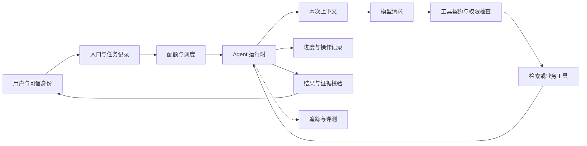

# Agent 工程面试题库

面向 Agent 应用、运行时与后端工程岗位，按当前学习目标整理。共 **126 题、17 个主题**：114 道原理与工程题、6 道系统设计题、6 道 Go 编码题。每题包含参考回答、追问和容易误答的地方；先解释机制，再讨论故障窗口、成本和设计取舍。

整理日期：2026-10-07。题目与回答依据本项目 Wiki、源码和原始资料独立编写；GitHub 社区题库用于补充覆盖面。这里的 P0/P1/P2 是学习优先级，不是统计得到的面试频率，也不代表任何公司的官方题库。

## 先看术语与使用方式

| 术语 | 含义 |
| --- | --- |
| Harness | 围绕模型的执行控制程序，管理工具、状态、预算、权限和恢复 |
| Contract，契约 | 调用双方约定的输入、输出、错误、权限与副作用规则 |
| Invariant，不变量 | 每一步都必须成立的规则，例如工具结果必须有对应调用 |
| Side effect，副作用 | 调用改变外部状态，例如发消息、下单、修改文件 |
| Idempotency，幂等 | 同一业务操作重复提交，产生与一次提交相同的业务效果 |
| Unknown outcome，结果未知 | 调用方没拿到结果，无法确认外部操作是否已经完成 |
| Grounding，依据约束 | 回答中的事实可以回溯到可用证据 |
| Recall，召回 | 找回相关资料的能力；不是最终答案正确率 |
| Rerank，重排 | 对已召回的候选再次排序；不能凭空找回候选之外的资料 |
| SLO | 服务目标，例如成功率和尾延迟要求 |
| P95/P99 | 延迟分布的第 95/99 百分位，反映慢请求 |
| Fencing token | 单调递增的执行代次，用来拒绝已失去执行权的旧 worker |

其余缩写见 [术语表](TERMS.md)。章节开头解释本章新增术语。

优先级：

- **P0**：应能独立讲清并结合代码解释，是当前岗位准备的核心。
- **P1**：掌握核心以后深入，要求能处理异常、讨论替代方案。
- **P2**：扩展与系统推演，先说明假设与边界，再给方案。

使用方法：遮住或折叠参考回答，先用 2–3 分钟口述，再画数据流或故障时间线。自评分为 0（不会）、1（只有定义）、2（能讲机制）、3（能解释失败与取舍）、4（能用实际代码或记录证明）。评分是练习尺度，不是招聘录用标准。

## GitHub 资料怎么选

以下检查了入口、目录和部分内容，没有逐题认证全部答案。推荐顺序依据与本项目目标的匹配程度，不依据 star 数量。

| 资料 | 适合拿来做什么 | 使用时注意 |
| --- | --- | --- |
| [ai-agent-engineer-handbook 的面试报告](https://github.com/harrisliangsu/ai-agent-engineer-handbook/blob/main/interview-prep/interview-questions.md) | 工程问题覆盖较广，含记忆、系统设计、评测、安全和行为题，适合检查知识缺口 | 答案中的产品细节、性能数字和“最优方案”需回到原文验证；案例数字不能写成自己的经历 |
| [agent-camp](https://github.com/yibo365/agent-camp) | 按 Agent、上下文、工具、RAG、工程化与源码主题复习 | 是模块知识库，适合查缺补漏；框架和产品章节需要带版本阅读 |
| [llm-master](https://github.com/youngyangyang04/llm-master) | 连接模型基础、应用工程、项目表达与面试路线 | 社区投稿面经用于了解提问风格，不等于招聘方确认的真实题单；路线中的商业内容按需跳过 |
| [learn-nanobot 的面试章节](https://github.com/bcefghj/learn-nanobot/blob/main/docs/13-interview-bagua/README.md) | 把 Agent、MCP、RAG 与具体源码实现联系起来 | Nanobot 专项和实现语言与本项目不同，应迁移机制，不能照搬实现 |
| [Awesome AI Agent Architect Interview Q&A](https://github.com/ishandutta2007/Awesome-AI-Agent-Architect-Interview-QA) | 英文问答、架构题、场景题口述练习 | 架构与框架知识仍需结合实际约束核验，不能靠框架名称代替设计 |

建议：以本题库作为练习入口，GitHub 资料作为补充；遇到争议，优先查协议、官方文档、论文和当前源码。不要背诵未经核验的提升百分比，也不要把“某实验有效”说成“所有 Agent 都这样”。

## 题目地图

| 主题 | 题号 | 对应岗位能力 | 深入学习 |
| --- | --- | --- | --- |
| [A · Agent 与架构](#a) | Q001–Q008 | C02、C13 | [Agent 全景](01-agent-overview.md) |
| [B · 模型基础](#b) | Q009–Q014 | C01、C04 | [模型与循环](02-models-and-loop.md) |
| [C · 模型 API 与提示词](#c) | Q015–Q022 | C03、C04 | [模型技术展开](02-models-and-loop.md#技术展开) |
| [D · 工具与 Go 并发](#d) | Q023–Q030 | C01、C04、C07 | [工具与编排](03-tools-and-orchestration.md) |
| [E · 上下文工程](#e) | Q031–Q038 | C03 | [上下文管理](04-context-management.md) |
| [F · 检索与 RAG](#f) | Q039–Q048 | C06、C08 | [检索与 RAG](05-retrieval-rag.md) |
| [G · 长期记忆](#g) | Q049–Q056 | C03、C06、C10 | [长期记忆](06-memory.md) |
| [H · MCP 与 Skills](#h) | Q057–Q064 | C04、C05、C10 | [MCP](07-mcp.md)、[Skills](08-skills.md) |
| [I · 运行时可靠性](#i) | Q065–Q072 | C02、C07 | [运行时](09-runtime-reliability.md) |
| [J · 持久化与恢复](#j) | Q073–Q080 | C07 | [检查点](10-checkpoints-and-recovery.md) |
| [K · 队列与容量](#k) | Q081–Q086 | C07、C13 | [调度](11-task-scheduling.md) |
| [L · 子 Agent](#l) | Q087–Q092 | C12 | [子 Agent](12-subagents.md) |
| [M · 浏览器、执行与安全](#m) | Q093–Q100 | C10、C11 | [执行](13-browser-and-execution.md)、[安全](14-security-and-isolation.md) |
| [N · 观测与评测](#n) | Q101–Q108 | C08、C09 | [观测与评估](15-observability-and-evaluation.md) |
| [O · 项目与沟通](#o) | Q109–Q114 | C13、C14 | [能力对照](../JOB_REQUIREMENTS.md) |
| [P · 系统设计](#p) | Q115–Q120 | C02–C13 | 综合使用各模块 |
| [Q · Go 编码](#q) | Q121–Q126 | C01、C04、C07、C10 | 对照代码与不变量 |

完整岗位定义见 [岗位能力对照](../JOB_REQUIREMENTS.md)。覆盖题目表示安排了练习，不表示已经具备真实生产经验。

## 先练这 24 题

[Q001](#q001)、[Q003](#q003)、[Q015](#q015)、[Q018](#q018)、[Q024](#q024)、[Q026](#q026)、[Q031](#q031)、[Q033](#q033)、[Q039](#q039)、[Q043](#q043)、[Q047](#q047)、[Q050](#q050)、[Q059](#q059)、[Q062](#q062)、[Q065](#q065)、[Q066](#q066)、[Q074](#q074)、[Q077](#q077)、[Q083](#q083)、[Q089](#q089)、[Q096](#q096)、[Q099](#q099)、[Q103](#q103)、[Q115](#q115)。

先掌握这组，再按章节补齐。对不熟的题回到 Wiki 技术展开，而不是反复读答案。

<a id="a"></a>
## A · Agent 与架构

本章新增术语：Workflow 是程序规定的执行流程；Planner 是规划下一组动作的组件；Executor 是实际执行动作的组件；DAG 是没有环的依赖图。

机制阅读：[Agent 全景](01-agent-overview.md#技术展开)。原始资料：[ReAct 论文](https://arxiv.org/abs/2210.03629)、[Building Effective Agents](https://www.anthropic.com/engineering/building-effective-agents)。

<a id="q001"></a>
### Q001 · P0 · 一次模型 API 调用和 Agent 有什么区别？

<details><summary>参考回答、追问与误区</summary>

模型调用把输入转换成输出，可能输出工具调用请求；实际代码由宿主执行。Agent 控制层围绕目标重复组织输入、请求模型、校验与调度动作、保存 observation，再判断继续还是终止。区别在于反馈闭环和执行责任，不在于有没有某个框架。

例如“查规则再计算”至少包含获取外部证据、执行计算、反馈结果和给出答案。任务状态、权限和预算必须由程序约束，不能只靠模型承诺。

**追问**：只调用一次工具的程序算 Agent 吗？——术语有宽窄用法，面试中先约定定义，再描述实际闭环；长期记忆和多 Agent 不是成立的必要条件。  
**误区**：认为“接了大模型就自动有规划、记忆和安全能力”。

</details>

<a id="q002"></a>
### Q002 · P0 · 什么情况下应该用固定 Workflow，而不是让模型自由规划？

<details><summary>参考回答、追问与误区</summary>

步骤确定、结果可验、合规路径固定的任务，优先用 Workflow；模型负责其中的分类、提取或生成。资料来源和任务路径变化较大时，才把相应决策交给 Agent。可采用混合方式：确定性主流程中嵌入受限的检索循环。

选择时比较任务质量、可控性、延迟、成本和失败恢复难度。更多自主性意味着更多状态与异常组合，应通过任务集验证收益。

**追问**：报销审核怎么选？——金额校验和审批由确定性程序执行，模糊条款解释可交给模型，缺证据时转人工。  
**误区**：用 Agent 把所有 if/else 改写成自然语言。

</details>

<a id="q003"></a>
### Q003 · P0 · ReAct 是否要求打印完整 Thought？

<details><summary>参考回答、追问与误区</summary>

ReAct 的核心是推理与行动交替，并把环境反馈用于后续决策。教学版本可以显式输出 Thought / Action / Observation；工程实现可以通过原生 tool_calls 完成相同闭环，不要求解析模型完整思维链。

可观测性主要记录可验证的请求、动作、结果、状态与简短决策说明。模型自己写的“我已经查到”不能证明工具执行过，推理文本也不是安全检查。

**追问**：不显示 Thought 怎么排查？——用实际输入、调用参数、工具结果、结束原因和状态变化定位；需要解释时记录简短理由。  
**误区**：把显式 Thought 当成防幻觉保证或执行凭证。

</details>

<a id="q004"></a>
### Q004 · P1 · Planner–Executor 一定比逐步 ReAct 更好吗？

<details><summary>参考回答、追问与误区</summary>

预先规划适合依赖清楚、可以分解的大任务，便于展示进度和发现可并行部分；但计划依赖的信息可能过期，额外规划请求也增加成本。逐步 ReAct 更能利用新 observation，却可能局部反复试探、缺少全局路径。

可保留粗粒度计划，按执行结果重新规划，限制重规划次数。计划是建议，执行器仍校验权限、依赖与预算。

**追问**：第 2 步查不到资料怎么办？——标记相关节点受阻，调整后续依赖或请求补充，不能盲目继续执行旧计划。  
**误区**：让模型给出步骤列表，就声称已经实现可靠规划系统。

</details>

<a id="q005"></a>
### Q005 · P0 · Agent 状态机至少要区分哪些状态？

<details><summary>参考回答、追问与误区</summary>

可按任务区分 queued、running、waiting_approval、stopped、failed、done；按动作区分 pending、running、succeeded、failed、unknown。任务状态和工具状态分开：某工具失败后，任务仍可能通过替代资料完成。

每个转移要规定触发条件、负责者和持久化位置。done 应满足任务成功标准；收到一段普通文本不等于业务完成。取消请求与实际停止之间也可能存在过渡过程。

**追问**：付款超时属于 failed 吗？——先记 unknown，查询付款状态后再确认业务结局。  
**误区**：只用一个布尔字段 success 表达所有运行与业务状态。

</details>

<a id="q006"></a>
### Q006 · P1 · Agent 为什么容易“看起来完成，实际上没完成”？

<details><summary>参考回答、追问与误区</summary>

模型可能在无证据时总结，工具也可能只接受请求而尚未产生效果。因此要区分请求被接收、执行结束、外部结果生效、结果满足用户目标这几层证据。

成功标准应在任务开始前可描述：例如文件存在、内容通过约束检查、部署版本可读回、订单状态正确。风险较高的动作由确定性检查确认，无法确认就返回未完成或待核实。

**追问**：“接口返回 200”够吗？——检查业务码、异步任务状态和目标对象，200 本身只说明一层接口结果。  
**误区**：以模型的 Final Answer 代替验收。

</details>

<a id="q007"></a>
### Q007 · P1 · 工具越来越多时，怎么避免模型选错？

<details><summary>参考回答、追问与误区</summary>

先改契约：名称、描述、参数要说明用途、前置条件、返回字段和副作用，减少功能重叠。再按权限与任务范围缩小可选集合，必要时用目录发现或按需加载，保留稳定工具身份。

用工具选择混淆表区分“不该调用”“选错工具”“参数错误”，再决定是改善描述、合并工具还是增加路由。隐藏工具会影响提示缓存与发现能力，应评估收益。

**追问**：为什么不能只加一句“仔细选工具”？——没有提供可区分的契约，也没有减少候选歧义。  
**误区**：认为工具越多，Agent 能力就必然越强。

</details>

<a id="q008"></a>
### Q008 · P1 · 怎样评估一次 Agent 架构改造值不值得做？

<details><summary>参考回答、追问与误区</summary>

先确定失败类型与目标指标，再构造包含正常、边界、失败任务的对照集。比较相同模型与工具条件下的成功率、误操作、尾延迟和每个成功任务成本，必要时做消融实验，只改变一个机制。

例如增加 Reviewer，应确认它发现了独立错误，而非只是多生成一段相同结论；也要计入新增请求、延迟和错误拒绝。上线时采用小范围灰度与回退条件。

**追问**：样本太少怎么办？——报告样本数与不确定性，把结果作为方向信号，继续补充代表性任务。  
**误区**：用一次漂亮演示证明架构优越。

</details>

<a id="b"></a>
## B · 模型基础

本章新增术语：Token 是模型处理的离散单元；Q/K/V 是注意力中的查询、键和值；KV cache 保存已计算的键和值；Prefill 处理输入，Decode 逐步生成；SFT 用示范训练，偏好优化用好坏回答对训练。

原始资料：[Transformer 论文](https://arxiv.org/abs/1706.03762)、[LoRA 论文](https://arxiv.org/abs/2106.09685)、[DPO 论文](https://arxiv.org/abs/2305.18290)。训练细节是辅助知识，本题库重点仍是 Agent 工程。

<a id="q009"></a>
### Q009 · P1 · 用工程师能听懂的话解释 Transformer 注意力。

<details><summary>参考回答、追问与误区</summary>

每个位置通过 Q 与其他位置的 K 计算相关程度，用这些权重汇总 V。缩放点积注意力可写为 softmax(QKᵀ / √dₖ)V。自回归模型使用因果遮罩，避免位置看到未来 token；多头在不同投影子空间进行这种计算。

普通完整注意力的分数矩阵随序列长度呈平方增长；推理系统还有权重读取、KV 存储等成本，不能只用这一个复杂度预测服务延迟。

**追问**：注意力权重能证明引用真实吗？——不能，引用需要对照证据内容。  
**误区**：说多头天然保证学会某个固定语法功能，或每个新 token 都从零计算全部历史。

</details>

<a id="q010"></a>
### Q010 · P0 · 为什么 token 不能简单按字数计算？temperature=0 是否完全可复现？

<details><summary>参考回答、追问与误区</summary>

分词器按词片、字节或其他规则切分；中文、英文、代码和特殊标识符的字符/token 比例不同。请求还包含角色、工具定义、多模态内容等开销，粗估需要留余量，并用服务端 usage 校准。

temperature 调整采样分布，top_p 限制采样候选概率质量。降低随机性不保证完全复现，服务版本、并行计算和采样实现仍可能变化。

**追问**：输入中文时 len(text)/4 有什么风险？——Go len 得到字节数，且比例并不固定，可能低估或高估；不能把估算当精确硬上限。  
**误区**：把一个汉字当一个固定 token，或把 temperature=0 当确定性程序。

</details>

<a id="q011"></a>
### Q011 · P1 · Prefill、Decode、KV cache 和前缀缓存是什么关系？

<details><summary>参考回答、追问与误区</summary>

Prefill 处理已有输入并建立 KV；Decode 利用已有 KV 逐步生成新 token。前缀缓存把可复用输入前缀的计算跨请求共享，与一条生成序列内的 KV 复用作用范围不同。

输入长通常影响首 token 延迟，输出长通常影响持续生成时长，但实际瓶颈依赖硬件、批处理、序列长度与服务实现。压缩历史会改变一段前缀，可能降低缓存命中；缓存也有过期、计价和复用规则。

**追问**：缓存命中后模型“永久记住”了用户吗？——没有，它仍按当前请求输入工作，缓存只优化计算。  
**误区**：把 KV cache 等同于跨会话长期记忆。

</details>

<a id="q012"></a>
### Q012 · P0 · Prompt、RAG、微调分别解决什么问题？

<details><summary>参考回答、追问与误区</summary>

Prompt 提供本次规则与任务；RAG 把外部可更新、可引用的信息按需带入；微调调整模型对输入的行为分布，更适合稳定格式、领域任务模式或特定风格。三者可以组合。

需要最新制度和权限过滤时先考虑检索；希望减少某种反复发生的行为错误时，可比较更清楚的契约、示例提示与微调。微调不提供可靠删除、精确事实读回或业务授权。

**追问**：让模型记住所有客户资料应该微调吗？——先考虑访问控制、更新删除与证据需求，通常需要受控数据源。  
**误区**：认为微调后就不需要 RAG，也不会产生幻觉。

</details>

<a id="q013"></a>
### Q013 · P2 · SFT、RLHF、DPO、LoRA 怎样区分？

<details><summary>参考回答、追问与误区</summary>

SFT 从示范输入输出学习。典型 RLHF 流程利用人类偏好训练奖励模型，再进行强化学习；DPO 在特定建模假设下直接用偏好对优化策略，不需要同样的显式奖励模型与在线强化学习循环。

LoRA 是参数高效适配方法，用低秩更新减少需训练的参数；它与训练目标是两个维度，可以用于 SFT，也可用于其他适配目标。减少可训练参数不等于基础权重、激活和优化器开销全部消失。

**追问**：DPO 能不能改善工具选择？——可以用相关偏好数据尝试，但需任务评测，不能由方法名称推断效果。  
**误区**：把 LoRA 当成与 SFT 并列的任务目标。

</details>

<a id="q014"></a>
### Q014 · P1 · 推理成本太高时，先换小模型、量化，还是减少上下文？

<details><summary>参考回答、追问与误区</summary>

先拆成本：输入、输出、重复请求、检索重排和空转步骤分别占多少。无效上下文与重复动作可先治理；稳定简单任务可尝试小模型，复杂任务再升级。自托管量化可以减少权重内存与部分计算成本，但质量和速度受硬件、量化方案与负载影响。

比较的是每个成功任务的成本与尾延迟，而非单次请求单价。小模型多试几轮可能比大模型一次完成更贵。

**追问**：预算下降但任务成功率下降怎么办？——画质量、成本、延迟的取舍曲线，按业务目标选择，而非只报 token 节省。  
**误区**：假设量化、缓存或小模型有固定提升比例。

</details>

<a id="c"></a>
## C · 模型 API 与提示词

本章新增术语：tool_calls 是模型提出的调用请求；tool_choice 控制工具使用方式；finish_reason 是响应结束原因；SSE 是服务端向客户端推送事件的格式；Adapter 是不同提供方接口的转换层。

机制与协议示例：[模型技术展开](02-models-and-loop.md#技术展开)。具体字段支持以选定服务的当前接口与实测为准。

<a id="q015"></a>
### Q015 · P0 · 原生 Function Calling 和在 prompt 中要求输出 Action JSON 有什么区别？

<details><summary>参考回答、追问与误区</summary>

两者都由模型生成调用意图，宿主执行函数。文本方案把格式放进 prompt，并自行解析输出；原生方案用接口的 tools/schema 描述工具，通过 tool_calls、调用 ID 和 tool 结果消息关联闭环。后者通常有更清楚的协议边界，约束能力取决于模型与服务。

执行器仍必须检查工具是否存在、参数是否符合契约、权限与副作用是否允许。结构正确只是进入执行阶段的一个条件。

**追问**：原生工具调用后 system prompt 能简短吗？——可以简化回答格式约束，但仍需说明任务目标、资料不足处理和权限规则。  
**误区**：认为模型返回 tool_calls 时已经在云端执行本地函数。

</details>

<a id="q016"></a>
### Q016 · P0 · tool_call_id 为什么必须回填？它是不是幂等键？

<details><summary>参考回答、追问与误区</summary>

assistant 消息提出多个调用时，每条工具结果通过 tool_call_id 对应其中一个调用，使模型明确哪份结果来自哪个动作。消息不能出现孤立结果或遗漏结果；错误也应形成对应结果。

调用 ID 是对话协议关联标识，不保证跨重试、跨恢复的业务去重。幂等键应由业务操作身份确定并在执行端保存，重新生成调用 ID 不应重新创建同一订单。

**追问**：两次相同参数一定是同一业务操作吗？——可能是两个有意重复的订单，需要操作身份与用户意图区分。  
**误区**：用模型调用 ID 替代订单操作记录。

</details>

<a id="q017"></a>
### Q017 · P0 · Structured Output 合法是否意味着结果可信？

<details><summary>参考回答、追问与误区</summary>

结构约束解决可解析性和部分字段约束，例如字段类型或枚举。事实正确、来源有效、当前权限、金额范围与资源存在性仍要另行验证。

“引用 document_id=123”可以符合 schema，但该文档可能不存在、属于其他租户或不支持结论。依次检查协议、业务和证据，错误返回明确字段路径，方便模型修正。

**追问**：需要检查哪些服务端内容？——资源身份、权限、引用有效性、数值和跨字段规则，不信任模型提供的 tenant_id。  
**误区**：把通过 JSON Schema 当成通过业务验收。

</details>

<a id="q018"></a>
### Q018 · P0 · 收到 finish_reason=length、空 choices 或拒答，loop 应该怎么办？

<details><summary>参考回答、追问与误区</summary>

把响应结局显式分类。length 说明输出被截断，不能把未完整的调用参数直接执行；空 choices 或协议异常需要记录原始受控响应并停止或有限重试；拒答走独立用户反馈路径。

恢复是否可行取决于具体接口：可增大预算、减少输入或请求继续，但先保留已有状态，避免重复执行已完成动作。推理 token 是否占输出上限应按提供方核验，不能一律套用 4096。

**追问**：增大上限有什么代价？——请求耗时、费用与可容纳输入空间都可能变化，需要本地预算配合。  
**误区**：把任何没有 tool_calls 的响应都当成成功答案。

</details>

<a id="q019"></a>
### Q019 · P1 · 流式工具参数分片怎样消费？何时能执行？

<details><summary>参考回答、追问与误区</summary>

按响应中规定的调用索引或 ID 聚合名字和参数增量；一帧可能只包含半个 JSON、空增量或多个调用，不能假定每帧是一条完整消息。等服务明确结束该调用、完整参数解析和校验通过后再执行。

客户端要处理连接中断、终止事件和 usage，给慢消费者设置背压。取消生成与取消已发出的外部操作分开。普通正文可以逐步展示，副作用工具不应靠字符串前缀抢跑。

**追问**：连接断开前参数已经凑齐能执行吗？——必须确认协议层调用完成条件，不能仅凭 JSON 语法合法。  
**误区**：逐帧 json.Unmarshal 后立刻 dispatch。

</details>

<a id="q020"></a>
### Q020 · P1 · 怎样设计跨模型提供方的适配层？

<details><summary>参考回答、追问与误区</summary>

统一内部消息、调用、用量和错误结构；适配层处理具体请求字段、工具能力、输出预算、推理选项、结束原因和流式事件。为能力差异建立明确支持矩阵，不能把“兼容接口”当成字段行为完全一致。

原始字段可在受控审计中保留，业务层只消费归一结果。遇到不支持的参数应明确拒绝或按规则转换，而不是静默假装生效。

**追问**：所有供应商都传 reasoning_effort=high 可以吗？——先核验模型支持与映射；同名字段也可能有不同含义。  
**误区**：只更换 base URL，就宣称无损切换所有模型。

</details>

<a id="q021"></a>
### Q021 · P1 · 模型路由、降级和故障切换怎样做才可靠？

<details><summary>参考回答、追问与误区</summary>

按任务能力、数据策略、延迟与成本选择提供方，必要时使用小模型初判再升级。降级路径必须满足同样的核心契约：工具能力、窗口、格式与数据处理许可不能缺失。

失败切换要知道请求阶段。还未执行工具的模型请求可以有限重发；工具结果已经改变外部状态时，继续使用已记录 observation，不能把整个业务任务从头重做。记录路由原因、版本与实际用量。

**追问**：低价模型回答得快就自动路由吗？——先比较任务成功率、总步骤、政策与成本，再确定阈值。  
**误区**：把故障切换当成无限重试或自动重复外部动作。

</details>

<a id="q022"></a>
### Q022 · P0 · system prompt 怎样写，才能减少幻觉又不限制死格式？

<details><summary>参考回答、追问与误区</summary>

写清目标、工具用途、证据与引用规则、资料不足处理、风险操作边界和完成条件。调用格式可以交给原生工具协议，面向用户的回答保留必要自由度。信息源与指令分层，工具和网页内容只作为数据。

Prompt 是行为引导，执行器仍负责硬约束。用无资料、冲突资料、工具失败和恶意内容的任务检查规则是否生效，再针对错误修改。

**追问**：加“不要幻觉”够不够？——还需可用证据、拒答标准、结果校验与评测。  
**误区**：把越来越长的提示词当成唯一可靠性方案。

</details>

<a id="d"></a>
## D · 工具与 Go 并发

本章新增术语：Semaphore 是限制同时占用名额的信号量；Race 是数据竞争；Backpressure 是下游忙时抑制上游；Schema 校验检查格式，业务校验检查意义。

机制、Go 片段与源码：[工具与编排](03-tools-and-orchestration.md#技术展开)。语言规则参考 [encoding/json](https://pkg.go.dev/encoding/json)。

<a id="q023"></a>
### Q023 · P0 · 一个好工具契约除了名字和参数，还需要什么？

<details><summary>参考回答、追问与误区</summary>

至少说明用途与不适用范围、前置条件、输出结构、错误分类、超时、权限和副作用。外部写操作还要定义幂等键、状态查询方式、取消含义和审计字段。

例如 create_order 不应只返回“操作成功”，应返回可核查的订单身份与状态；网络超时后执行器应能查询同一 operation_id。描述必须与实际 handler 行为一致。

**追问**：为什么要把“只读”写进契约？——它影响重试、并行与授权策略，但执行端也要落实只读边界。  
**误区**：让模型仅根据函数名猜业务行为。

</details>

<a id="q024"></a>
### Q024 · P0 · 多个工具怎么并行？哪些不能并行？

<details><summary>参考回答、追问与误区</summary>

模型一次提出多个调用后，执行器识别依赖与冲突，对独立调用用有界 goroutine 并发；结果按调用 ID 回填。calculator 与日期查询独立，检索后再对检索得到的数字计算则有依赖，必须等待结果。

写同一资源、依赖隐含会话状态或使用同一可变文件的调用，需要串行或资源锁。并行工具数只是并发上限，不会使后续依赖数据提前出现。

**追问**：任务有 16 个工具就开 16 个 goroutine 吗？——受连接池、上游限额、CPU、租户预算和冲突策略约束。  
**误区**：把“模型输出多个调用”和“执行器保证安全并行”当成同一件事。

</details>

<a id="q025"></a>
### Q025 · P1 · 工具“加载”和工具“执行”有什么区别？

<details><summary>参考回答、追问与误区</summary>

加载是发现、读取定义、建立连接或初始化资源；执行才真正调用具体能力。模型通常看见 schema，而不是本地函数代码。可以按需加载昂贵资源，或并行发现互不依赖的 MCP server，但要控制数量和启动超时。

共享注册表更新需要稳定命名与版本；正在执行的请求应使用一致的定义快照。关闭一个 server 时先处理其未完成调用，避免只删除定义却泄漏进程。

**追问**：普通计算题要初始化 embedding 吗？——没有用到检索时应避免这项成本。  
**误区**：把安装/加载工具直接理解成模型在后台并行调用它。

</details>

<a id="q026"></a>
### Q026 · P0 · Go 批量并发如何保证结果归属正确且没有数据竞争？

<details><summary>参考回答、追问与误区</summary>

预先分配与调用数等长的结果切片，每个 worker 只写自己索引，完成后统一读取；用 WaitGroup 等待，用信号量限制活跃调用。不要让 worker 无锁 append 共享切片，也不要多路同时写共享 map。

结果携带原始调用 ID，完成顺序与输出顺序可以不同。若函数或返回值内部共享可变状态，仍需同步或深拷贝；切片分槽并不自动解决工具内部的竞争。

**追问**：取消时等待信号量的 worker 怎么退出？——获取名额时 select 监听 ctx.Done，所有名额路径都保证释放。  
**误区**：认为 goroutine 轻量，就不需要限流或资源管理。

</details>

<a id="q027"></a>
### Q027 · P1 · JSON 解码怎样区分缺参、零值、类型错和多余字段？

<details><summary>参考回答、追问与误区</summary>

普通结构体零值可能同时表示“缺失”和“显式给 0”，可用指针或显式存在性检查区分。Decoder.DisallowUnknownFields 拒绝未知字段；需要确认输入只有一个 JSON 值，并在解码前限制大小。这些机制不替代必填、空白字符串和跨字段业务检查。

interface{} 默认数值行为、UseNumber 与强类型字段各有取舍。金额应采用明确精度与单位，不能从“JSON number 合法”推断浮点足够准确。

**追问**：传 query=null 会怎样？——要按契约处理，不能把解码成功直接当成有可用查询。  
**误区**：handler 只检查 err==nil。

</details>

<a id="q028"></a>
### Q028 · P1 · 一个并行 batch 中有工具失败，其余结果要丢弃吗？

<details><summary>参考回答、追问与误区</summary>

通常为每个调用生成独立结果，成功和失败都回填，使模型能调整。批次失败不自动回滚外部世界；已经完成的副作用需要记录，不能因为一个读工具失败而整批重做。

如果业务要求原子效果，应在业务服务中使用事务或显式补偿流程，不能靠 goroutine 批次实现。确实可以取消无意义的剩余调用，但取消是否生效仍要确认。

**追问**：失败前已有一笔付款完成怎么办？——保留付款事实，查询剩余操作并进行业务补偿或人工处理。  
**误区**：把 WaitGroup 的“全都结束”理解成事务提交。

</details>

<a id="q029"></a>
### Q029 · P0 · 错误 observation 应该返回多少细节？

<details><summary>参考回答、追问与误区</summary>

返回可行动的分类、字段路径、是否可修正、是否可重试、执行结果是否已知和必要摘要。例如“missing_argument，字段 expression，未执行”比“error”有用。供模型修正的错误与供维护者定位的堆栈分开。

避免泄露密钥、内部路径、完整网络响应或攻击者可利用的细节。发生参数错误时应让模型改参，不对同一参数自动重试；真正瞬时错误可有限退避。

**追问**：为什么 unknown 要写进结果？——否则模型可能把未得到回执误解为未执行。  
**误区**：静默吞错，或者把全部内部异常直接塞进 prompt。

</details>

<a id="q030"></a>
### Q030 · P1 · 工具结果很大时，怎样减少 token 而保留证据？

<details><summary>参考回答、追问与误区</summary>

优先从工具契约减少不相关字段，按查询提取片段，并返回稳定来源 ID、页码或内容范围。需要全文时提供受控句柄或分页，再由 Agent 按需取回；保留原始结果的受控存储和截断说明。

不能简单按字节切中文导致无效 UTF-8，也不能截掉错误状态、单位、例外条件或引用位置。总输出上限和模型可见上限是两种边界。

**追问**：摘要后引用原文页码还能保留吗？——能，但必须保留明确映射，摘要本身不是新的原始证据。  
**误区**：只展示前 N 字，就宣称资料完整可靠。

</details>

<a id="e"></a>
## E · 上下文工程

本章新增术语：Transcript 是完整轨迹；View 是本次送入模型的视图；消息闭包要求调用和结果成组保留；Compaction 是重组或压缩历史；Context rot 指长而杂的输入可能降低信息使用效果。

机制、预算算例与保留规则：[上下文管理](04-context-management.md#技术展开)。产品的具体阈值和实现需要带版本研究，不能从一张图推断所有 Codex 或 Claude 的内部策略。

<a id="q031"></a>
### Q031 · P0 · 上下文预算怎么算？为什么不能只数 messages 的字数？

<details><summary>参考回答、追问与误区</summary>

在接口采用总窗口约束的前提下，可规划：可用输入 = 窗口 − 输出预留 − 安全余量。输入包括 system、历史、当前问题、摘要、工具定义和多模态表示；不同提供方的推理预算和计费规则另行核验。

例如窗口 32k，预留输出 8k、安全余量 2k，则计划输入不超过 22k；这是示意参数，不是所有模型的固定设置。粗估与实际 usage 结合，输出上限省略也不表示无限输出。

**追问**：工具定义很长但消息很短，为什么仍超限？——tools 也参与模型输入和服务限制。  
**误区**：把本地估计值当供应商精确 token 数，或忘记留输出空间。

</details>

<a id="q032"></a>
### Q032 · P0 · Transcript 与 View 为什么要分开？

<details><summary>参考回答、追问与误区</summary>

Transcript 为追踪、恢复和审计保存实际事件；View 按预算与任务需求选取本轮输入，可能包含摘要、截断结果和部分原文。压缩修改 View，不应抹掉原始轨迹；原始数据也需要权限与保留期控制。

观测台应分别展示“发生过什么”和“这次模型看见什么”。历史存在于存储，不表示每次请求都发送全部历史。

**追问**：Turn 1 为什么可能显示 system 但不应该算历史？——system 是当前请求规则，历史应指之前发生的会话内容，展示分组必须明确。  
**误区**：用一个不断裁剪的 slice 同时承担审计和模型输入。

</details>

<a id="q033"></a>
### Q033 · P0 · 为什么上下文要按消息组裁剪，不能只保留最后 6 条？

<details><summary>参考回答、追问与误区</summary>

一条 assistant 可能提出多个工具调用，后面对应多条 tool 结果。如果从中间裁剪，就会留下孤立工具结果或缺失结果的调用，破坏协议。应以完整用户轮或闭合调用组为保留单元，再选择最近组数。

“最近 6 条”不等于“最近 3 轮”；一轮工具任务可能包含多条消息。当前用户输入、必要的进行中组与系统规则要额外保护，无法塞进预算时应明确处理。

**追问**：某轮有 4 个并行调用，应该保留几条？——保留调用消息和全部对应结果，并按具体策略保留相关用户/回答；不能按固定条数切半。  
**误区**：把消息条数下降直接解读为删除了同样数量的用户轮。

</details>

<a id="q034"></a>
### Q034 · P0 · Trim 与 Summarize 分别什么时候合适？

<details><summary>参考回答、追问与误区</summary>

Trim 删除旧输入，成本低且没有摘要模型开销，适合旧信息已无用的短期任务。Summarize 把仍需使用的事实、决定、约束和未完成事项压成摘要，适合长任务，但增加延迟并可能丢失或改变细节。

不是所有 observation 都值得进摘要：可以去掉可重新读取的大输出，同时保留来源与句柄。重要用户原话或业务身份可用程序结构化保存，减少纯摘要依赖。

**追问**：能不能永远保留全部用户原话？——原话也会超过窗口，应按身份、当前约束和优先级保护，必要时询问或分任务。  
**误区**：认为有摘要就永远不会忘记或误记。

</details>

<a id="q035"></a>
### Q035 · P1 · 触发线、目标线和接受线有什么区别？应该每次压到“最小”吗？

<details><summary>参考回答、追问与误区</summary>

触发线决定何时压缩，目标线表示希望缩到多大，接受线决定压缩结果能否继续运行。应保留足够空间避免下一步马上再压缩，但目标不一定是硬性失败条件。

压到最小可能丢当前约束、未完成事项和消息闭包。压缩后大小由保护区、摘要、工具定义和最近组共同决定；没有通用的“固定压到 40%”或“越小越好”。如果保护区过大，可减少可选最近组，不能偷偷删当前输入。

**追问**：目标 40%，结果 48%，而触发线 90%，要停吗？——结合安全余量与后续增长判断，常可接受并记录警告。  
**误区**：从某个产品用量骤降推断其必然执行相同百分比策略。

</details>

<a id="q036"></a>
### Q036 · P1 · 递归摘要怎样防止“摘要的摘要”漂移？

<details><summary>参考回答、追问与误区</summary>

递归摘要把旧摘要与新淘汰信息一起更新，可能逐渐弱化否定、单位、来源和时间。可采用结构化摘要槽位：目标、用户约束、事实及来源、已完成动作、未解决问题；关键原文与操作状态由程序保留。

给摘要做约束检查，重要冲突回原始记录核对，必要时重建而不是永远递归。摘要是派生视图，不能反向覆盖原始事实。

**追问**：“不要付款”被摘要成“付款事项”怎么办？——把禁止性约束视为保护字段，检查丢失与含义变化。  
**误区**：认为一句“务必保留重要信息”能保证无限次摘要无损。

</details>

<a id="q037"></a>
### Q037 · P1 · 摘要请求失败、写得过长或调用工具时怎么办？

<details><summary>参考回答、追问与误区</summary>

在副本上准备新 View，校验成功后整体替换；失败时保留旧 View。摘要请求应在服务支持时显式禁止工具调用；可以有限重试、缩短摘要目标或减少可选最近组。

如果旧 View 仍满足硬预算，可以继续并记录警告；已经超出硬限制时，尝试确定性清理或返回上下文不足，不能无限重试。摘要与主请求共同受任务预算约束，要预留压缩后的下一次决策。

**追问**：为什么不能边摘要边删原消息？——失败后会失去恢复依据，也可能出现不完整的消息组。  
**误区**：任何摘要偏长都停止任务，或压缩失败后发送必然超限的请求。

</details>

<a id="q038"></a>
### Q038 · P1 · 怎样平衡工具结果清理、上下文压缩与前缀缓存？

<details><summary>参考回答、追问与误区</summary>

频繁改写早期历史可能降低前缀复用，保留大量一次性输出又占窗口。可在结果产生时限制无关内容，平时追加稳定视图，到阈值附近集中清理与压缩；具体收益以提供方缓存规则和任务数据验证。

截断内容附说明与可重读来源。衡量减少的 token、缓存命中变化、压缩次数、延迟和任务正确率。不能以缓存命中为理由一直保留错误或过期信息。

**追问**：压缩一定使所有缓存失效吗？——不一定，未变化的前缀仍可能复用，取决于服务机制与请求布局。  
**误区**：把“每次清理都更省钱”当成无需测量的结论。

</details>

<a id="f"></a>
## F · 检索与 RAG

本章新增术语：Embedding 把文本映射为向量；BM25 是词项检索打分方法；RRF 按名次融合不同召回列表；ANN 是近似最近邻搜索；Contextual Retrieval 给片段补充文档背景后建立索引。

机制与算例：[检索与 RAG](05-retrieval-rag.md#技术展开)。原始资料：[BM25](https://nlp.stanford.edu/IR-book/html/htmledition/okapi-bm25-a-non-binary-model-1.html)、[RRF 论文](https://cormack.uwaterloo.ca/cormacksigir09-rrf.pdf)、[Contextual Retrieval](https://www.anthropic.com/engineering/contextual-retrieval)。

<a id="q039"></a>
### Q039 · P0 · RAG 在 Agent 中应该放在哪？一定要做成工具吗？

<details><summary>参考回答、追问与误区</summary>

RAG 包含资料准备、检索、组装证据与生成。放进 Agent 时，检索可以是模型按需调用的工具，适合是否检索、查询方式和资料来源随任务变化的场景；也可以由确定性流程强制检索，适合知识库问答或有固定证据要求的场景。

不应预先把所有资料塞入 prompt；是否主动调用由模型决定、是否允许无证据回答由产品与程序规则决定。需要最新政策的回答，工具未调用或结果不足时应阻止无依据结论。

**追问**：模型“觉得知道”就不检索怎么办？——强制检索阶段、检查证据字段或限定无证据回答范围。  
**误区**：把“检索必须永远是模型自由选择的工具”当成唯一正确架构。

</details>

<a id="q040"></a>
### Q040 · P0 · Chunk 怎样切？overlap 越大越好吗？

<details><summary>参考回答、追问与误区</summary>

优先保留标题、段落、列表、表格和条款等语义边界，再设置大小上限。每块携带 document_id、版本、位置、标题与访问范围。太小会丢主体和例外，太大会降低检索聚焦并消耗窗口。

重叠可以保护边界内容，但增加索引和重复证据；需要去重并计入成本。数字、单位、否定与适用范围不能被随意拆开。最佳大小随语料和问题分布变化，用召回与最终答题质量选择。

**追问**：表格应该按固定字符切吗？——尽量保留表头与行关系，或构造带表头的行组。  
**误区**：用一个通用 chunk_size 与 overlap 处理所有文档。

</details>

<a id="q041"></a>
### Q041 · P0 · 本地与线上向量模型怎样切换？维度一样能混用吗？

<details><summary>参考回答、追问与误区</summary>

查询与文档向量必须处于兼容的向量空间；模型版本、归一化、指令模板和维度都应进入索引身份。维度一样只说明数组长度相同，不说明语义坐标相同。切换模型通常需要重建文档索引。

本地要考虑启动、模型下载、CPU/内存和离线可用性；线上要考虑费用、延迟、限流与资料外发规则。先验证相同问题集的召回、ID 检索和中文效果。

**追问**：只修改查询模型为什么可能更差？——查询向量与旧索引不匹配，即使没有维度报错。  
**误区**：把所有 1024 维向量都当成可互相比较。

</details>

<a id="q042"></a>
### Q042 · P1 · 余弦、点积、L2 的关系是什么？什么时候需要 ANN？

<details><summary>参考回答、追问与误区</summary>

余弦为 x·y/(‖x‖‖y‖)。向量都归一化为单位长度时，点积等于余弦，平方 L2 距离为 2−2(x·y)，排序可对应；未归一化时不能照搬。拒绝零向量、非有限值和维度不匹配。

暴力检索时间约 O(Nd)，float32 原始向量存储约 4Nd 字节。例如 10 万条、1024 维约 390.6 MiB，尚未算元数据与索引。ANN 用额外索引换延迟，但召回与更新成本需要测量。

**追问**：向量库是不是 Day 4 的必要条件？——小语料可以直接用 Go 扫描，规模与延迟要求再决定是否引入。  
**误区**：认为向量检索必然要拆独立服务。

</details>

<a id="q043"></a>
### Q043 · P0 · BM25 为什么能补 embedding？RRF 怎么算？

<details><summary>参考回答、追问与误区</summary>

BM25 利用词项匹配、词频饱和与文档长度归一化，擅长型号、代码和精确名字；embedding 适合语义改写，但可能错过 TS-999。分词需要保留这种标识符，不能把所有数字拆碎。

RRF 常用 score(d)=Σ 1/(c+rankᵢ(d))，未进入某列表则不贡献该项。示意 c=60，同一文档在两路分别第 1、2 名，得分约 0.032522。它避开直接混合量纲不同的分数，但忽略原始分数差距；参数仍需验证。

**追问**：0.0325 表示 3.25% 正确率吗？——不是概率；按内容 ID 合并候选，避免重复块异常加权。  
**误区**：把向量相似度与 BM25 分数未经校准直接相加。

</details>

<a id="q044"></a>
### Q044 · P0 · 召回 k、重排候选数和最终注入条数怎样选？

<details><summary>参考回答、追问与误区</summary>

三者分开：较大的候选集保护召回；重排在候选中筛选；最终按证据多样性、相关性和 token 预算注入少量片段。多跳问题还需覆盖多个子问题，不能只返回某一个主题的相近段落。

重排无法补回候选外的关键证据；它也增加延迟与费用。相关分数不是通用概率，阈值应按模型、语料、查询类型校准，不能跨索引套同一个 0.7。

**追问**：k 从 3 改 20，答案反而差了怎么办？——检查重复、冲突、位置影响和无关噪声，比较召回与生成两个阶段。  
**误区**：认为 top-k 一定相关，或越多越安全。

</details>

<a id="q045"></a>
### Q045 · P1 · Contextual Retrieval 的“小抄”解决什么问题？会带来什么风险？

<details><summary>参考回答、追问与误区</summary>

单个片段可能只有“营收增长 3%”，缺少公司、年份和章节背景。给片段补充简短的文档背景，再用于向量与词项索引，有助于查询找到它；原文与生成背景分开保存。

背景生成有预处理成本，也可能编造主体、时间或适用范围。它只是检索辅助，最终事实应来自原文。文档版本变化后背景和索引一起失效；效果不能照搬文章中的实验提升比例。

**追问**：把背景直接当答案证据可以吗？——需要原文支持，来源应标到真实片段。  
**误区**：给所有 chunk 加一句泛化标题就称为完整的上下文检索。

</details>

<a id="q046"></a>
### Q046 · P1 · 文档更新、删除与访问权限怎样进入 RAG 链路？

<details><summary>参考回答、追问与误区</summary>

内容版本或哈希标识派生索引，更新时生成新版本再切换，避免一半新一半旧。删除要覆盖原文、chunk、向量、关键词索引和缓存；必要时用删除标记先阻止读取，再异步清理。

以可信用户身份做租户与权限过滤，候选离开数据层前不应泄露不可见内容。对最终引用再次核对当前权限与版本，处理检索后权限变化；模型生成的 tenant_id 不是授权凭证。

**追问**：先全库检索，最后让模型过滤安全吗？——不可见内容已进入上下文，边界已经失守。  
**误区**：只删除数据库原文，却仍从向量缓存召回。

</details>

<a id="q047"></a>
### Q047 · P0 · “10 题召回至少 7 条”怎样变成可靠的检索评测？

<details><summary>参考回答、追问与误区</summary>

先标注每题的相关片段集合或可替代证据，明确“命中一条”与“找齐回答所需证据”的区别。Hit@k 看是否至少命中一条，Recall@k 看找回相关集合的比例，MRR 关注第一条相关结果的位置。

题集包含精确 ID、语义改写、长文、多跳、冲突和库外题。先人工检查召回，再评最终回答，分开报告检索漏召回与生成误用。用于调参的题不是独立留出集。

**追问**：每题命中一条，但答案仍错怎么办？——检查是否少了例外条款或第二个证据，以及生成有没有忠实使用。  
**误区**：把 7/10 的一次结果当生产召回保证。

</details>

<a id="q048"></a>
### Q048 · P0 · 有引用就代表没有幻觉吗？资料不足怎样处理？

<details><summary>参考回答、追问与误区</summary>

引用应能解析到可见文档的具体版本与位置，而且片段真正支持对应陈述。引用数量、存在性和支持程度是不同指标；模型可以正确引用一个无关段落。

低相关、冲突或关键字段缺失时，限定次数改写查询或补充来源，仍不足则说明缺什么、哪些部分可确认。混合已有知识回答时要区分证据与推断，不能把推断伪装为原文规定。

**追问**：资料只说“最高 300”，模型说“每天 300”算什么？——单位与适用条件误用，引用存在也不能通过。  
**误区**：把加上 [1] 当成依据校验。

</details>

<a id="g"></a>
## G · 长期记忆

本章新增术语：Provenance 是事实来源；TTL 是有效期限；Revision 是内容版本；Fingerprint 是内容与配置指纹；Optimistic commit 指工作在锁外完成，提交时核对版本。

机制、并发时间线与源码：[长期记忆](06-memory.md#技术展开)。

<a id="q049"></a>
### Q049 · P0 · 长期记忆、历史摘要、RAG 和缓存怎样区分？

<details><summary>参考回答、追问与误区</summary>

历史摘要主要延续当前任务；长期记忆保存跨会话仍有用的用户事实、偏好或任务经验。RAG 是按需检索信息的过程，可检索知识库也可检索记忆。缓存复用派生结果或计算，不承担事实真相职责。

区分所有者、来源、有效期、修改权限与删除语义。缓存失效不能等同于忘记用户；完整历史存盘也不等于模型下次自动看到。

**追问**：“喜欢中文表格”放哪里？——可成为有来源的用户偏好，按任务相关性注入；仅当前报告的格式要求未必需要长期保存。  
**误区**：把消息历史、向量库和记忆三个名称互换。

</details>

<a id="q050"></a>
### Q050 · P0 · 谁来决定写记忆？怎样避免把模型猜测记成事实？

<details><summary>参考回答、追问与误区</summary>

模型可提议值得记的内容，程序校验来源、身份、允许的类别、敏感信息和重复项，再决定提交。保存来源引用、原话或可验证记录，明确区分用户陈述、工具事实与系统推断。

“模型总结用户可能做金融”不是可直接登记的事实；工具失败经验可以保存实际错误与上下文，不能扩写成未经证实的通用规则。本项目采用受控来源写入，生产设计还需编辑、删除与治理。

**追问**：用户让记密码怎么办？——按保存策略拒绝或引导受控凭证管理，不把密码放进可检索正文。  
**误区**：任何模型生成摘要都可以自动写入长期记忆。

</details>

<a id="q051"></a>
### Q051 · P1 · 新旧记忆冲突时，应该直接覆盖吗？

<details><summary>参考回答、追问与误区</summary>

先辨别同一主体、属性、适用范围与时间。例如“这个报告用英文”与“通常用中文”可以同时成立；最新偏好变更则可让旧项退役。保存来源与变更关系，冲突无法判断时询问用户或暂不注入。

生产设计可用 expected_revision 防止并发覆盖，按实体与属性整理，而不是用近似向量去重直接删事实。相关度和新旧时间都不等于事实可靠性。

**追问**：两个会话同时修改同一偏好？——使用版本校验或事务，冲突后重新读取并明确合并规则。  
**误区**：认为最新一条永远正确，或所有相似记忆都重复。

</details>

<a id="q052"></a>
### Q052 · P1 · TTL、遗忘权重和最近访问时间有什么不同？

<details><summary>参考回答、追问与误区</summary>

TTL 是硬性的有效期；遗忘分数通常用于排序或淘汰，最近访问时间是其中一个信号。示意 score=importance×2^(−age/half_life)：半衰期后权重减半，但并未自动判定事实失效。

被频繁误召回的记忆可能一直获得“最近访问”加分，因此应区分被检索与被有效使用，避免错误自我强化。长期稳定偏好与临时订单状态需要不同期限。

**追问**：过期内容是否可以留档？——可按审计策略留档，但不能继续作为当前事实注入。  
**误区**：用访问次数代替有效性，或把软分数当删除承诺。

</details>

<a id="q053"></a>
### Q053 · P1 · 记忆索引怎样避免因内容、模型或模板变化而过期？

<details><summary>参考回答、追问与误区</summary>

索引键应包含内容身份与版本、embedding 模型和维度、归一化方式、背景/提示模板版本及分词配置。任一影响派生结果的配置变化都应触发相应重建，不只比较文本是否相同。

原始记录与派生向量分开保存，读取时核对索引版本。可以惰性重建并暂时使用词项检索，但要标明降级路径与限制；不能让不兼容向量静默参与打分。

**追问**：只调整 Contextual Retrieval 的背景提示是否要重建？——其输出改变向量输入，需要纳入指纹。  
**误区**：缓存键只写 memory_id，导致修改后仍取旧向量。

</details>

<a id="q054"></a>
### Q054 · P1 · 生成记忆向量时，为什么不能一直持有文件锁？

<details><summary>参考回答、追问与误区</summary>

embedding 或摘要请求可能耗时很长，持锁会阻塞其他读写并放大故障影响。可以在锁内读取快照与版本，锁外进行网络计算，再加锁确认记录仍存在且版本/配置没变，才提交索引。

若期间用户删除或修改记录，丢弃过期结果，不得把旧向量重新写回。不同进程需要进程间锁或存储事务，单进程 mutex 不够。

**追问**：锁外网络返回后，记录已被删除怎么办？——提交验证失败，放弃这次派生结果。  
**误区**：为了“线程安全”把长网络调用全部塞进全局锁。

</details>

<a id="q055"></a>
### Q055 · P0 · 已经注入过记忆，模型为什么还反复搜索？怎样控制？

<details><summary>参考回答、追问与误区</summary>

模型不一定意识到注入内容足够，工具描述也可能鼓励再次查询。给注入片段标出来源、用途和当前有效范围，记录本任务已查过的查询与结果；相同搜索且结果无变化时提示已有依据，必要时限制次数。

不能只禁止重复：资料更新、冲突或新子问题可能需要再查。衡量重复比例、有效召回和任务质量，再决定缓存或控制策略。

**追问**：依靠 tool+args 熔断够吗？——换一种近义查询就绕过，需要结合结果与进展判断。  
**误区**：把重复检索问题全部归因于模型记忆差。

</details>

<a id="q056"></a>
### Q056 · P0 · 用户要求“忘掉我这条信息”，怎样确认真的忘了？

<details><summary>参考回答、追问与误区</summary>

明确删除范围：原始记忆、派生向量、词项索引、背景、结果缓存与后续注入；先撤销可读性，再进行物理清理，防止并发索引任务把旧内容复活。保留期限与审计策略需要清楚说明。

历史会话可能仍包含同一内容，长期记忆删除不能自动等同于全部历史销毁。新请求组装时应尊重撤销状态，区分遗忘功能与整账户数据删除。

**追问**：向量删了但 prompt 缓存还在怎么办？——停止在新请求中引用该内容，核验供应商的数据与缓存删除规则。  
**误区**：只在 UI 隐藏记忆行，就报告已完全删除。

</details>

<a id="h"></a>
## H · MCP 与 Skills

本章新增术语：Host 是提供 Agent 使用环境的宿主；MCP client 连接工具服务；MCP server 提供工具/资源等能力；JSON-RPC 是远程请求与响应格式；Capabilities 是协议能力声明；frontmatter 是文档头部元信息。

机制与源码：[MCP](07-mcp.md#技术展开)、[Skills](08-skills.md#技术展开)。版本参考：[MCP 工具规范](https://modelcontextprotocol.io/specification/2026-07-28/server/tools)、[官方 SDK 的 2026-07-28 迁移说明](https://ts.sdk.modelcontextprotocol.io/v2/migration/support-2026-07-28)。下述版本差异明确限定协议代次，不假定所有 SDK 默认使用新版。

<a id="q057"></a>
### Q057 · P0 · Function Calling、MCP、Skill、Agent 各是什么？

<details><summary>参考回答、追问与误区</summary>

Function Calling 是模型输出工具调用意图的接口机制；MCP 是宿主与能力服务之间的协议；Skill 提供某类任务的做法、知识或流程；Agent 控制层把模型决策与执行反馈连成闭环。

同一个 MCP 工具可映射成模型的 Function Calling 定义，Skill 可以指导何时调用它。协议和文档都不天然授予执行权限；实际执行仍落在服务或宿主进程。

**追问**：加载 Skill 会自动启动一个服务吗？——取决于实现；本项目是知识型加载，不执行 Skill 脚本。  
**误区**：把这些名词当成同一种框架的不同叫法。

</details>

<a id="q058"></a>
### Q058 · P0 · mcp_add 到底是谁执行？需要哪些 ID？

<details><summary>参考回答、追问与误区</summary>

宿主把模型 tool_calls 转成 MCP 请求，具体 server 的 handler 执行加法并返回结果。stdio 通常连接宿主启动的子进程，HTTP 可以连接远程服务；MCP 本身不要求工具与 Agent 在同一机器。

分清三层身份：模型 tool_call_id 关联对话，JSON-RPC id 关联一条协议请求，业务 operation_id 关联可恢复的外部操作。映射关系由宿主维护，不能把三者混成一个“调用 ID”。

**追问**：重连后换了 RPC id，会不会重复付款？——RPC id 不提供业务幂等，需要执行端的操作记录。  
**误区**：认为凡是 mcp_ 前缀都由模型提供方执行。

</details>

<a id="q059"></a>
### Q059 · P1 · MCP 2026-07-28 从握手状态转向请求元信息，省了什么、付出了什么？

<details><summary>参考回答、追问与误区</summary>

相对 2025 代依赖初始化状态的连接，新代协议用请求携带的版本与能力元信息减少对会话握手状态的依赖，更利于独立请求和无状态路由。示意工具请求的元信息放在 params._meta 中：

```json
{
  "jsonrpc": "2.0",
  "id": "rpc-17",
  "method": "tools/call",
  "params": {
    "name": "add",
    "arguments": {"a": 2, "b": 3},
    "_meta": {
      "io.modelcontextprotocol/protocolVersion": "2026-07-28",
      "io.modelcontextprotocol/clientInfo": {"name": "learning-client", "version": "1.0"},
      "io.modelcontextprotocol/clientCapabilities": {}
    }
  }
}
```

代价是重复传输与校验、兼容分支及协议迁移成本。高频短请求且能力元信息很大时，重复开销可能更明显；依赖旧会话功能的应用也需要迁移。无状态协议不消除业务会话、授权或幂等状态，HTTP 还有相应传输规则。

**追问**：clientCapabilities 能证明访问权限吗？——不能，它声明支持的协议功能，服务仍检查身份与授权。  
**误区**：说新版无需任何状态，或所有旧 SDK 自动切换到新版。

</details>

<a id="q060"></a>
### Q060 · P0 · stdio 与 Streamable HTTP 在运维和安全上有什么不同？

<details><summary>参考回答、追问与误区</summary>

stdio 需要管理子进程、输入输出与退出，stdout 保持协议内容，日志走 stderr；启动时最小化环境变量和文件权限，避免 server 继承密钥。它可以本地通信，却不自动成为受限执行环境。

HTTP 要考虑身份鉴别、授权、TLS、Origin/Host 校验、连接与重连、超时和多租户。不同协议版本的会话与流式功能不完全一致；部署时明确版本与支持矩阵。

**追问**：stdio 没有网络鉴权是不是安全？——它仍可读取继承的环境、文件和可达网络，安全边界取决于进程权限。  
**误区**：把传输方式当成完整权限系统。

</details>

<a id="q061"></a>
### Q061 · P1 · 服务启用了 schema 校验，handler 里的 RequireString 是否多余？

<details><summary>参考回答、追问与误区</summary>

如果所有入口都经过相同 schema，中间层的类型检查可能重复；handler 取参仍负责将动态值变成可用类型，并可保护关闭校验、直接调用或其他入口。业务校验始终另外存在，例如空字符串、表达式语义与数值范围。

对照实验可关闭入口 schema，用 expression=123 调用要求字符串的 handler：这时 RequireString 的类型检查真正触发。开启 schema 时，同一输入应在进入 handler 前被拒绝。字符串为空是否失败取决于 schema 与 helper 的具体实现，不能想当然。

**追问**：重复校验如何避免规则漂移？——区分入口类型契约、取参和业务规则，集中定义并检查错误路径。  
**误区**：把 RequireString 自动理解成非空字符串校验。

</details>

<a id="q062"></a>
### Q062 · P0 · schema 错误、unknown_skill、JSON-RPC 错误和网络错误怎样处理？

<details><summary>参考回答、追问与误区</summary>

分层判断：参数或未知技能通常是可由模型修正、但同参重试无益的错误；协议格式、方法不存在和鉴权错误按契约处理；临时连接故障可能可退避，但写操作要先判断结果是否未知。工具业务错误与 JSON-RPC 层失败也应区分。

一句话标准：**相同操作与参数再次执行是否有合理成功机会，且不会造成不可控的重复副作用。** 参数解析失败不应机械重试两次，应回填字段错误；unknown_skill 可提示有效名称或重新发现目录。

**追问**：HTTP 200 携带工具错误，任务成功吗？——不是，传输成功与工具业务成功不同。  
**误区**：只按 HTTP 状态码或错误文本关键词决定重试。

</details>

<a id="q063"></a>
### Q063 · P0 · Skill 为什么要渐进加载？索引和正文分别放什么？

<details><summary>参考回答、追问与误区</summary>

常驻索引包含名称、简短描述与适用条件，帮助判断是否使用；选中后加载正文中的步骤、约束、知识与资源引用，减少无关 token。全文一直常驻会增加窗口成本与任务混淆。

正文要说明前置条件、成功标准和错误处理。加载内容只能增加任务知识，不能绕过宿主权限或把外部文件当可信系统指令。

**追问**：frontmatter 应支持所有 YAML 吗？——取决于契约，手写子集需要明确限制，复杂语法应拒绝而非误解析。  
**误区**：把一个长 system prompt 拆成文件，就认为实现了有效渐进加载。

</details>

<a id="q064"></a>
### Q064 · P1 · Skill 和 MCP 目录动态更新时有哪些风险？

<details><summary>参考回答、追问与误区</summary>

工具与知识的名称、版本、schema 或说明改变，可能使计划、缓存与恢复记录引用旧契约。使用定义快照、内容哈希与稳定身份；更新后重新验证需要继续执行的动作，旧版本不可用时明确停止或迁移。

资源读取应限制根目录、路径穿越和链接逃逸，执行脚本另设权限。目录发现与刷新是功能，授权仍由可信策略决定；第三方描述可能含注入内容。

**追问**：恢复时找不到原工具版本怎么办？——不要静默用同名新工具重放副作用，先检查兼容性和业务状态。  
**误区**：认为动态加载后的新工具天然继承全部权限。

</details>

<a id="i"></a>
## I · 运行时可靠性

本章新增术语：Exponential backoff 是逐次加长等待；Jitter 给等待引入随机扰动；Permanent 表示同参自动重试无益；Circuit breaker 在异常模式下暂时阻断；Cancellation 是停止请求，未必已经停止执行。

机制、退避算例与取消边界：[运行时](09-runtime-reliability.md#技术展开)。语言规则参考 [Go context](https://pkg.go.dev/context)。

<a id="q065"></a>
### Q065 · P0 · max_steps 设 10 和 50，各自代价是什么？只限制步数够吗？

<details><summary>参考回答、追问与误区</summary>

10 更快截断失控，但可能误杀合理长任务；50 给正常任务更多机会，也扩大空转、费用和暴露风险。应按任务类型与实际步数分布配置，并明确“step”指决策轮、模型请求还是工具动作。

还需要总时间、模型调用数、token/金额、工具次数、并发与无进展限制。摘要、重排和子 Agent 也消耗资源。超限返回未完成事项与已执行摘要，特别标出不可重做的副作用。

**追问**：20 次检索加 1 次付款如何计预算？——不同资源分账，预算检查不能只看循环索引。  
**误区**：用 max_steps 当作费用、时间与安全的全部护栏。

</details>

<a id="q066"></a>
### Q066 · P0 · 生产重试是不是按每个工具 case by case 写 if？

<details><summary>参考回答、追问与误区</summary>

采用统一错误结构表达来源、是否可修正/重试、执行结果确定性与建议等待，再由执行器统一处理预算、退避和日志。工具封装负责知道业务语义：只读查询临时失败、支付未知结果和参数错误不能相同对待。

因此是统一机制加工具策略，不是散落的字符串 if。400 通常需改请求，429 需尊重服务限制，5xx 也不必然安全重试；写请求超时先查状态。

**追问**：未知 MCP 工具能默认自动重试吗？——不了解副作用与幂等时保守处理。  
**误区**：所有异常都重试 k 次，再让模型重新做一遍。

</details>

<a id="q067"></a>
### Q067 · P1 · 指数退避怎样设置？重试 3 次总耗时怎么算？

<details><summary>参考回答、追问与误区</summary>

定义“重试 3 次”是初次加 3 次、最多 4 次尝试。示意基础等待 200ms，依次 200、400、800ms，共 1.4s；每次最多 5s，则这部分上界约 21.4s，尚未计调度和限流等待。总任务 deadline 可能提前终止。

加最大等待、jitter、Retry-After 与总尝试预算，避免大量客户端同时冲击上游。每次开始前检查剩余时间；等待用可取消 timer，不能无条件 sleep。

**追问**：如何避免工具、HTTP client、任务队列各重试三次？——规定每层责任，统一计数与预算，避免乘法放大。  
**误区**：只写 retry_count，不明确次数含义与总耗时。

</details>

<a id="q068"></a>
### Q068 · P0 · failed、timeout、cancelled 和 unknown outcome 怎么区分？

<details><summary>参考回答、追问与误区</summary>

failed 是已知未满足操作目标或被明确拒绝；timeout 表示调用方等到期限；cancelled 表示收到停止请求。后两者不说明外部动作未完成，因此可同时带“结果未知”属性。

结果确定性与停止原因是两个轴。请求还没发送就取消通常无外部副作用，发出付款后超时则应查询业务状态。恢复需要这些信息，不能把未知统一变成失败后重做。

**追问**：用户点停止后订单仍创建了，如何解释？——记录停止请求时间与实际执行阶段，展示外部结果并进行受控后续处理。  
**误区**：以本地 context 错误推断外部业务没有发生。

</details>

<a id="q069"></a>
### Q069 · P0 · Go context 超时能杀掉 goroutine 吗？工具不配合怎么办？

<details><summary>参考回答、追问与误区</summary>

context 是协作式取消通知，不会强制杀 goroutine。HTTP 请求、数据库调用和工具循环必须传递并响应它。调用方停止等待不等于工作结束，后台 goroutine 仍可能占资源或产生副作用。

对不可信或难以取消的执行放入独立进程，并清理进程组或受控 cgroup；设置输出、连接与关闭期限。缓冲结果通道可以避免迟到发送阻塞，但不能解决工具本身永久运行。

**追问**：父任务取消，子进程所有后代必停吗？——取决于进程管理与隔离，不能只依赖 CommandContext 杀单个进程。  
**误区**：在外面 select ctx.Done 就宣称实现完整取消。

</details>

<a id="q070"></a>
### Q070 · P0 · 连续 3 次相同 tool+args 熔断能防住所有死循环吗？

<details><summary>参考回答、追问与误区</summary>

它能识别相邻重复，但会漏掉 A/B 交替、近义查询、参数轻微变动与返回一直 pending 的轮询。参数应做语法规范化，区分键顺序；是否合并 1 与 1.0 要按业务语义决定。

增加滑动窗口，观察动作、结果变化和任务进展，同时允许合理等待。有变化的状态轮询不应直接误杀，但应有等待间隔和总期限。熔断报告疑似无进展，并返回已有成果。

**追问**：同样搜索参数返回了新文档，算原地打转吗？——结合结果版本与任务进展判断。  
**误区**：把 repeated_action 与 max_steps 视为完全相同的机制。

</details>

<a id="q071"></a>
### Q071 · P1 · 模型请求错误、工具 panic 和业务失败应在同一层处理吗？

<details><summary>参考回答、追问与误区</summary>

分别处理。模型适配层归一响应和可重试状态；执行器管理调用预算与工具结果；工具边界捕获可安全隔离的 panic 并保留维护者诊断；业务失败依契约形成 observation。主循环不能继续使用损坏状态。

Go recover 只处理同一 goroutine 的 panic，不会自动接住其他 worker 的 panic。对未知状态的组件，应停止或重建，不应恢复后假装正常。日志与错误回填分别面向维护者和模型。

**追问**：recover 后能否自动再调用一次付款？——要先确认状态和幂等，panic 并不证明付款未完成。  
**误区**：在 main 中一个 defer recover 包办所有并发错误。

</details>

<a id="q072"></a>
### Q072 · P1 · 审批等待应该阻塞一次模型请求吗？怎样防止批准的动作被替换？

<details><summary>参考回答、追问与误区</summary>

把审批作为明确的任务状态，保存具体工具、资源、规范化参数、风险说明、版本和有效期。等待期间释放不必要的 worker/连接，并允许用户取消；收到审批后再检查权限、预算与目标当前状态。

批准只适用于被审查的具体操作，不能换参后继续使用原批准。审批身份可信且可审计，模型不能自己宣告“用户已经批准”。

**追问**：用户批准删除 A，模型执行删除 B 怎么拦？——批准绑定操作摘要或哈希，执行时核对且限制一次性使用。  
**误区**：用一个永久 allow_all 布尔值表示所有高风险操作授权。

</details>

<a id="j"></a>
## J · 持久化与恢复

本章新增术语：Checkpoint 是恢复快照；WAL 是执行前先写意图的日志；Atomicity 是不可见半次更新；Durability 是已确认的数据抵抗约定故障的能力；Lease 是有期限的执行权；Exactly-once 要明确保证的操作边界。

故障时间线与存储示例：[持久化与恢复](10-checkpoints-and-recovery.md#技术展开)。文件持久化规则参考 [fsync](https://man7.org/linux/man-pages/man2/fsync.2.html)。

<a id="q073"></a>
### Q073 · P0 · Checkpoint 应保存哪些状态？哪些时刻保存？

<details><summary>参考回答、追问与误区</summary>

保存任务身份、用户目标、配置/权限版本、当前状态、可恢复的消息与摘要、预算计数、已提交动作及结果、未完成调用和停止原因。秘密使用受控引用，避免明文进入快照。

在模型提出动作后、执行前保存意图；结果回来后保存结果与新的消息闭包。保存粒度决定恢复时最多重做多少工作。快照描述进度，不替代业务服务的操作账本。

**追问**：只保存最后一条回答够吗？——无法判断哪些工具已执行、预算剩余多少、怎样继续。  
**误区**：有一份 JSON 就声称任意崩溃都能无损恢复。

</details>

<a id="q074"></a>
### Q074 · P0 · 执行前写 WAL，能否消除“操作已成功但结果没存”的窗口？

<details><summary>参考回答、追问与误区</summary>

不能消除，但能识别。时间线是：写 pending → 发出外部请求 → 外部成功 → 写 succeeded。若后两步之间崩溃，恢复看到 pending，只知道可能执行过。

需要业务幂等键或状态查询，确认同一操作是否完成；查询无法确认时维持 unknown，避免盲目重放。外部副作用与本地日志不在同一事务内，不能靠写入顺序变成原子操作。

**追问**：pending 也可能完全没发送，怎么办？——通过业务键查询或幂等重试覆盖两种情况，无法做到时人工核实。  
**误区**：把“先写日志”直接等同于副作用恰好执行一次。

</details>

<a id="q075"></a>
### Q075 · P1 · 临时文件加 rename 为什么还不等于可靠持久化？

<details><summary>参考回答、追问与误区</summary>

在支持相应语义且同一文件系统内，rename 可提供原子可见的替换，读者不会看见半份新文件。抗断电还需要按存储保证处理文件 Sync、rename 后目录 Sync，以及检查各阶段错误。

并发覆盖、跨文件系统、磁盘满、权限和损坏检测另行处理。rename 成功后目录同步失败，新的文件可能已经可见，但持久性不确定；不能简单报告“写入完全没有发生”。

**追问**：什么时候需要数据库？——当事务、多进程一致性、查询与恢复要求超过文件方案能力时再引入。  
**误区**：把原子性与持久性当成一个属性。

</details>

<a id="q076"></a>
### Q076 · P0 · 幂等键应该从哪里来？能直接用 tool+args 的哈希吗？

<details><summary>参考回答、追问与误区</summary>

幂等键标识同一业务意图，通常由可信任务/操作身份生成并持续保存，执行端把键与参数摘要、状态和结果绑定。重试沿用该键，改参数则拒绝冲突或产生新的受审操作。

相同参数可能是两次合法购买，哈希不能区分用户意图；不同模型调用 ID 又可能属于同一重试。键的租户范围、有效期、并发提交与结果查询都要定义。

**追问**：键过期后任务恢复会怎样？——可能重新产生副作用，应结合操作账本保留期与恢复期限设计。  
**误区**：把去重请求、动作重复熔断与业务幂等混为一谈。

</details>

<a id="q077"></a>
### Q077 · P0 · 为什么 checkpoint、队列去重和文件锁仍不能证明 exactly-once？

<details><summary>参考回答、追问与误区</summary>

Checkpoint 保存状态，队列去重减少重复提交，锁减少并发执行；它们都不能自动把外部操作与状态记录合并为事务。锁失效、崩溃重放和回执丢失仍有窗口。

在明确边界内，可以通过事务或可靠幂等账本获得一次业务效果；跨系统通常采取至少一次尝试、幂等执行、可查询状态与补偿。不要笼统说“整个 Agent exactly-once”。

**追问**：完成快照还在，为什么可能有重复请求？——另一个 worker 可能在结果写入之前已经发出操作，或旧执行者未实际退出。  
**误区**：从“正常续跑没重复”推广到所有故障都不重复。

</details>

<a id="q078"></a>
### Q078 · P1 · 单机锁、多机 lease 和 fencing 分别解决什么？

<details><summary>参考回答、追问与误区</summary>

单机锁协调约定范围内的执行者；lease 给分布式执行权设期限，便于故障后接管。但旧 worker 可能因暂停、网络隔离等原因不知道租约已过期，恢复后仍向外写入。

Fencing token 随执行代次递增，写入端拒绝过时代次。若目标系统不检查 token，只在队列里生成它没有作用。续租与接管还要考虑时钟、事务和网络故障。

**追问**：任务接管后旧 worker 回来了怎么办？——拒绝旧代次提交，必要时用同一业务幂等键抵御外部重复操作。  
**误区**：以“有分布式锁”代替所有失主与双执行者分析。

</details>

<a id="q079"></a>
### Q079 · P1 · 并行工具执行一半时崩溃，恢复怎么处理？

<details><summary>参考回答、追问与误区</summary>

为每个操作分别保存意图、参数摘要、执行状态与结果。已确认成功的结果复用；明确未执行的可继续；结果未知的先查询或依幂等契约重试。恢复组装消息时，每个 tool_call 都要得到明确结果，未知也不能被伪造为成功。

只在整个 batch 完成后保存，会丢失部分进度，扩大未知窗口；更细粒度记录增加写入开销。粒度按工具成本和风险选择。

**追问**：三次读查询和一次付款，是否用同样恢复策略？——读查询可重新读取并标版本，付款必须查同一业务操作。  
**误区**：失败 batch 全部重跑最省事。

</details>

<a id="q080"></a>
### Q080 · P1 · 用户续聊或升级程序后，旧 checkpoint 可以直接恢复吗？

<details><summary>参考回答、追问与误区</summary>

检查快照格式、工具/schema 版本、模型消息兼容性、任务身份、权限和用户新意图。数据结构变化需要版本标记与迁移；旧工具行为不兼容时不要静默重放。

“继续原任务”和“基于历史问新问题”不同：前者保留未完成操作身份，后者创建新的目标与预算范围。取消也不抹去已经完成的副作用，续跑应先读回事实。

**追问**：用户改了付款金额却复用旧 operation_id？——参数冲突，应重新审查并生成新的业务意图或明确修改流程。  
**误区**：把反序列化成功等同于安全恢复。

</details>

<a id="k"></a>
## K · 队列与容量

本章新增术语：Worker 是执行任务的工作者；At-least-once 是可能重复的至少一次投递；Dead letter 是暂时无法处理的任务归档；Outbox 是把业务变更与待发消息一起记录；Little 定律描述稳定系统的平均在途量、到达率与时长关系。

容量与执行权机制：[任务调度](11-task-scheduling.md#技术展开)。

<a id="q081"></a>
### Q081 · P0 · 工具并发、任务队列和子 Agent 为什么是三层不同的事？

<details><summary>参考回答、追问与误区</summary>

工具并发处理一次任务中独立动作；任务队列处理多个独立用户目标的接收、排队、执行与结果；子 Agent 是父任务委派子目标，并由父任务汇总。

各层分别有状态、预算和并发限制。worker 数控制任务槽位，不能替代每个任务的工具并发；父任务委派不能绕过平台总容量。

**追问**：一个 worker 内再开 10 个工具并发，实际资源会多少？——还取决于活跃任务数与工具类别，应聚合到进程/租户/平台预算。  
**误区**：有 goroutine 池就已经具备完整任务调度。

</details>

<a id="q082"></a>
### Q082 · P1 · 如何根据流量估算需要多少并发任务槽位？

<details><summary>参考回答、追问与误区</summary>

稳定系统平均在途量 L=λW，λ 为平均到达率，W 为同一统计边界内的平均逗留时间。示意每秒 1 个任务、平均执行 20 秒，平均约 20 个活跃任务；需额外考虑峰值、长尾和目标利用率。

它不是按 P99 直接替代平均值的容量公式，也不说明 CPU/GPU/上游额度一定足够。拆出模型等待、工具等待和实际计算时间，分别估算连接、内存与限流瓶颈；过载时排队或拒绝并展示状态。

**追问**：worker 从 20 增到 40，吞吐不涨？——可能上游请求/token 限额、连接池或共享锁才是瓶颈。  
**误区**：只按 CPU 核数，或只按模型接口单次延迟选 worker 数。

</details>

<a id="q083"></a>
### Q083 · P0 · 队列至少一次投递，怎样防止重复创建任务和重复业务效果？

<details><summary>参考回答、追问与误区</summary>

提交端用可信 task_id 或请求键去重，状态存储原子判断 queued/running/done，完成任务可返回已存结果。消息 ack 与完成状态要按故障窗口设计；重复投递仍可能发生。

任务去重只减少同一任务重复进入，执行过程中外部副作用仍要靠操作级幂等。相同问题可能是用户有意重新运行，不能把问题文本哈希当永久唯一任务身份。

**追问**：状态写 done 后 ack 丢失？——重复消费读到 done，复用结果并 ack；之前的动作必须已经有可信结果记录。  
**误区**：把队列去重视为支付、发消息等副作用的去重保证。

</details>

<a id="q084"></a>
### Q084 · P1 · 工具重试与任务重试怎样避免放大？

<details><summary>参考回答、追问与误区</summary>

工具层只处理契约允许的短暂故障；任务层处理执行者失效或明确可恢复的任务状态，不把永久参数错误与未知副作用直接从头跑。共享总尝试、deadline 与费用预算，记录每层实际次数。

使用延迟重试、最大年龄、死信和人工处理。重试放回队列时释放 worker，不占着槽位 sleep。恢复从状态继续，比重做整个任务更重要。

**追问**：每层都重试 2 次会发生什么？——初次加重试的乘法组合可能远超预期，需要明确每层策略与计数。  
**误区**：任务失败就统一重入队，直到成功。

</details>

<a id="q085"></a>
### Q085 · P1 · 一个共享模型额度怎样分给多个任务和租户？

<details><summary>参考回答、追问与误区</summary>

并发上限、每分钟请求数和 token/金额配额分别管理。对主请求、摘要、重排和子 Agent 统一预留与结算；本地进程计数不能保证多机全局额度。

可使用共享计量服务或存储原子操作，按租户设置公平队列和突发额度。估计 token 预留后按实际 usage 调整；请求回执丢失可能使费用不确定，应采用保守计量与对账。

**追问**：并发限制为 4，为什么仍收到 429？——请求速率或 token 速率超限，即使同时活跃数很小。  
**误区**：把一个 semaphore 当作全部限流和预算系统。

</details>

<a id="q086"></a>
### Q086 · P2 · Outbox、优先级和取消如何进入任务队列设计？

<details><summary>参考回答、追问与误区</summary>

Outbox 把任务状态变更与待投递事件写在同一存储事务，由投递者重发未确认消息，减少“状态已更新但消息未发”的窗口；消费者仍处理重复。它不使外部付款与本地事务自动原子化。

优先级要配合 aging 或公平调度，避免低优任务饿死。取消 queued 任务可撤销执行资格；running 任务需要通知执行者并记录实际停止结果，不能只把队列表中状态改掉。

**追问**：取消与领取同时发生怎么办？——原子领取检查状态/版本，执行前再确认取消与权限。  
**误区**：把消息成功入队当成业务已完成。

</details>

<a id="l"></a>
## L · 子 Agent

本章新增术语：Delegation 是委派子目标；Fan-out/Fan-in 是拆出并汇总；Aggregate budget 是父子共享的总预算；Least privilege 是只授予当前任务需要的最小权限。

机制、委派契约与边界：[子 Agent](12-subagents.md#技术展开)。

<a id="q087"></a>
### Q087 · P0 · 什么时候多 Agent 有收益，什么时候反而更差？

<details><summary>参考回答、追问与误区</summary>

可独立调查的子问题、需要不同专长或隔离嘈杂上下文的任务，可能受益于委派并行。强依赖、同一状态反复写、资料很少或预算紧的任务，通信、重复检索与汇总成本可能超过收益。

与单 Agent 或固定并行工具方案对照成功率、总请求、成本和尾延迟；多个模型赞同不代表证据独立。角色数量是实现选择，不是能力指标。

**追问**：三个 Agent 都引用同一篇错资料怎么办？——需要来源多样性和事实核对，投票不能解决共同错误。  
**误区**：以 Agent 数量或角色名体现架构先进。

</details>

<a id="q088"></a>
### Q088 · P0 · 一个子任务包应包含什么？怎样汇总结果？

<details><summary>参考回答、追问与误区</summary>

包含目标、所需输入、范围、禁止事项、工具与资源权限、预算、deadline、返回结构和完成标准。传最小必要上下文，不把父任务全文无选择复制。

结果应包含结论、证据与位置、未解决问题、错误和实际资源消耗。父 Agent 核对证据与冲突，再做决策；子 Agent 不应直接替父任务执行未授权的最终副作用。

**追问**：子 Agent 只返回“查完了”够吗？——缺少可核验结论与来源，不能完成可靠汇总。  
**误区**：委派一句“帮我解决这个问题”，不规定范围与输出。

</details>

<a id="q089"></a>
### Q089 · P0 · 子 Agent 的上下文隔离、进程隔离与安全隔离有什么区别？

<details><summary>参考回答、追问与误区</summary>

独立消息历史减少互相污染；独立进程便于生命周期与崩溃处理；文件、网络、凭证、用户与资源隔离才限制实际访问。几个普通进程可能读同一目录、继承同一密钥，安全权限并没有缩小。

按威胁模型选择资源根、最小环境与沙箱，明确共享哪些输出。上下文互不可见不意味着工具无法读取对方文件。

**追问**：子任务拿到父密钥后能否外发？——如果出口和凭证没限制就可能，独立上下文挡不住。  
**误区**：把“开了新进程”直接写成“安全隔离已完成”。

</details>

<a id="q090"></a>
### Q090 · P1 · 子 Agent 怎样继承权限，避免扩大能力？

<details><summary>参考回答、追问与误区</summary>

有效权限应是父权限、委派范围与平台策略的交集，子任务只能收窄。可信身份和审批记录由宿主传递，模型生成的参数不能扩大联网白名单、租户或工具集合。

再限制递归深度与子任务数量；资源句柄带作用域和期限。父任务被撤权或取消后，子任务执行前应重新验证，不能依赖永久的启动快照。

**追问**：父任务允许浏览，但子任务只需计算，给浏览器吗？——不需要，按最小必要能力配置。  
**误区**：原样继承所有参数就等于已经完成最小权限。

</details>

<a id="q091"></a>
### Q091 · P1 · 父任务预算 100 次模型请求，4 个子任务如何共享？

<details><summary>参考回答、追问与误区</summary>

建立父子聚合预算，先预留给汇总、重试和收尾，再分配可消费额度；子任务请求前扣预留，返回后按实际 usage 对账。各子任务有局部上限，但局部上限之和不能绕过总上限。

跨进程需要可信的共享计量或分配不可超用的预算份额。父任务取消与总预算耗尽要传播；已发出的请求和外部副作用不能靠归零预算撤回。

**追问**：每个子任务都设 max_steps=100 有什么问题？——最坏情况远超父任务预计，摘要等辅助调用还需计入。  
**误区**：只给父任务加计数器，漏掉子进程费用。

</details>

<a id="q092"></a>
### Q092 · P1 · 重复委派、子任务失败和父进程退出怎么处理？

<details><summary>参考回答、追问与误区</summary>

用稳定子任务身份绑定父任务、目标与配置，复用已完成结果；目标改变时不能盲目复用。子任务失败可返回部分证据，父任务按目标决定继续、重分配或停止。

父进程停止时明确传播取消，收集结果并清理后代；kill -9 可能跳过应用清理，需要额外生命周期机制。恢复时检查子任务状态和执行锁，防止重复启动两个执行者。

**追问**：任务文本哈希完全一样是否就可复用？——还要看资料版本、权限、工具配置和结果有效期。  
**误区**：父 goroutine 退出，就假定子进程及所有后代已退出。

</details>

<a id="m"></a>
## M · 浏览器、执行与安全

本章新增术语：CDP 是浏览器调试协议；Namespace 隔离进程看到的资源；seccomp 限制系统调用；cgroup 限制一组进程的资源；SSRF 是让服务访问非预期地址；Prompt injection 是不可信内容试图改变 Agent 的指令或权限。

机制：[浏览器与执行](13-browser-and-execution.md#技术展开)、[安全隔离](14-security-and-isolation.md#技术展开)。原始资料：[CDP Page](https://chromedevtools.github.io/devtools-protocol/tot/Page/)、[bubblewrap](https://github.com/containers/bubblewrap)、[seccomp](https://docs.kernel.org/userspace-api/seccomp_filter.html)、[cgroup v2](https://docs.kernel.org/admin-guide/cgroup-v2.html)。

<a id="q093"></a>
### Q093 · P0 · 浏览器页面加载完成，为什么仍读不到业务内容？

<details><summary>参考回答、追问与误区</summary>

DOMContentLoaded、load 与目标内容可用是不同阶段。单页应用可能随后请求接口、渲染列表或切换登录状态，应等待目标选择器、内容条件或已知业务响应，并设置独立 deadline。

network idle 不适合所有页面，长连接和轮询可能永远不空闲。保留 URL、采集时间与加载状态，区分空内容、权限不足、反机器人页面和正常无结果；不靠固定 sleep 伪装稳定。

**追问**：遇到验证码怎么办？——报告工具受阻，使用允许的数据源或用户协助，不把验证页当正文。  
**误区**：load 事件一到就声称页面业务准备好。

</details>

<a id="q094"></a>
### Q094 · P1 · 实时浏览器画面怎样避免积压？截图能证明任务完成吗？

<details><summary>参考回答、追问与误区</summary>

控制采集频率与大小，按 CDP 规则确认帧，客户端使用有界队列或保留最新帧，避免慢观众导致内存和磁盘增长。帧携带任务、调用与时间身份，停止后清理采集、连接与过期文件。

画面说明某时刻浏览器显示了什么，不能单独证明后端写入或业务完成。点击、接口状态、页面目标与读回检查形成完整证据。

**追问**：最后截图显示“提交中”，可以判成功吗？——不能，需业务回执或状态确认。  
**误区**：把观测视频当成业务验收和审计的全部依据。

</details>

<a id="q095"></a>
### Q095 · P0 · bash 工具如何处理非零退出、超长输出和后代进程？

<details><summary>参考回答、追问与误区</summary>

非零退出仍作为结构化结果返回 exit_code、有限 stdout/stderr、是否截断、超时/取消与执行身份，让模型理解失败。持续读取两路输出，避免 pipe 塞满；超过展示上限后仍按策略排空或终止，不能无限缓存在内存。

对有副作用命令不自动重试。取消时处理整组后代和资源，不能只杀 shell 父进程；原始输出也按大小、敏感信息与保存期限治理。

**追问**：退出码 137 就是 OOM 吗？——可能是 SIGKILL 的表现，需要 cgroup/系统事件确定原因。  
**误区**：非零退出直接让整个 Agent 崩溃，或输出截断后停止读 pipe 导致死锁。

</details>

<a id="q096"></a>
### Q096 · P0 · Namespace、seccomp、cgroup 三者各挡什么？只用一个够吗？

<details><summary>参考回答、追问与误区</summary>

Namespace 控制可见的文件系统、进程、网络等资源；seccomp 按系统调用及部分参数限制内核接口；cgroup 计量并限制内存、CPU、进程/线程等资源。再配合权限、环境变量、工作目录与超时，它们仍共享宿主内核。

seccomp 要检查架构与 ABI，不能把某架构调用号照搬到另一架构；它不能可靠解析指针指向的路径字符串。资源限制必须确认实际生效，缺少机制时按风险选择拒绝执行或明确降级。

**追问**：CPUQuota=25% 是否是整机 CPU 的 25%？——通常需按 cpu.max 配额/周期解释，不能忽略核数与计量边界。  
**误区**：把一个“沙箱已启动”标志当成所有限制的验证。

</details>

<a id="q097"></a>
### Q097 · P0 · 系统目录只读、环境变量清空，是否就读不到密钥？

<details><summary>参考回答、追问与误区</summary>

只读阻止修改，不阻止读取；已挂载的凭证文件、项目私有配置、套接字和可用服务仍可能泄密。清空环境不消除文件内容，也不限制其他工具读取相同信息。

只挂载必要资源，排除秘密，使用专用身份、短期凭证、最小接口权限与受控出口。浏览器、MCP server、子 Agent 和日志也要纳入同一凭证威胁模型，不能只检查 bash。

**追问**：把项目根目录整体只读挂载有什么风险？——代码旁的私有配置与数据可能一起可读，需要范围明确的挂载。  
**误区**：把 read-only 当成 unreadable。

</details>

<a id="q098"></a>
### Q098 · P1 · 拦截内网 URL 为什么仍可能有 SSRF？白名单代理怎么设计？

<details><summary>参考回答、追问与误区</summary>

URL 检查之外，要规范化 host/端口，检查 DNS 返回的全部地址，处理 IPv4、IPv6 与映射形式，并把实际连接绑定到已检查地址，防止检查与连接之间重解析。跳转、子资源、WebSocket 和代理解析路径都要覆盖。

优先限定协议、精确域名与端口，TLS 保持原主机校验。记录实际目的地而不记录敏感 URL 参数；白名单允许某域名，不等于该域名每条路径、查询和上传都符合业务授权。

**追问**：先解析域名确认公开 IP，再让 HTTP client 自己 Dial 够吗？——再次 DNS 解析可能连接到不同地址。  
**误区**：只禁止 URL 字符串包含 127.0.0.1。

</details>

<a id="q099"></a>
### Q099 · P0 · Bash 断网，但浏览器能联网，为什么仍可能外发敏感数据？

<details><summary>参考回答、追问与误区</summary>

模型可用 bash 读取数据，再将数据放入浏览器的 URL、表单或其他网络请求；每个工具单独限制仍允许组合形成外发通道。风险来自信息流与权限组合，而非只有“联网工具能读文件”这一种路径。

不可信网页与检索内容不能授予新权限。保护敏感资源、限制实际出口与可传数据，高风险操作审批绑定具体参数，必要时分离身份与上下文。Prompt 防注入规则辅助引导，但不是硬边界。

**追问**：只允许一个合法域名就安全了吗？——该域名可能接收查询参数或上传，仍要限制用途、路径与数据。  
**误区**：认为工具各自安全，组合后必然安全。

</details>

<a id="q100"></a>
### Q100 · P1 · 多租户 Agent 的边界应在哪些地方检查？

<details><summary>参考回答、追问与误区</summary>

从可信认证身份建立租户上下文，在任务、工具资源、检索、记忆、检查点、缓存、子任务、观测页面和凭证选择处落实。目录名或模型参数只作为请求数据，不能成为唯一授权来源。

区分共享基础设施与共享数据，缓存键包含作用域，文件/浏览器会话隔离，额度公平且审计可追踪。审批确认具体动作，不授予跨租户读取；权限变更后重新校验长任务。

**追问**：缓存相同 query 的回答可以跨租户共享吗？——只有输入和结果都确认为公开、无个性化和权限差异时才可考虑。  
**误区**：只在 HTTP 入口校验一次，后台子任务和恢复完全信任旧状态。

</details>

<a id="n"></a>
## N · 观测与评测

本章新增术语：Trace 表示一次任务关联的执行过程；Span 表示有起止时间的操作；TTFT 是首 token 延迟；TPOT 是生成阶段每 token 用时；Holdout 是未参与调试的留出集；Ablation 是移除某机制的消融对照。

机制、指标口径与统计算例：[观测与评估](15-observability-and-evaluation.md#技术展开)。追踪概念参考 [OpenTelemetry Traces](https://opentelemetry.io/docs/concepts/signals/traces/)。

<a id="q101"></a>
### Q101 · P0 · Turn、Step、history 和本轮输入分别是什么？

<details><summary>参考回答、追问与误区</summary>

先明确 UI 定义：Turn 通常对应一次用户请求，Step 对应其中一次模型决策/工具反馈阶段；history 是该 Step 之前已经发生且本次仍发送的会话内容，本轮输入是本次用户或新增反馈。system、工具定义与摘要单独标识。

工具链会让一轮产生多个 Step，历史条数也不同。完整请求视图可以展示所有 messages，但不能把所有输入都叫“用户历史”，或把旧消息渲染成新事件。

**追问**：messages=4 而 history=2 一定是显示错了吗？——可能另两条是 system 与当前 user，先看明确分组与原始请求。  
**误区**：仅用消息数组长度判断用户聊了几轮。

</details>

<a id="q102"></a>
### Q102 · P0 · 观测台显示“原始输入输出”，需要什么才有排障价值？

<details><summary>参考回答、追问与误区</summary>

记录实际发出的请求而非事后重建：模型、messages、tools、参数、路由、时间、响应/增量、结束原因、用量和关联 ID。说明内容是原始还是经过脱敏/截断，并将本次输入快照与执行事件区分。

生产数据控制访问、字段脱敏、大小、保留期与删除，原始内容不能无条件写到公共日志。复现还需资料、工具、提示与版本，模型服务变化可能使重跑不完全一致。

**追问**：只保存模型回答和工具名能排查上下文错误吗？——不知道模型当时看到了什么，证据不足。  
**误区**：UI 中事后读取最新记忆，代替该请求的真实输入。

</details>

<a id="q103"></a>
### Q103 · P0 · 端到端 tracing 怎样关联模型、工具、子 Agent 与恢复？

<details><summary>参考回答、追问与误区</summary>

使用稳定 task_id，区分 turn/step、模型请求 ID、tool_call_id、业务 operation_id、attempt 和子任务 ID。模型、工具与持久化操作各有 span 或事件，父子关系记录因果，不能只按时间排序猜关联。

恢复可能生成新的 trace/attempt，但链接到同一任务与操作记录；并行工具时间线允许重叠。UI 轨迹、事件账本与 OpenTelemetry 接入是不同实现层，不因画出时间线就自动具备全部 tracing。

**追问**：同一工具出现三行，是三个业务操作吗？——可能是同一操作的三次尝试，要看 ID 和状态。  
**误区**：所有日志带一个 trace_id 就认为完成业务恢复审计。

</details>

<a id="q104"></a>
### Q104 · P0 · Agent 应评什么？为什么工具成功率不等于任务成功率？

<details><summary>参考回答、追问与误区</summary>

任务层评目标满足、事实正确、引用支持、权限合规与副作用；过程层评工具选择、参数、无进展与恢复；系统层评可用性、延迟、成本和资源。检索还需单独评召回。

工具可以执行成功但查询错人、单位算错或资料不支持答案。反过来某工具失败后替代路径可能完成任务。成功率的分母、排除条件和失败类别必须事先定义，不能把拒答全部删掉。

**追问**：拒答算成功还是失败？——按题目标准区分正确拒答与错误拒答。  
**误区**：只统计 HTTP 200，或只让模型说“任务已完成”。

</details>

<a id="q105"></a>
### Q105 · P1 · 成本和延迟怎样统计，才不会把优化结果算错？

<details><summary>参考回答、追问与误区</summary>

计入主模型、压缩、重排、embedding、重试与子任务；不同提供方的缓存/推理计量分别按真实用量与当前计价规则核算。报告每任务与每成功任务成本，不能只比较一条主请求。

延迟拆队列等待、输入构建、首 token、输出生成、工具、重试和汇总。并行阶段的端到端时间不是所有工具耗时相加，使用跨度与关键路径，并报告 P95/P99。

**追问**：子 Agent 并行后耗时减少，成本一定减少吗？——总工作量可能增加，两项分别测。  
**误区**：把 prompt_tokens 直接当全部费用，或用平均延迟掩盖长尾。

</details>

<a id="q106"></a>
### Q106 · P1 · 10 题答对 8 题，能说成功率稳定 80% 吗？

<details><summary>参考回答、追问与误区</summary>

这是该样本的点估计，不能直接保证总体表现。若近似独立、代表性二项样本，8/10 的 Wilson 95% 区间约为 49%–94%；样本少，不确定性很大。题目相关、参与调参或只挑简单题还会破坏代表性。

扩充到典型任务、边界和失败组合，保留独立评测集，多次运行观察随机性。报告数量、版本、失败分布和区间，而不是只放一个百分比。

**追问**：连续跑同一个简单问题 100 次够吗？——只能说明该问题的稳定性，不能覆盖任务多样性。  
**误区**：把小样本成功率写成线上质量承诺。

</details>

<a id="q107"></a>
### Q107 · P1 · LLM-as-a-judge 怎样用，哪些情况不能只靠它？

<details><summary>参考回答、追问与误区</summary>

为开放回答提供评分维度、参考依据与拒答规则，并用人工标注样本校准。盲化方案身份、交换展示顺序，检查位置、长度、风格与自偏好；记录 judge 模型与提示版本。

数值、操作状态、权限和引用身份优先用确定性检查。事实支持与语义质量可以辅助判分，但 judge 也会幻觉，不独立于错误资料。争议与高风险样本转人工，监测与人工的一致性。

**追问**：更长的答案总获高分怎么办？——拆评分维度，做长度与位置对照，避免把冗长当质量。  
**误区**：让同一模型生成并无依据自评，作为唯一验收。

</details>

<a id="q108"></a>
### Q108 · P1 · 一个回答错了，怎样归因，而不是直接改 prompt？

<details><summary>参考回答、追问与误区</summary>

沿链路检查：资料是否存在且有效、权限与解析是否正确、召回是否包含证据、重排/压缩是否丢失、模型是否使用、工具是否执行、业务结果是否确认。找到第一个关键失败，再区分主因和后续放大。

用冻结条件的对照与消融验证修复，保留回归样本和独立留出集；不能把反复调过的题当新验证。升级模型、语料或工具时重新跑相关场景，必要时灰度监测线上漂移。

**追问**：召回正确但生成没用，有什么方向？——证据布局、任务规则、引用校验与生成模型，先隔离变量。  
**误区**：每个 bad case 都在 system prompt 追加一句禁止事项。

</details>

<a id="o"></a>
## O · 项目与沟通

本章新增术语：STAR 是按情境、任务、行动、结果组织案例的方法；Trade-off 是有明确代价的方案取舍；Postmortem 是复盘故障、证据和改进行动。

本章提供表达结构，不替你编造履历。学习项目、独立实验、真实上线和团队协作分别说明。生产级回归是工程目标；当前教学阶段不写 test 文件的约定不代表生产系统可以没有自动验证。

<a id="q109"></a>
### Q109 · P0 · 用 90 秒介绍你的 Go Agent 项目，应该讲什么？

<details><summary>参考回答、追问与误区</summary>

按“问题 → 核心闭环 → 两个设计决策 → 验证证据 → 边界”组织。可以解释原生工具调用、有界并发、Transcript/View、来源校验记忆和中断恢复；选最熟的两点深入，不必罗列所有模块。

明确这是学习项目，引用实际实践记录；未做多机协调、完整评测或跨工具安全治理时如实说明。成果与理解分开，能运行不代表能解释所有故障。

**追问**：选一个你独立修改过的函数解释。——从源码、输入输出和故障分支讲起。  
**误区**：把框架名堆成简介，或给学习实验编造生产用户量。

</details>

<a id="q110"></a>
### Q110 · P1 · 为什么用 Go 手写 loop？为什么不直接用框架？

<details><summary>参考回答、追问与误区</summary>

当前目的是看清解析、调度、状态维护与终止，手写能暴露协议与恢复边界；Go 便于显式并发、context 和进程管理。对复杂生产交付，应比较框架的可观测性、状态持久化、版本兼容、依赖成本与团队经验。

选择不是“框架不好”，而是按当前目标取舍；引入框架后仍要理解幂等、权限和外部副作用。学习项目保持简单，也不声称已承担所有生产保证。

**追问**：后续什么时候引入框架？——当确定的能力需求和维护收益超过迁移与限制成本时。  
**误区**：用“零依赖”替代接口正确性与交付质量。

</details>

<a id="q111"></a>
### Q111 · P1 · 讲一个设计被 review 指出问题后，怎样改进的真实案例。

<details><summary>参考回答、追问与误区</summary>

选择有记录的例子：固定输出上限与高推理预算冲突、摘要目标被当作硬停止线、观测 history 分组混淆等。说清旧行为、触发条件、影响、根因、最小改动和实际验证；分别说明自己的工作与 reviewer 的发现。

不要把“修改后能跑”当完整证明，要解释原失败场景和新增边界是否被覆盖。当前仍存在的限制也应能说清。

**追问**：为什么这个修改必要，其他文件为何不用动？——根据实际数据流解释改动边界。  
**误区**：把他人发现的问题说成自己独立发现，或只报“优化了很多”。

</details>

<a id="q112"></a>
### Q112 · P1 · 线上 Agent 突然超时增加，你如何排查与止损？

<details><summary>参考回答、追问与误区</summary>

先确定影响、起始时间、任务与租户分布，以及近期模型、提示、资料、工具和部署变更。拆队列、模型首 token、工具、重试与压缩耗时，关注请求数、token、错误率和资源压力，关联真实 trace。

在授权范围内采用限流、关闭异常路径、降级或回滚，避免为了复现再触发高风险副作用。保留证据与变更记录，复盘明确根因、检测缺口、负责人和验证计划。

**追问**：模型供应商没报故障，就不是它的问题吗？——仍需实际请求与时间段证据，平台公告不是每个调用的诊断。  
**误区**：先加 worker 或加超时，不定位瓶颈与重试放大。

</details>

<a id="q113"></a>
### Q113 · P1 · 用 AI 编码如何保持独立判断？与产品、研究和安全怎样协作？

<details><summary>参考回答、追问与误区</summary>

先把需求变成可验的输入、行为与成功标准，检查现有链路；让 AI 协助搜集和实现，但自己核对协议、差异、依赖、错误路径和真实运行证据。生成代码也按相同质量标准审查。

与产品确认哪些行为必须确定、哪些可拒答；与研究确认质量假设与评测；与基础设施确认配额与恢复；与安全确认数据、权限和审批。记录决策、接口负责人和剩余风险，而不是无限增加抽象层。

**追问**：文档与代码冲突听谁的？——区分目标契约与实际行为，明确差异后修正，不盲信任何一份旧材料。  
**误区**：把“AI 说能工作”作为交付依据。

</details>

<a id="q114"></a>
### Q114 · P1 · 用英文解释“超时不意味着操作没执行”，并说明项目边界。

<details><summary>参考回答、追问与误区</summary>

可练习以下表达，再用自己的案例改写：

> A timeout means the caller stopped waiting. It does not prove that the remote operation failed. Before retrying a write, I would query its status or reuse a business idempotency key.

> This is a learning project written in Go. It implements tool calling, bounded concurrency, context compaction, retrieval and checkpoint recovery. The production design would still need shared quotas, stronger isolation and broader evaluation.

练习读一页原始协议，再用英文解释请求、响应、异常和取舍；不知道的地方明确说明假设，不用背出不存在的项目指标。

**追问**：What would you persist before a payment call?——操作身份、参数摘要、授权和 pending 状态，再查询或幂等恢复。  
**误区**：英文只背产品介绍，无法说明自己的故障窗口。

</details>

<a id="p"></a>
## P · 系统设计

以下是面试推演，包含现有学习项目尚未实现的生产机制。先澄清需求，再按目标、数据流、状态、失败、安全、容量和验证回答；没有必要一开始就拆多个服务。

通用结构：



模型提出动作，工具执行；运行时掌握状态和预算；业务执行端掌握具体资源授权与副作用幂等。图是职责图，不要求每个方框一个进程。

<a id="q115"></a>
### Q115 · P0 · 设计一个企业制度问答 Agent，既要检索又要计算。

**题设**：用户查询出差补贴，制度按地区、职级、版本与租户区分，回答要给金额、适用条件和来源。

<details><summary>参考设计、追问与误区</summary>

**成功标准**：找到用户可见、在指定日期有效的制度，金额和单位正确，引用支持结论；关键信息不全时补问或明确资料不足。

**数据流**：可信身份 → 提取地区/日期/天数等槽位 → 带权限和版本过滤的混合检索 → 重排与证据选择 → 确认适用条款 → 确定性金额计算 → 生成附来源回答。计算依赖检索，不并行；用户资料与独立制度查询可以在允许范围内并行。

**数据结构**：文档含租户、版本、有效期与 chunk 位置；工具返回片段、分数、来源和例外；计算输入含单位、明确精度与计费规则。trace 关联查询、片段、计算参数与回答。

**失败与安全**：冲突版本或缺职级时不猜；限制重搜次数，工具错误作为 observation。模型不能选择其他租户身份。检索内容视为数据，禁止依其指令扩大权限。

**验证**：分别评召回、规则适用、计算、引用支持和正确拒答，包含制度更新、同名条款、无资料与恶意片段。记录每成功任务成本和尾延迟，先优化错误环节再扩大架构。

**追问**：同一个查询缓存怎么处理版本和权限？——键包含租户、有效日期、身份/可见范围与资料版本，更新后失效。  
**误区**：只画“向量库 → LLM”，忽略业务条件、单位与权限。

</details>

<a id="q116"></a>
### Q116 · P1 · 设计一个可以退款的客服 Agent，怎样防重复与越权？

**题设**：查订单、解释政策、提出退款并等待确认；超时、进程崩溃与重复消息都可能发生。

<details><summary>参考设计、追问与误区</summary>

**责任边界**：模型协助理解与说明，订单归属、退款额度、状态转移和实际执行由业务服务校验。可退款与批准退款分开，不能通过提示词模拟授权。

**数据流**：可信身份 → 查订单和政策 → 校验资格 → 生成具体退款提议 → 用户审批绑定订单、金额、币种、版本与有效期 → 持久化 operation_id 和 pending → 调用幂等业务接口 → 查询/确认状态 → 返回受控回执。

**操作账本**：按租户与业务操作身份记录参数摘要、审批、代次、pending/succeeded/failed/unknown 和结果。重复同一键返回同一结果，参数变化拒绝冲突。若收到超时，查询同一操作，不能再生成一个退款键。

**故障窗口**：请求前崩溃可恢复执行；服务完成但回执丢失维持 unknown，查询后补写；无法查询和幂等时转人工。取消仅停止未来动作，已生效退款遵循业务补偿流程。

**验证**：重复用户消息、重复队列投递、并发 worker、批准后改金额、超时后成功、撤销权限、部分退款等场景。核心指标包括误退款、重复退款、拒绝越权、任务成功和状态不明的收敛时间。

**追问**：锁过期后旧 worker 再退款？——执行端检查幂等身份与必要的 fencing，不只相信队列锁。  
**误区**：给工具加 retry=3，再说实现高可靠退款。

</details>

<a id="q117"></a>
### Q117 · P1 · 设计一个修代码并在 CI 验证的 Agent。

**题设**：读取仓库、修改代码、运行检查，产生可审查的补丁；执行代码不可信，不能泄露凭证或擅自部署。

<details><summary>参考设计、追问与误区</summary>

**成功标准**：修改满足明确行为要求，差异可审查，相关检查真实通过，报告未验证范围。绿色退出码不等于改对问题，仍需检查触发场景。

**执行边界**：绑定任务、仓库版本和写入目录；只暴露必要源码与工具，使用隔离文件系统、最小环境、seccomp/cgroup、超时与磁盘配额。联网通过受控代理，凭证尽量由代理持有，不把平台密钥交给任意命令。

**循环**：读取任务与约束 → 查源码 → 提出修改 → 执行受限编辑/命令 → 收集真实 diff、退出码与输出 → 修正或终止。提交、推送、部署等动作按明确授权与审批执行，批准绑定实际差异和目标。

**恢复**：保存基准版本、变更身份与检查结果。恢复前核对仓库是否变化，避免把旧补丁套到新状态；未知命令副作用不能自动重跑。

**评测**：使用真实缺陷任务与独立检查，覆盖编译失败、资源耗尽、恶意脚本、网络外发、超时和工作区冲突。衡量有效修复、回归、费用与审查成本，保留可核查证据。

**追问**：bash 断网但浏览器联网有什么缺口？——跨工具外发仍成立，整条信息流要受约束。  
**误区**：把 Docker、bubblewrap 或 Chrome 沙箱任一名字当完整安全结论。

</details>

<a id="q118"></a>
### Q118 · P1 · 设计一个多 Agent 调研系统，怎样避免重复劳动与假共识？

**题设**：多个子任务并行调查一个问题，最终给出带来源的报告，总时间和费用有限。

<details><summary>参考设计、追问与误区</summary>

**拆分依据**：按可独立证实的子问题或来源分工，先比较固定并行检索是否足够。每个任务包说明范围、输出字段、证据、权限、预算与截止时间，父任务保留汇总额度。

**共享与隔离**：共享可访问资料索引与已查询结果，减少重复；不共享全部推理与长期记忆。结果包含来源版本、结论、支持片段、冲突和未解决问题，不能只返回漂亮摘要。

**汇总**：按事实合并，识别多个子任务其实引用同一资料；冲突回到原始证据和时间条件。Reviewer 可以检查证据支持，但多数投票不构成真实性保证。

**失败与预算**：部分子任务超时返回已确认结果；总预算统一预留与结算，限制递归和并发。父任务停止时传播取消，恢复按子任务身份复用有效成果。

**评测**：同一题集比较单 Agent、固定工具并行和子 Agent，测证据覆盖、重复来源、错误、总成本与尾延迟。调研范围增大不等于质量提高。

**追问**：子任务共享一个缓存是不是破坏隔离？——共享范围由资料权限与任务身份定义，缓存不是天然公开数据。  
**误区**：用三个模型互相同意作为独立核验。

</details>

<a id="q119"></a>
### Q119 · P2 · 设计支持高并发、续聊、停止和观测的 Agent 平台。

**题设**：每分钟 1000 个任务，平均执行 30 秒，需要多租户限额、可恢复执行与实时状态。

<details><summary>参考设计、追问与误区</summary>

**容量假设**：到达率约 16.7/s，按平均执行时间估计约 500 个活跃任务；还需峰值和长尾余量。先确认模型请求/token 配额与每任务动作数，500 不是可直接上线的 worker 配置。

**控制链路**：API 验证身份和任务键，状态库保存目标、预算与版本；公平队列分配执行权，worker 运行单任务。共享配额约束主/辅助模型与子任务，过载时排队或拒绝，不用无限堆积进程解决。

**状态与恢复**：任务状态、操作账本、检查点各有职责；领取使用租约与必要的 fencing，重复消费读状态复用结果。业务副作用由工具端幂等。续聊创建新用户轮，恢复原任务先验证权限、版本与未知操作。

**观测与停止**：事件携带任务、请求、操作和 attempt 身份，客户端用有序游标读事件；实时画面有背压。停止写入取消状态并通知执行者，回报实际停止结果，不把点按钮等同于全部进程退出。

**SLO 与验证**：定义受理、排队、执行成功、P95/P99、成本与取消收敛目标；压测正常流量与上游降速、worker 崩溃、消息重复、存储故障。单机可合并职责，多机按真实瓶颈拆分。

**追问**：怎样保证每租户预算？——可信共享计量、请求前预留与实际对账，不依靠每个进程单独计数。  
**误区**：只把服务副本数加大，忽略全局限额和重复副作用。

</details>

<a id="q120"></a>
### Q120 · P2 · 设计支持跨会话记忆、更新删除和模型升级的记忆服务。

**题设**：记忆包含用户偏好与可验证经验，多进程读取，用户可纠错或删除，embedding 可切换。

<details><summary>参考设计、追问与误区</summary>

**真相与索引分离**：原始记录含主体、租户、类别、内容、来源、适用范围、有效期、版本和删除状态；向量、背景、词项索引与缓存均为派生数据。所有读取以可信身份过滤。

**写入**：模型提出候选，程序验证来源与保存策略，检查重复/冲突，采用版本条件提交。用户修正改变版本，避免同时更新丢失。把秘密保存在受控凭证系统，而非检索正文。

**派生更新**：锁内读快照，锁外生成背景和向量，提交前核对版本与删除状态；指纹包含模型、维度、模板和分词。升级建立新索引，评测后切换，查询与文档始终匹配同一空间。

**删除**：立即阻止注入，发布失效事件清理派生数据和缓存；在途索引任务不能复活旧项。明确历史、备份与供应商数据范围，不能把一行删除宣称为所有系统的永久销毁。

**评测与成本**：评误记、漏记、冲突解决、错误召回、正确遗忘与跨租户泄漏。与无记忆对照看任务收益，计入预处理、召回、重排和维护成本；频繁访问不自动证明记忆有价值。

**追问**：存储先用文件还是数据库？——按并发、事务、权限和查询需求选择，当前学习文件方案与多租户服务保证区分。  
**误区**：用一个向量库同时代表事实存储、授权和完整删除。

</details>

<a id="q"></a>
## Q · Go 现场编码

这些是练习题，不是新增项目功能。可以在独立练习工作区实现并手动运行，不要求在本项目创建 test 文件或假模型。参考回答给算法、关键不变量与边界输入，前两题附可编译的标准库函数示意；当前源码不因此改变。

<a id="q121"></a>
### Q121 · P0 · 写一个有限大小、拒绝未知字段的工具参数解析函数。

**要求**：参数含必填非空 query、可选整数 k（默认 3，范围 1–20）；最大 4096 字节；拒绝未知字段和多个 JSON 值，出错时不执行工具。这里的大小与范围是练习契约。

<details><summary>参考代码、边界输入与追问</summary>

需要 bytes、encoding/json、errors、fmt、io、strings。用指针区分缺失 query 与字符串零值；本示例把 k=null 与缺省都处理为默认值。

```go
type SearchArgs struct {
    Query *string `json:"query"`
    K     *int    `json:"k"`
}

func ParseSearchArgs(raw []byte) (SearchArgs, error) {
    if len(raw) > 4096 {
        return SearchArgs{}, errors.New("arguments exceed 4096 bytes")
    }
    dec := json.NewDecoder(bytes.NewReader(raw))
    dec.DisallowUnknownFields()
    var args SearchArgs
    if err := dec.Decode(&args); err != nil {
        return SearchArgs{}, fmt.Errorf("invalid arguments: %w", err)
    }
    var extra any
    if err := dec.Decode(&extra); err != io.EOF {
        if err == nil {
            return SearchArgs{}, errors.New("expected one JSON value")
        }
        return SearchArgs{}, fmt.Errorf("extra data after arguments: %w", err)
    }
    if args.Query == nil || strings.TrimSpace(*args.Query) == "" {
        return SearchArgs{}, errors.New("query is required and must be non-empty")
    }
    if args.K == nil {
        k := 3
        args.K = &k
    }
    if *args.K < 1 || *args.K > 20 {
        return SearchArgs{}, errors.New("k must be between 1 and 20")
    }
    return args, nil
}
```

**边界推演**：空对象、query=null、query 为空白、k 为字符串或小数、未知字段、两个相连 JSON、超长输入、正常 query 缺 k。前几个应拒绝，最后一个使用默认值。

**追问**：重复的 query 键会被拒绝吗？——不会，encoding/json 的这种使用不拒绝重复键；需要另加 token 层校验。若要求区别 k 缺失与 null，也要保存存在性。  
**误区**：DisallowUnknownFields 自动完成全部 schema 和业务校验。

</details>

<a id="q122"></a>
### Q122 · P0 · 实现有界并发，保持每个工具结果与输入调用对应。

**要求**：并发 limit 大于 0；等待名额时可取消；每个调用保留 ID；结果顺序与输入相同，某一工具错误不抹掉其他结果。

<details><summary>参考代码、不变量与追问</summary>

需要 context、errors、sync。示例假设 run 不 panic，并响应 context；批次很大时可用固定 worker 替代每项一个 goroutine。

```go
type BatchCall struct {
    ID string
}

type BatchResult struct {
    ID     string
    Output string
    Err    error
}

func ExecuteBounded(
    ctx context.Context,
    calls []BatchCall,
    limit int,
    run func(context.Context, BatchCall) (string, error),
) ([]BatchResult, error) {
    if limit < 1 || run == nil {
        return nil, errors.New("positive limit and run function are required")
    }
    results := make([]BatchResult, len(calls))
    sem := make(chan struct{}, limit)
    var wg sync.WaitGroup
    for i, call := range calls {
        wg.Add(1)
        go func(i int, call BatchCall) {
            defer wg.Done()
            results[i].ID = call.ID
            select {
            case sem <- struct{}{}:
            case <-ctx.Done():
                results[i].Err = ctx.Err()
                return
            }
            defer func() { <-sem }()
            if err := ctx.Err(); err != nil {
                results[i].Err = err
                return
            }
            results[i].Output, results[i].Err = run(ctx, call)
        }(i, call)
    }
    wg.Wait()
    return results, nil
}
```

**不变量**：活跃 run 不超过 limit；每个槽位只有一个写入者；等待完成后才读结果；所有已获取名额最终释放；工具错误保存在对应位置。

**追问**：run 永不返回怎么办？——Wait 会一直等，context 不能强杀；不合作工具需要更强的执行隔离与清理。取消与启动仍可能竞争，副作用执行器必须检查业务状态。  
**误区**：无锁 append、共享 map 写入，或认为本函数已经解决操作幂等和所有取消问题。

</details>

<a id="q123"></a>
### Q123 · P1 · 写一个可取消退避重试器，永久错误不重试。

**要求**：最多 4 次尝试，等待 200/400/800ms，支持 ctx；错误分类与是否可安全重放由工具契约提供，不能匹配错误字符串。

<details><summary>参考算法、边界推演与追问</summary>

算法：尝试前检查 ctx 与剩余预算 → 执行并记录 attempt → 成功返回 → 永久错误返回 → 结果未知且不可安全重放时返回 unknown → 耗尽次数返回最后错误 → 用 timer 等待或响应取消 → 下一次。

Go 中 select 同时监听 timer.C 与 ctx.Done；退出时停止 timer。每次尝试的 timeout 受父 deadline 限制。返回 attempts、最终分类、摘要与结果确定性；执行器把耗尽错误回填模型。

**边界推演**：初次成功（无等待）、缺参（只尝试一次）、前两次临时失败第三次成功、一直失败（共四次）、等待中取消、执行中取消、写操作回执丢失。时间上界与 Q067 的定义一致。

**追问**：加 jitter 后是否仍应严格等 200/400/800ms？——这些是基准/上界设计，需明确随机策略与最大总等待，按约定调整推演。  
**误区**：取消后仍 sleep 完整间隔，或未知副作用重放四次。

</details>

<a id="q124"></a>
### Q124 · P1 · 写一个按完整消息组裁剪上下文的函数。

**要求**：保留 system、当前输入与必须闭合的工具组；最近 K 组尽量保留；估算输入不超过预算，无法满足时明确报错，不删除保护区。

<details><summary>参考算法、不变量与追问</summary>

先建立消息组，维护 tool_call_id 集合验证调用与结果归属，拒绝孤立结果、重复结果与缺少必要结果。确定保护区，计算固定开销；从最新的可选完整组向前加入，加入一组前检查预算。

若“最近 K 组”是硬约束且容纳不下则返回失败；若是软目标，缩小 K 并记录实际保留数。摘要也是一项受计量的输入，不能吞掉当前 user。在副本上构建成功后提交，保留完整 Transcript。

**边界推演**：system 本身超预算、一轮 4 个调用、当前轮巨大、旧摘要很长、空历史、最近一组恰好填满、压缩失败。用手工 ID 列表与 token 计量检查闭包和保护区。

**追问**：为什么不把最近一个工具结果再截一半凑预算？——可以按独立输出策略处理内容，但不能破坏调用结果结构或丢失关键状态。  
**误区**：直接 messages[len(messages)-6:]。

</details>

<a id="q125"></a>
### Q125 · P1 · 设计一个副作用操作的幂等执行器接口与状态机。

**要求**：同一租户与 operation_id 的重复请求返回相同业务结果；同键改参拒绝；支持并发、进程崩溃与查询。

<details><summary>参考算法、时间线与追问</summary>

记录键（tenant、operation_id）、参数摘要、授权、状态、执行代次与结果。存储支持原子创建/条件更新；同键已成功直接返回，参数不一致拒绝，正在执行返回明确状态，未知结果先查询外部系统。

```text
absent → pending → succeeded
               ├→ failed（明确未成功）
               └→ unknown → query → succeeded / failed / 仍未知
```

外部调用沿用同一业务幂等键，完成后条件写入结果。只有在外部也能幂等执行或查询时，才能收敛“成功但本地未记录”的窗口；仅用 Go mutex 或内存 map 无法提供跨进程、跨崩溃保证。

**边界推演**：两个请求同时首次提交、同键改金额、外部成功后进程退出、账本写失败、旧 worker 恢复、账本过期后重放。分别写出已有证据和允许的下一步。

**追问**：外部接口没有幂等和查询能力？——明确未知窗口，限制自动重放并提供人工确认或业务补偿；不能承诺 exactly-once。  
**误区**：在调用完成后才缓存结果，认为缓存就能阻止并发重复执行。

</details>

<a id="q126"></a>
### Q126 · P2 · 设计一个限定域名与公开地址的 Go HTTP 工具客户端。

**要求**：只访问白名单 HTTPS 主机与允许端口；拒绝内网与环回等不允许地址；每次跳转重新校验，实际连接不能绕过检查，响应大小有上限。

<details><summary>参考算法、边界推演与追问</summary>

用 url.Parse 解析并规范化主机与端口，拒绝不允许的协议、userinfo 和非精确匹配主机。使用 netip 规范化地址及 IPv4 映射形式，结合明确的地址策略检查 DNS 返回；仅 IsPrivate 不够，还要考虑环回、链路本地、未指定与其他禁止范围。

把审核过的 IP 交给自定义 DialContext 建立连接，同时保留原始主机的 TLS 校验与 SNI；避免默认代理或再次 DNS 解析绕开规则。CheckRedirect 对每个目标运行相同策略，限制跳转、连接/读取时长与响应大小。

**边界推演**：白名单域名被附加攻击者后缀、IPv6 环回、IPv4-mapped IPv6、一次 DNS 返回混合地址、检查后解析变化、跳转到内网、代理环境变量、超大正文和长期流。浏览器子资源、WebSocket 不由这一个普通 HTTP 客户端自动覆盖。

**追问**：域名通过校验，URL 查询里携带秘密怎么办？——网络目的地限制不是数据外发授权，仍需敏感信息与动作策略。  
**误区**：只校验 host 字符串，再让默认 client 任意解析、跳转和代理。

</details>

## 怎样安排练习

可以按掌握情况使用下列顺序，不要求在固定时间背完整份题库。

| 轮次 | 内容 | 要产出的理解证据 |
| --- | --- | --- |
| 1 | 24 道优先题 | 独立口述机制，画一条工具闭环 |
| 2 | A–F | 解释接口、并行、上下文和检索算例 |
| 3 | G–L | 画记忆更新、未知副作用与恢复时间线 |
| 4 | M–O | 说明跨工具风险、指标口径和真实项目边界 |
| 5 | P | 选择两个系统设计，给出失败路径与验收 |
| 6 | Q | 完成 Go 编码并手动推演关键分支 |

45 分钟模拟面试可以这样安排：5 分钟项目介绍，10 分钟工具/上下文，10 分钟恢复/安全，15 分钟系统设计或编码，5 分钟复盘。每次只选一个主问题深入追问，不必一次覆盖所有主题。

## 把题目接回当前代码

| 题目 | 源码或实践入口 | 当前边界怎么回答 |
| --- | --- | --- |
| Q015–Q030、Q065–Q071 | [loop](../internal/agent/react.go)、[工具分发](../internal/agent/dispatch.go)、[模型协议](../internal/llm/protocol.go) | 已有原生调用、并行和分类重试；无进展识别与不合作工具取消仍有边界 |
| Q031–Q038 | [上下文实现](../internal/agent/context_manager.go)、[设计](../docs/day-03/context-system-design.md) | 解释 Transcript/View 与消息组，不能把项目阈值当通用产品策略 |
| Q039–Q048 | [检索](../internal/retrieval/retrieval.go)、[向量](../internal/retrieval/embedding.go)、[Day 4](../docs/day-04/day-04-lab.md) | 本地/线上可选；小样本对比不代表大规模效果，混合检索升级范围要区分 |
| Q049–Q056 | [记忆](../internal/memory/memory.go)、[记忆检索](../internal/memory/memory_retrieval.go)、[Day 5](../docs/day-05/day-05-lab.md) | 有来源校验、TTL 和派生索引；完整质量治理与升级对比仍需实践 |
| Q057–Q064 | [MCP](../internal/mcp/mcp.go)、[Skills](../internal/skills/skills.go) | 已有协议与知识型加载；远程鉴权、动态列表与第三方最小环境仍待补齐 |
| Q073–Q086 | [检查点](../internal/agent/checkpoint.go)、[子进程](../internal/agent/child.go)、[队列](../internal/queue/queue.go) | 单机恢复与去重不等于多机 fencing、全局配额或副作用 exactly-once |
| Q087–Q092 | [子 Agent](../internal/agent/subagent.go)、[实践](../docs/bonus-subagents/subagents-lab.md) | 区分上下文、进程和安全隔离，聚合预算与父死亡收尾仍需加强 |
| Q093–Q100 | [浏览器](../internal/browser/)、[沙箱](../internal/sandbox/)、[Day 12](../docs/day-12/day-12-lab.md) | 已有读取、执行与隔离机制；浏览器组合外发、资源降级与网络边界仍需治理 |
| Q101–Q108 | [观测台](../internal/observer/)、[说明](../docs/observer/observer-notes.md) | 能展示请求与轨迹；完整 tracing、留出集、统计评测与告警尚未全面建立 |

当前事实与待办以 [PROJECT](../PROJECT.md) 为入口，理解确认以自己的复述、独立推演和真实修改为依据。本题库提供完整的岗位练习范围，不替代实际生产交付与协作经验。

[返回 Wiki](README.md) · [技术展开索引](README.md#技术展开索引) · [术语表](TERMS.md) · [深度问题](../docs/deep-questions.md)
